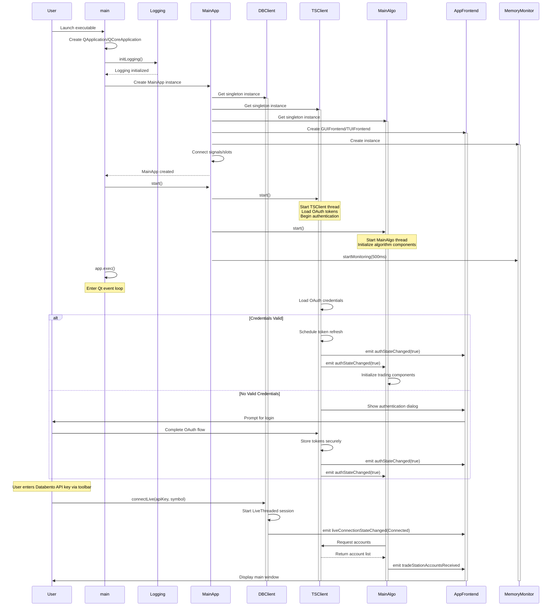
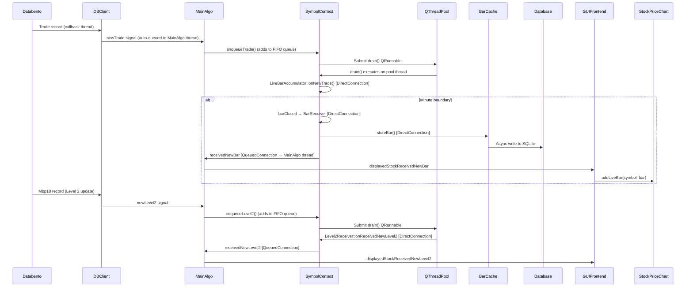
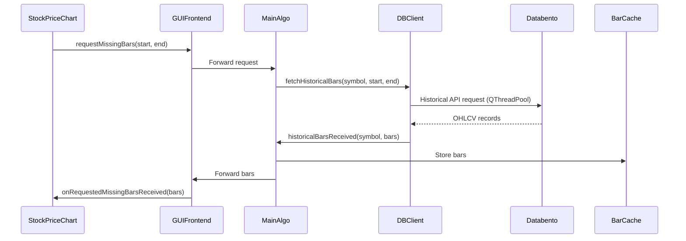
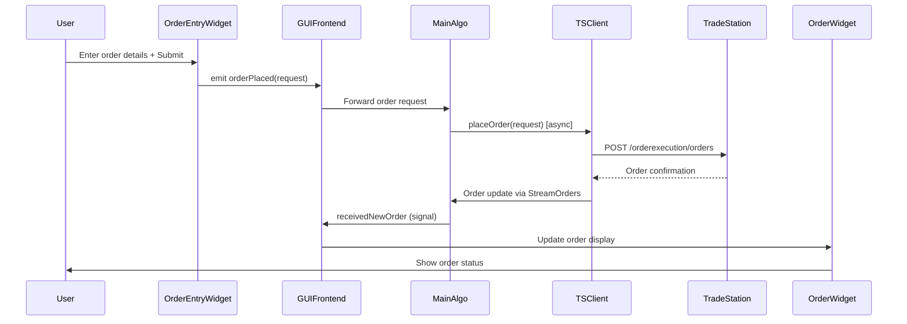
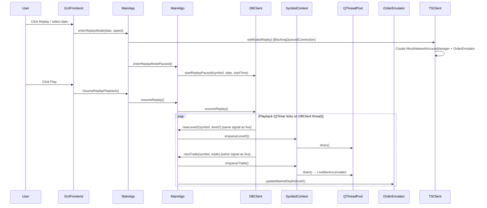

# L2Trader Architecture

## Table of Contents

1. [Overview](#overview)
2. [System Architecture](#system-architecture)
3. [Core Components](#core-components)
4. [Threading Model](#threading-model)
5. [Memory Management](#memory-management)
6. [Data Flow](#data-flow)
7. [Design Patterns](#design-patterns)

## Overview

L2Trader is a real-time algorithmic trading application built with Qt6 following a Model-View-Controller (MVC) architecture. It uses a dual-API design:

- **Databento** — all market data: live Level 2 order book, trades, historical bars, and replay archive files (`.dbn.zst`).
- **TradeStation** — all brokerage operations: OAuth authentication, order placement/cancellation, position and order streaming, account management.

### Key Architectural Principles

- **Asynchronous Communication**: Qt signal/slot mechanism ensures thread-safe data flow
- **Singleton Pattern**: Core services (DBClient, TSClient, MainAlgo) use controlled singleton access
- **Composition Over Inheritance**: Direct member objects preferred over pointers
- **Smart Pointer Usage**: Consistent memory management with std::unique_ptr, std::shared_ptr, and QPointer
- **Thread Safety**: QReadWriteLock for concurrent data access; signal/slot queuing for cross-thread calls

## System Architecture

```mermaid
graph TD
    subgraph "Main Application"
        MA[MainApp] -->|singleton| DB[DBClient]
        MA -->|singleton| TS[TSClient]
        MA -->|singleton| MAL[MainAlgo]
        MA -->|creates| AF[AppFrontend]
        MA -->|creates| MM[MemoryMonitor]
    end

    subgraph "External Data Sources"
        DB -->|databento-cpp LiveThreaded| DB_API[Databento XNAS.ITCH]
        DB -->|databento-cpp Historical| DB_HIST[Databento Historical API]
        TS -->|REST + WebSocket| TS_API[TradeStation Brokerage API]
    end

    subgraph "Algorithm Core"
        MAL --> SI[SymbolContext]
        SI --> BC[BarCache]
        SI --> L2R[Level2Receiver]
        MAL --> LBA[LiveBarAccumulator]
        MAL --> PR[PositionsReceiver]
        MAL --> OR[OrdersReceiver]
    end

    subgraph "GUI Frontend"
        AF --> GFW[GUIFrontend]
        GFW --> SPC[StockPriceChart]
        GFW --> L2W[Level2Widget]
        GFW --> CT[CacheTab]
        GFW --> LT[LoggingTab]
        GFW --> ST[StrategiesTab]
        GFW --> PW[PositionWidget]
        GFW --> OW[OrderWidget]
        GFW --> BW[BalanceWidget]
        GFW --> OEW[OrderEntryWidget]
    end

    %% Signal/Slot Connections
    DB -.->|newLevel2| MAL
    DB -.->|newTrade| MAL
    DB -.->|newLevel1| MAL
    DB -.->|newStatus| AF
    DB -.->|liveConnectionStateChanged| AF
    TS -.->|authStateChanged| AF
    TS -.->|authStateChanged| MAL
    MM -.->|memoryUsageUpdated| AF

    MAL -.->|tradeStationAccountsReceived| AF
    MAL -.->|displayedStockReceivedNewBar| AF
    MAL -.->|displayedStockReceivedNewLevel2| AF
    MAL -.->|displayedStockReceivedNewTrade| AF
    MAL -.->|receivedNewPosition| AF
    MAL -.->|positionDeleted| AF
    MAL -.->|receivedNewOrder| AF
    MAL -.->|balanceUpdated| AF

    GFW -.->|onSelectDisplayedStock| MAL
    SPC -.->|requestMissingBars| GFW
    GFW -.->|forwards to| MAL

    %% Styling
    classDef mainApp fill:#e1f5fe,stroke:#01579b,stroke-width:2px
    classDef clients fill:#f3e5f5,stroke:#4a148c,stroke-width:2px
    classDef algo fill:#e8f5e8,stroke:#1b5e20,stroke-width:2px
    classDef gui fill:#fff3e0,stroke:#e65100,stroke-width:2px
    classDef external fill:#fce4ec,stroke:#880e4f,stroke-width:2px

    class MA mainApp
    class DB,TS,DB_API,DB_HIST,TS_API clients
    class MAL,SI,BC,L2R,L1R,LBA,PR,OR,RE algo
    class AF,GFW,SPC,L2W,CT,LT,ST,PW,OW,BW,OEW gui
    class MM external
```



### Program Startup Sequence



## Core Components

### 1. MainApp

**Role**: Application orchestrator
**Thread**: Main GUI thread
**Responsibilities**:
- Initialize and coordinate all core singletons (DBClient, TSClient, MainAlgo)
- Manage application lifecycle and shutdown sequence
- Connect signal/slot chains between components
- Manage data source mode switching (Live ↔ Replay)

**Key Members**:
```cpp
DBClient& m_databentoClient;         // Singleton reference (market data)
TSClient& m_tradeStationClient;      // Singleton reference (brokerage)
MainAlgo& m_mainAlgo;                // Singleton reference
FrontEnd* m_appFrontend;             // GUI or TUI implementation
MemoryMonitor* m_memoryMonitor;      // System resource tracking
```

### 2. DBClient

**Role**: Databento market data client singleton
**Thread**: Own dedicated `QThread` (like TSClient). Databento's internal `LiveThreaded` thread handles callbacks; `QThreadPool` workers handle historical/download.
**Responsibilities**:
- Live streaming via `databento::LiveThreaded` (Level 2, trades, trading status)
- Historical bar fetching via `databento::Historical`
- Replay data download (`.dbn.zst` archive files)
- Symbol resolution via `PitSymbolMap` (instrument_id → ticker)
- API key management and connection state tracking

**Threading**: DBClient lives on its own QThread. State-modifying methods self-route to DBClient thread if called from elsewhere. In live mode, the thread mostly idles (Databento's LiveThreaded does the heavy lifting). The thread will host the replay QTimer tick loop when replay is folded in.

**Connection State Machine**:
```
Disconnected → Connecting → Connected
Connected → Reconnecting (on exception) → Connecting
Connected → Disconnected (on user disconnect)
```

**Key Signals**:
```cpp
void liveConnectionStateChanged(ConnectionState state);
void newLevel2(QString symbol, Level2 level2);
void newTrade(QString symbol, Trade trade);
void newStatus(QString symbol, bool isHalted, QString haltReason, bool isSsr);
void liveGatewayError(QString errorText, bool isFatal);
void historicalBarsReceived(QString symbol, QVector<Bar> bars);
void replayDownloadFinished(QString symbol, QDate date, bool success, QString error);
```

**Subscription Model**: Each `subscribeLive()` subscribes to three schemas simultaneously — `Mbp10` (Level 2), `Trades`, and `Status`. Subscriptions accumulate; Databento does not support unsubscribe.

**Dataset**: Defaults to `XNAS.ITCH` (NASDAQ TotalView). Configurable via `setDataset()`.

### 3. TSClient

**Role**: TradeStation brokerage client singleton
**Thread**: Dedicated worker thread (stack-allocated)
**Responsibilities**:
- OAuth 2.0 authentication with automatic token refresh (20-minute tokens, refreshed 5 seconds early)
- REST API requests (accounts, balances, order placement/cancellation)
- WebSocket streaming for orders and positions
- Replay mode: routes all requests through `MockNetworkAccessManager` → `OrderEmulator`

**Key Signals**:
```cpp
void authStateChanged(bool authenticated, QString reason);
void totalDataReceivedBytesIncreased(qsizetype bytesIncrease);
```

**Replay Mode**: `TSClient::setMode(Mode::Replay)` creates a `MockNetworkAccessManager` that intercepts all network requests and routes them to `OrderEmulator`. `Mode::Live` and `Mode::Sim` use the real TradeStation API.

### 4. MainAlgo

**Role**: Trading algorithm coordinator singleton
**Thread**: Dedicated worker thread (stack-allocated)
**Responsibilities**:
- Maintain one `SymbolContext` instance per tracked symbol
- Route market data (Level 2, trades) from DBClient to the correct `SymbolContext` queue
- Track positions, orders, and account balances via `PositionsReceiver` / `OrdersReceiver`
- Forward replay control signals from DBClient to the frontend
- Pause/resume heartbeat timers on stream receivers during replay

**Key Members**:
```cpp
QMap<QString, SymbolContext*> m_symbolContexts;            // Symbol → context (actor)
std::unique_ptr<PositionsReceiver> m_positionReceiver;
std::unique_ptr<OrdersReceiver> m_orderReceiver;
QTimer* m_balancePollingTimer;
```

### 5. SymbolContext

**Role**: Per-symbol actor with thread-pool drain loop
**Thread**: Enqueued from any thread; drain runs on QThreadPool worker threads
**Responsibilities**:
- FIFO work queue for Level2 and Trade events (thread-safe enqueue)
- Sequential processing per symbol, parallel across symbols
- Bar cache with SQLite persistence
- Level 2 reception via `Level2Receiver`
- Live bar accumulation (1-minute and 10-second intervals)

**Actor Pattern**:
```cpp
class SymbolContext : public QObject {
    using WorkItem = std::variant<Level2, Trade>;

    QMutex m_queueMutex;
    QQueue<WorkItem> m_queue;
    std::atomic<bool> m_draining{false};
    std::atomic<bool> m_destroying{false};
    QWaitCondition m_drainDone;
    QString m_symbol;
    BarCache m_barCache;              // Direct member
    Level2Receiver m_level2Receiver;  // Direct member
    Level1Receiver m_level1Receiver;  // Direct member
};
```

### 6. BarCache

**Role**: Bar data caching with memory/database tiers
**Thread**: Thread-safe via QReadWriteLock
**Responsibilities**:
- In-memory bar storage by day
- SQLite persistence for historical data
- Automatic database preloading
- Stream management for live bars

**Bar Timestamp Convention**: Bars use **open-time** (Databento native).
- A bar covering 4:00:00–4:00:59 is timestamped `4:00:00`
- Trading day: index 0 = `4:00 AM`, index 899 = `6:59 PM`
- **900 bars per day** (4:00 AM – 6:59 PM, XNAS.ITCH extended hours)

**Memory Optimization**: Bar class ~104 bytes (32% reduction from original design).
- Float precision for OHLC data (4 bytes each; sufficient for stock prices)
- Bitfield packing for flags
- Optimal member alignment

### 7. LiveBarAccumulator

**Role**: Builds in-progress OHLCV bars from individual `Trade` records
**Thread**: QThreadPool worker thread (called from SymbolContext drain loop via DirectConnection)
**Usage**: Used identically in both live and replay modes — DBClient emits `newTrade` in both cases, routed through MainAlgo → SymbolContext → LiveBarAccumulator.

**Convention**: A trade at 09:31:04 contributes to the bar timestamped **09:31:00** (floor to current minute).
- `barUpdated(Bar)` — emitted on every trade, carries the in-progress bar
- `barClosed(Bar)` — emitted at minute-boundary rollover with the completed bar

### 8. Replay Playback (DBClient)

**Role**: Replays historical market data from Databento `.dbn.zst` archive files
**Thread**: DBClient thread (replay logic lives inside DBClient, not a separate class)
**Data Sources**:
```
~/.local/share/L2Trader/ReplayData/{YYYY-MM-DD}/{SYMBOL}_mbp10.dbn.zst   (Level 2)
~/.local/share/L2Trader/ReplayData/{YYYY-MM-DD}/{SYMBOL}_trades.dbn.zst  (Trades)
```

**Playback Speed**: Configurable via `Playback::Speed` enum (in `PlaybackTypes.h`) — from `SuperSlow` (0.01×) to `AsFastAsPossible` (0ms timer delay). Speed can be changed during playback.

**Unified Pipeline**: In replay mode, DBClient emits `newLevel2` and `newTrade` — the same signals as live mode. MainAlgo routes them identically to SymbolContext queues. No separate replay signals or wiring needed.

### 9. OrderEmulator

**Role**: Simulates realistic order execution during replay mode
**Activation**: Only when `TSClient::Mode::Replay` is set
**Features**:
- Reception delay: 100–500 ms (random, scaled by playback speed)
- Execution delay: 10–50 ms after reception (random, scaled by playback speed)
- Limit order monitoring against live market depth snapshots
- Fill price = current ask (buy) or current bid (sell) — NOT the limit price
- Simulated account `SIM123456` with $100,000 starting balance

### 10. Frontend Abstraction

**Role**: UI abstraction layer
**Thread**: Main GUI thread
**Implementations**:
- **GUIFrontend**: Full-featured Qt Widgets interface with charts, Level 2 table, order entry, and replay controls
- **TUIFrontend**: Lightweight ncurses terminal interface for headless monitoring

**Interface** (FrontEnd abstract base class):
```cpp
class FrontEnd : public QObject {
signals:
    void selectedDisplayedStock(const QString& symbol);

public slots:
    virtual void onTSClientDataUsageUpdate(qsizetype bytes) = 0;
    virtual void onTradeStationAccountsReceived(const QVector<Account>& accounts) = 0;
    virtual void onMemoryUsageUpdate(qsizetype bytes) = 0;
    virtual void onCurrentHighlightedStockBarReceived(const QString& symbol, const Bar& bar) = 0;
    virtual void onCurrentHighlightedReceivedNewLevel2(const QString& symbol, const Level2& level2,
                                                       double dwp, double bidTotalVol, double askTotalVol) = 0;
    virtual void onCurrentHighlightedReceivedNewTrade(const QString& symbol, const Trade& trade) = 0;
    virtual void onNewPositionReceived(const QString& accountId, const Position& position) = 0;
    virtual void onPositionDeleted(const QString& accountId, const QString& positionId) = 0;
    virtual void onNewOrderReceived(const QString& accountId, const Order& order) = 0;
    virtual void onBalanceUpdated(const Balance& balance) = 0;
};
```

## Threading Model

### Thread Overview

| Thread | Owner | Purpose | Lifetime |
|--------|-------|---------|----------|
| Main | QApplication | GUI event loop, UI updates | Application lifetime |
| DBClient | DBClient singleton | Databento API, live callbacks, replay playback | Application lifetime |
| Databento internal | DBClient | Live callbacks (Level2, Trade, Status records) | DBClient::connectLive lifetime |
| QThreadPool worker(s) | Qt global pool | SymbolContext drain loops, historical bar fetches | Per-task |
| TSClient | TSClient singleton | REST requests, OAuth, brokerage streams | Application lifetime |
| MainAlgo | MainAlgo singleton | Signal routing, replay control coordination | Application lifetime |
| Database | DatabaseThread (per BarCache) | SQLite operations | BarCache lifetime |

### Cross-Thread Communication

All cross-thread data flow uses Qt's signal/slot mechanism with automatic queuing:

```cpp
// DBClient thread → MainAlgo thread (routing)
connect(DBClient::getInstance(), &DBClient::newLevel2,
        MainAlgo::getInstance(), &MainAlgo::onNewLevel2Received);

// MainAlgo thread → SymbolContext queue (lock-free enqueue)
m_symbolContexts[symbol]->enqueueLevel2(level2);  // Thread-safe FIFO

// QThreadPool worker → MainAlgo thread (auto-queued back)
connect(&symbolCtx->barReceiver, &BarReceiver::receivedNewBar,
        mainAlgo, &MainAlgo::onBarReceived, Qt::QueuedConnection);
```

### SymbolContext Actor Model

Each `SymbolContext` is a passive actor with a FIFO work queue:
- **Enqueue**: Thread-safe (mutex-protected), called from MainAlgo thread
- **Drain**: Runs on QThreadPool worker — only one pool thread per symbol at a time
- **Internal connections**: Use `Qt::DirectConnection` (safe: single-drainer guarantee)
- **External connections**: Use `Qt::QueuedConnection` (cross-thread to MainAlgo/GUI)

### Thread Safety Mechanisms

#### QReadWriteLock for Shared Data

BarCache uses reader-writer locks for concurrent access:
```cpp
// Multiple concurrent readers
QReadLocker locker(&m_barCacheRwLock);
return m_barCacheByDay.value(date);

// Exclusive writer
QWriteLocker locker(&m_barCacheRwLock);
m_barCacheByDay[date].append(bar);
```

#### Mutex for Symbol Map

DBClient's `PitSymbolMap` is protected by `m_symbolMapMutex` because it is written by the Databento callback thread and read by any caller of `getSymbolForInstrumentId()`.

### Graceful Shutdown

Shutdown sequence:
1. **User initiates quit** (Ctrl+Q or window close)
2. **Stop timers and live Databento session** (DBClient::disconnectLive)
3. **Stop brokerage streams** (TSClient)
4. **Quit worker threads** (TSClient, MainAlgo) with 5-second timeout
5. **Terminate threads** if needed (last resort)
6. **Destroy singletons** in dependency order: MainApp → MainAlgo → TSClient → DatabaseThread
7. **Exit Qt event loop**

## Memory Management

### Composition Over Pointers

Prefer direct member objects over pointers when the object has a clear owner, lifetime matches the container, and polymorphism is not needed:

```cpp
class SymbolContext {
    BarCache m_barCache;              // Direct member (preferred)
    Level2Receiver m_level2Receiver;  // Direct member (preferred)
    // NOT: BarCache* m_barCache;     // Pointer (avoid unless necessary)
};
```

### Smart Pointer Guidelines

#### Qt Parent-Child Ownership

```cpp
QTimer* m_timer = new QTimer(this);  // Qt deletes when 'this' is deleted
```

#### QPointer for Uncertain Lifetimes

```cpp
QPointer<StreamOrders> m_streamOrders;  // Auto-nulls when stream deleted
if (m_streamOrders) { /* stream still alive */ }
```

#### std::unique_ptr for Exclusive Ownership

```cpp
std::unique_ptr<PositionsReceiver> m_positionReceiver;
std::unique_ptr<OrdersReceiver> m_orderReceiver;
```

#### std::shared_ptr for Shared Ownership

```cpp
std::shared_ptr<QVector<Bar>> bars;  // Shared between cache, UI, and callbacks
```

## Data Flow

### Live Market Data Pipeline



### Historical Bar Request Flow



### Order Entry Flow



### Replay Data Flow



> **Key insight**: The replay pipeline uses the exact same signals and routing as live mode. DBClient emits `newLevel2`/`newTrade` in both cases. No separate replay wiring is needed.

## Design Patterns

### 1. Singleton Pattern

**Usage**: DBClient, TSClient, MainAlgo, LogBroadcaster

**Implementation** (Meyer's Singleton — thread-safe C++11):
```cpp
class DBClient : public QObject {
public:
    static DBClient& getInstance() {
        static DBClient instance;
        return instance;
    }
    Q_DISABLE_COPY_MOVE(DBClient)
private:
    DBClient() { /* ... */ }
    ~DBClient() { /* cleanup */ }
};
```

### 2. Strategy Pattern (Frontend Selection)

```cpp
#ifdef GUI_ENABLED
    FrontEnd* frontend = new GUIFrontend(&mainAlgo);
#else
    FrontEnd* frontend = new TUIFrontend(&mainAlgo);
#endif
```

### 3. Observer Pattern (Qt Signal/Slot)

```cpp
// Observer registration
connect(subject, &Subject::dataChanged, observer, &Observer::onDataChanged);
// Subject notifies all observers
emit dataChanged(newData);
```

### 4. Repository Pattern (BarCache)

```cpp
class BarCache {
public:
    QVector<Bar> getBarsForDay(const QDate& date) const;
    void storeBars(const QDate& date, const QVector<Bar>& bars);
private:
    mutable QReadWriteLock m_barCacheRwLock;
    QMap<QDate, QVector<Bar>> m_barCacheByDay;  // In-memory
    DatabaseThread* m_databaseThread;            // Persistent
};
```

### 5. Command Pattern (Order Requests)

```cpp
struct PlaceOrderRequest {
    QString accountId;
    QString symbol;
    TradeAction tradeAction;
    OrderType orderType;
    int quantity;
    std::optional<double> limitPrice;
    TimeInForce timeInForce;
};
```

### 6. Mock/Interceptor Pattern (Replay Mode)

In replay mode, `MockNetworkAccessManager` intercepts all `QNetworkAccessManager` requests before they reach the network and routes them to `OrderEmulator`:
```cpp
// TSClient uses m_networkManager for all requests
// In replay mode m_networkManager = MockNetworkAccessManager
QNetworkReply* reply = m_networkManager->post(request, body);
// → MockNetworkAccessManager intercepts, returns MockNetworkReply
// → OrderEmulator processes the order locally
```

## Related Documentation

- [AUTHENTICATION.md](AUTHENTICATION.md) — OAuth 2.0 (TradeStation) and Databento API key management
- [FRONTEND.md](FRONTEND.md) — GUI and TUI implementation details
- [DEVELOPMENT.md](DEVELOPMENT.md) — Development setup and guidelines
- [CONTRIBUTING.md](CONTRIBUTING.md) — Contribution guidelines
- [STRATEGY.md](STRATEGY.md) — Strategy plugin system
