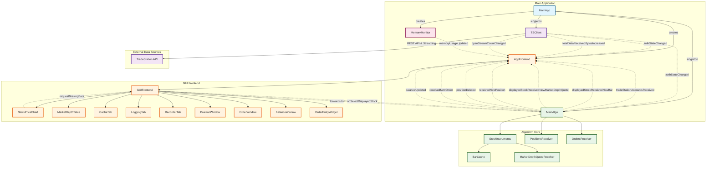
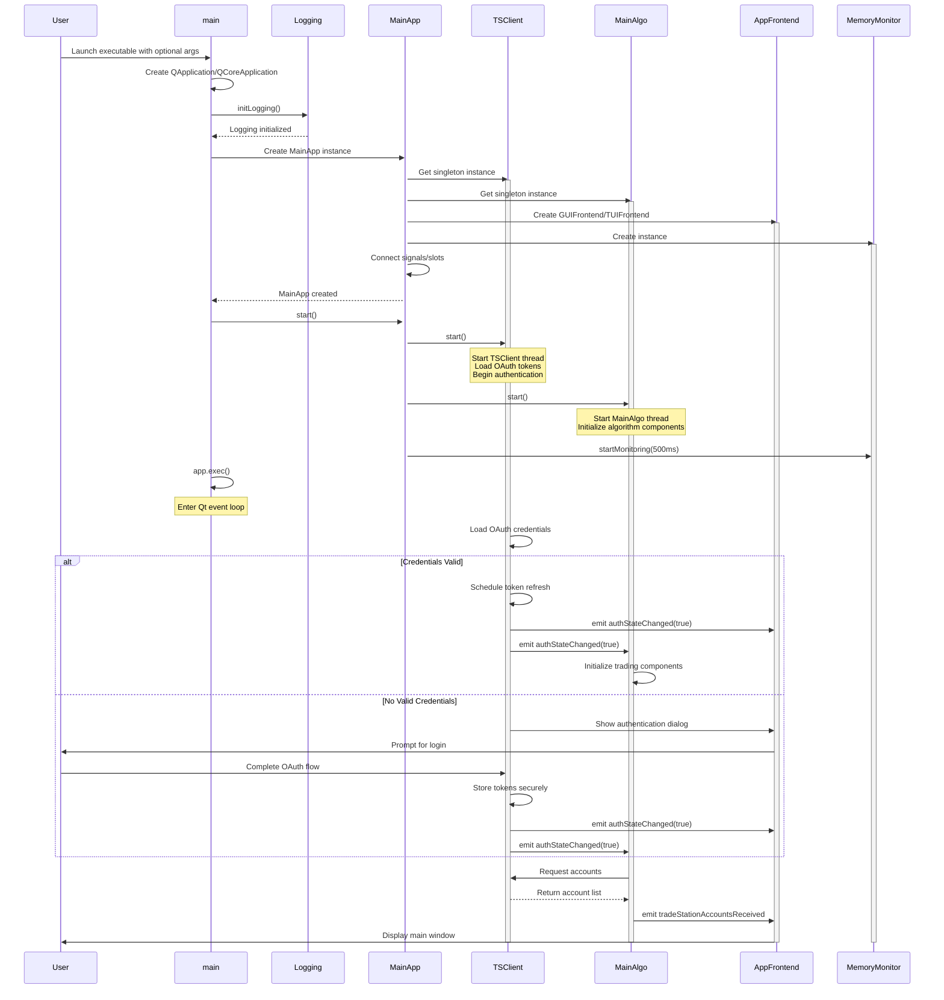
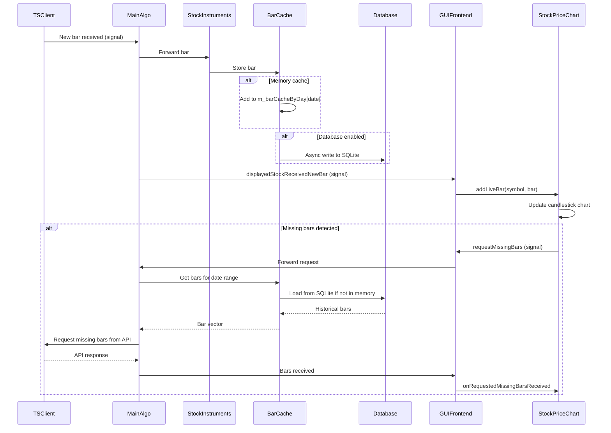
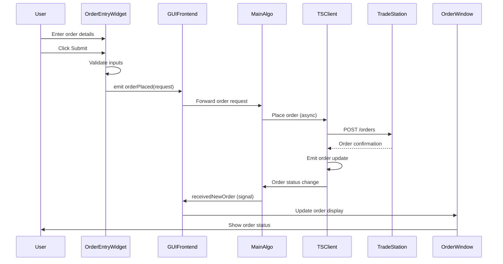

# L2Trader Architecture

## Table of Contents

1. [Overview](#overview)
2. [System Architecture](#system-architecture)
3. [Core Components](#core-components)
4. [Threading Model](#threading-model)
5. [Memory Management](#memory-management)
6. [Data Flow](#data-flow)
7. [Design Patterns](#design-patterns)

## Overview

L2Trader is a real-time algorithmic trading application built with Qt6 following a Model-View-Controller (MVC) architecture pattern. The application connects to the TradeStation API for live market data, executes trading strategies, and provides comprehensive market analysis tools through both graphical (GUI) and text-based (TUI) interfaces.

### Key Architectural Principles

- **Asynchronous Communication**: Qt signal/slot mechanism ensures thread-safe data flow
- **Singleton Pattern**: Core services (TSClient, MainAlgo) use controlled singleton access
- **Composition Over Inheritance**: Direct member objects preferred over pointers
- **Smart Pointer Usage**: Consistent memory management with std::unique_ptr, std::shared_ptr, and QPointer
- **Thread Safety**: QReadWriteLock for concurrent data access

## System Architecture



### Program Startup Sequence



## Core Components

### 1. MainApp

**Role**: Application orchestrator
**Thread**: Main GUI thread
**Responsibilities**:
- Initialize and coordinate core components
- Manage application lifecycle
- Connect signal/slot chains between components

**Key Members**:
```cpp
TSClient& tradeStationClient;        // Singleton reference
MainAlgo& mainAlgo;                  // Singleton reference
FrontEnd* appFrontend;               // GUI or TUI implementation
MemoryMonitor* memoryMonitor;        // System resource tracking
```

### 2. TSClient

**Role**: TradeStation API client singleton
**Thread**: Dedicated worker thread (stack-allocated)
**Responsibilities**:
- OAuth 2.0 authentication with automatic token refresh
- REST API requests (market data, orders, positions)
- WebSocket streaming connections
- Rate limiting and request tracking

**Key Features**:
- Thread-safe API access via Qt signal/slot queuing
- Automatic token refresh 5 seconds before expiration
- Async request tracking with timeout handling
- Secure credential storage via QKeychain

**Thread Pattern**:
```cpp
// Stack-allocated thread (preferred pattern)
QThread m_thread;

// Proper lifecycle management
~TSClient() {
    m_thread.quit();
    if (!m_thread.wait(5000)) {
        qWarning() << "Thread did not finish, terminating";
        m_thread.terminate();
        m_thread.wait();
    }
}
```

### 3. MainAlgo

**Role**: Trading algorithm coordinator singleton
**Thread**: Dedicated worker thread (stack-allocated)
**Responsibilities**:
- Stock screening and selection
- Bar cache management per symbol
- Position and order tracking
- Balance polling
- Market depth quote processing

**Key Members**:
```cpp
QMap<QString, StockInstruments*> stockInstruments;  // Symbol → instrument mapping
std::unique_ptr<PositionsReceiver> m_positionReceiver;
std::unique_ptr<OrdersReceiver> m_orderReceiver;
QTimer* m_balancePollingTimer;
```

### 4. StockInstruments

**Role**: Per-symbol data container
**Thread**: MainAlgo thread
**Responsibilities**:
- Bar cache with SQLite persistence
- Market depth quote reception
- Run-up detection (future feature)

**Composition Pattern** (preferred over pointers):
```cpp
class StockInstruments : public QObject {
private:
    QString m_symbol;
    BarCache m_barCache;                              // Direct member (composition)
    MarketDepthQuoteReceiver m_marketDepthQuoteReceiver;  // Direct member (composition)
};
```

### 5. BarCache

**Role**: Bar data caching with memory/database tiers
**Thread**: Thread-safe via QReadWriteLock
**Responsibilities**:
- In-memory bar storage by day
- SQLite persistence for historical data
- Automatic database preloading
- Stream management for live bars

**Thread Safety**:
```cpp
mutable QReadWriteLock m_barCacheRwLock;
mutable QMap<QDate, QVector<Bar>> m_barCacheByDay;
```

**Memory Optimization**:
- Bar class optimized to ~104 bytes (32% reduction)
- Float precision for OHLC data (sufficient for stock prices)
- Bitfield packing for flags
- Smart pointer usage for shared bar vectors

### 6. Frontend Abstraction

**Role**: UI abstraction layer
**Thread**: Main GUI thread
**Implementations**:
- **GUIFrontend**: Full-featured Qt Widgets interface
- **TUIFrontend**: Lightweight ncurses terminal interface

**Interface** (FrontEnd abstract base class):
```cpp
class FrontEnd : public QObject {
signals:
    void selectedDisplayedStock(const QString& symbol);

public slots:
    virtual void onTSClientDataUsageUpdate(qsizetype bytes) = 0;
    virtual void onTradeStationAccountsReceived(const QVector<Account>& accounts) = 0;
    virtual void onMemoryUsageUpdate(qsizetype bytes) = 0;
    virtual void onStreamCountUpdate(int count) = 0;
    virtual void onCurrentHighlightedStockBarReceived(const QString& symbol, const Bar& bar) = 0;
    virtual void onNewPositionReceived(const QString& accountId, const Position& position) = 0;
    virtual void onPositionDeleted(const QString& accountId, const QString& positionId) = 0;
    virtual void onNewOrderReceived(const QString& accountId, const Order& order) = 0;
    virtual void onBalanceUpdated(const Balance& balance) = 0;
};
```

## Threading Model

### Thread Overview

L2Trader uses Qt's threading model with dedicated worker threads for network and algorithm operations:

| Thread | Owner | Purpose | Lifetime |
|--------|-------|---------|----------|
| Main | QApplication | GUI event loop, UI updates | Application lifetime |
| TSClient | TSClient singleton | API requests, OAuth, streams | Application lifetime |
| MainAlgo | MainAlgo singleton | Trading logic, bar processing | Application lifetime |
| Database | DatabaseThread | SQLite operations (per BarCache) | BarCache lifetime |

### Threading Patterns

#### Stack-Allocated Threads (Preferred)

```cpp
class TSClient : public QObject {
private:
    QThread m_thread;  // Stack-allocated member

    ~TSClient() {
        // Proper cleanup with quit/wait/terminate pattern
        m_thread.quit();
        if (!m_thread.wait(5000)) {
            qWarning() << "Thread did not finish, terminating";
            m_thread.terminate();
            m_thread.wait();
        }
    }
};
```

**Rationale**:
- Simpler than heap allocation
- Automatic lifetime management
- Thread lifetime tied to object lifetime
- No memory leaks

#### Signal/Slot Cross-Thread Communication

All cross-thread communication uses Qt's signal/slot mechanism with automatic queuing:

```cpp
// Emitted from TSClient thread, received on MainAlgo thread
connect(&TSClient::getInstance(), &TSClient::authStateChanged,
        &MainAlgo::getInstance(), &MainAlgo::onAuthStateChanged,
        Qt::QueuedConnection);  // Explicit queued connection
```

#### Thread Affinity Assertions

Debug builds include thread affinity checks:

```cpp
void MainAlgo::someMethod() {
    Q_ASSERT(QThread::currentThread() == &m_thread);
    // Method must run on MainAlgo thread
}
```

### Thread Safety Mechanisms

#### 1. QReadWriteLock for Shared Data

BarCache uses reader-writer locks for concurrent access:

```cpp
// Multiple readers can access simultaneously
QReadLocker locker(&m_barCacheRwLock);
return m_barCacheByDay.value(date);

// Writers get exclusive access
QWriteLocker locker(&m_barCacheRwLock);
m_barCacheByDay[date].append(bar);
```

#### 2. Mutex-Free Queuing

Qt's signal/slot mechanism provides lock-free queuing:
- Signals emitted from any thread
- Slots executed on target thread
- No manual locking required

#### 3. Thread-Local Storage

Each thread maintains its own event loop and local variables.

### Graceful Shutdown

The application implements proper shutdown sequence:

1. **User initiates quit** (Ctrl+Q or window close)
2. **Stop timers and streams** in MainAlgo
3. **Quit worker threads** (TSClient, MainAlgo)
4. **Wait for threads** with timeout (5 seconds)
5. **Terminate if needed** (last resort)
6. **Clean up resources** in destructors
7. **Exit Qt event loop**

## Memory Management

### Composition Over Pointers

**Prefer direct member objects** over pointers when:
- Object has clear owner (containing class)
- Polymorphism not needed
- Lifetime matches container
- Object is not optional

**Example**:
```cpp
class StockInstruments {
    BarCache m_barCache;              // Direct member (preferred)
    // NOT: BarCache* m_barCache;     // Pointer (avoid unless necessary)
};
```

### Smart Pointer Guidelines

#### Qt Parent-Child Ownership (No Smart Pointers)

For Qt objects with parents, Qt manages memory automatically:

```cpp
QTimer* m_timer = new QTimer(this);  // Qt deletes when 'this' is deleted
QVBoxLayout* layout = new QVBoxLayout(parentWidget);
```

#### QPointer for Uncertain Lifetimes

For Qt objects that may be deleted independently:

```cpp
QPointer<StreamBars> m_stream;  // Automatically nulls when stream deleted
if (m_stream) {
    // Stream still exists
}
```

#### std::unique_ptr for Exclusive Ownership

For non-Qt objects or Qt objects without parents:

```cpp
std::unique_ptr<Ui::GUIFrontend> ui;
std::unique_ptr<LiveStreamDB> m_liveBarsDB;
std::unique_ptr<PositionsReceiver> m_positionReceiver;
```

#### std::shared_ptr for Shared Ownership

For data shared across async operations:

```cpp
std::shared_ptr<QVector<Bar>> bars;  // Shared between cache, UI, and callbacks

QFuture<std::expected<std::shared_ptr<QVector<Bar>>, Error>> getBars();
```

### Memory Optimization: Bar Class

The Bar class underwent significant optimization:

**Before**: ~152 bytes per bar
**After**: ~104 bytes per bar
**Savings**: 32% reduction

**Key Changes**:
1. **OHLC as float** (vs double): 4 bytes each, sufficient for stock prices
2. **Bitfield packing**: Flags compressed into single byte
3. **Member reordering**: Optimal alignment to minimize padding

**Impact**: For 10,000 bars, saves ~480 KB per symbol.

## Data Flow

### Market Data Pipeline



### Order Entry Flow



## Design Patterns

### 1. Singleton Pattern

**Usage**: TSClient, MainAlgo, LogBroadcaster, LoggingConfig

**Implementation** (Meyer's Singleton - thread-safe C++11):
```cpp
class TSClient : public QObject {
public:
    static TSClient& getInstance() {
        static TSClient instance;
        return instance;
    }
    
    Q_DISABLE_COPY_MOVE(TSClient)
    
private:
    TSClient() { /* ... */ }
    ~TSClient() { /* cleanup */ }
};
```

**Why Singletons**:
- **TSClient**: Global API access point, manages connection state
- **MainAlgo**: Centralized trading logic coordinator
- **LogBroadcaster**: Single log distribution point

**Not Singletons**:
- **MainApp**: Application orchestrator (one instance in main)
- **StockInstruments**: Multiple instances (per symbol)
- **Frontend**: One instance but not singleton (polymorphic)

### 2. Strategy Pattern

**Usage**: Frontend selection (GUI vs TUI)

```cpp
#ifdef GUI_ENABLED
    FrontEnd* frontend = new GUIFrontend(mainAlgo);
#else
    FrontEnd* frontend = new TUIFrontend(mainAlgo);
#endif
```

### 3. Observer Pattern

**Usage**: Qt signal/slot mechanism throughout

```cpp
// Observer registration
connect(subject, &Subject::dataChanged, observer, &Observer::onDataChanged);

// Subject notifies observers
emit dataChanged(newData);
```

### 4. Factory Pattern

**Usage**: Implicit in Qt (QObject creation, widget construction)

### 5. Command Pattern

**Usage**: Order placement requests

```cpp
struct PlaceOrderRequest {
    QString accountId;
    QString symbol;
    TradeAction tradeAction;
    OrderType orderType;
    int quantity;
    std::optional<double> limitPrice;
    TimeInForce timeInForce;
};
```

### 6. Repository Pattern

**Usage**: BarCache acts as repository for bar data

```cpp
class BarCache {
public:
    QVector<Bar> getBarsForDay(const QDate& date);
    void storeBars(const QVector<Bar>& bars);
    
private:
    QMap<QDate, QVector<Bar>> m_barCacheByDay;  // In-memory
    DatabaseThread* m_databaseThread;            // Persistent
};
```

## Related Documentation

- [AUTHENTICATION.md](AUTHENTICATION.md) - OAuth and security details
- [FRONTEND.md](FRONTEND.md) - GUI and TUI implementation
- [DEVELOPMENT.md](DEVELOPMENT.md) - Development setup and guidelines
- [CONTRIBUTING.md](CONTRIBUTING.md) - Contribution guidelines
