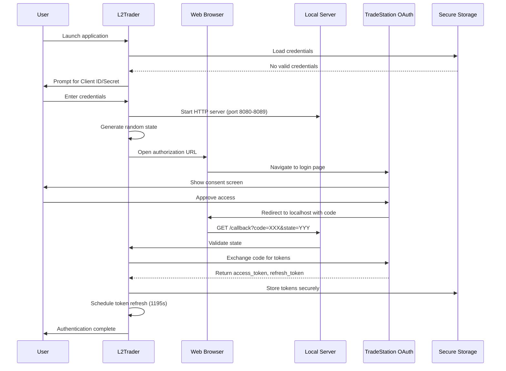
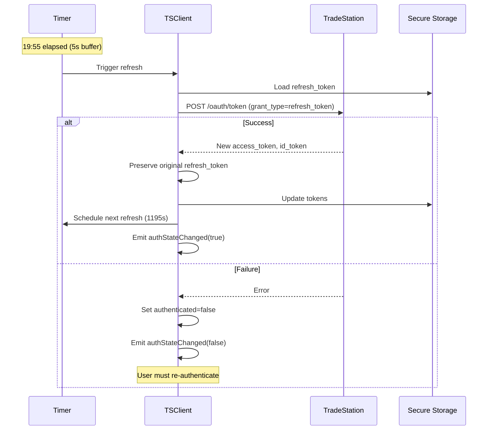
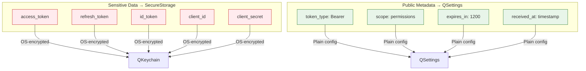

# L2Trader Authentication & Security

## Table of Contents

1. [Overview](#overview)
2. [OAuth 2.0 Authentication](#oauth-20-authentication)
3. [Token Management](#token-management)
4. [Secure Storage](#secure-storage)
5. [GUI vs TUI Mode](#gui-vs-tui-mode)
6. [Security Best Practices](#security-best-practices)

## Overview

L2Trader uses OAuth 2.0 Authorization Code Flow for secure authentication with the TradeStation API. The system provides:

- **Zero-trust authentication**: Users never share credentials with the application
- **Automatic token refresh**: Seamless API access without user intervention
- **Secure storage**: OS-level encryption via QKeychain
- **Dual-mode support**: Both GUI and headless (TUI) authentication flows
- **CSRF protection**: State parameter validation prevents attacks

## OAuth 2.0 Authentication

### Key Concepts

| Component | Description | Lifetime |
|-----------|-------------|----------|
| **Access Token** | Bearer token for API requests | 20 minutes |
| **Refresh Token** | Long-lived token for obtaining new access tokens | Persistent |
| **Authorization Code** | Temporary code exchanged for tokens | Single use |
| **Client ID & Secret** | Application credentials from TradeStation | Persistent |
| **State Parameter** | Random string for CSRF protection | Per-auth session |

### Required Scopes

```
openid           # OpenID Connect authentication
profile          # User profile information
offline_access   # Enables refresh token issuance
MarketData       # Access to market data streams
Matrix           # Access to Level 2 market depth data
ReadAccount      # Read account information and positions
Trade            # Execute trades and manage orders
```

### Initial Authentication Flow



### Token Refresh Flow

Access tokens expire after 20 minutes and are automatically refreshed 5 seconds before expiration:



**Important**: TradeStation does NOT return a new refresh_token during refresh operations. The original refresh_token must be preserved.

## Token Management

### AuthToken Class

Manages OAuth access and refresh tokens:

```cpp
class AuthToken {
public:
    // Factory method from API response
    static AuthToken receiveAuthToken(const QJsonObject &json);
    
    // Validation
    bool isValid() const;                    // Full validation
    bool isValidRefreshedToken() const;      // Validation without refresh_token check
    bool isExpired() const;                  // Check with 5s buffer
    
    // Expiration management
    int secondsUntilExpiration();           // Actual expiration time
    int secondsToNextRefreshRequest();      // Time until refresh (expire - 5s)
    
    // Persistence
    static bool storeToSettings(const AuthToken &token);
    static AuthToken loadFromSettings();
    
    // Accessors
    QString getAccessToken() const;
    QString getRefreshToken() const;
    QString getIdToken() const;
    QString getTokenType() const;
    QString getScope() const;
    int getExpiresIn() const;
};
```

### ClientToken Class

Manages TradeStation API client credentials:

```cpp
class ClientToken {
public:
    ClientToken(const QString &clientId, const QString &clientSecret);
    
    bool isValid() const;
    
    static bool storeToSettings(const ClientToken &token);
    static ClientToken loadFromSettings();
    static void clearSettings();
    
    QString getClientId() const;
    QString getClientSecret() const;
};
```

### TSClient Integration

TSClient orchestrates the entire authentication lifecycle:

```cpp
class TSClient : public QObject {
    // Authentication state
    bool authenticated;
    bool authInProgress;
    AuthToken authToken;
    ClientToken clientToken;
    
public:
    // Startup checks
    void start() {
        // 1. Load client credentials
        // 2. Load auth token
        // 3. Validate token:
        //    - Invalid/Missing → full authentication
        //    - Expired → immediate refresh
        //    - Valid → schedule refresh before expiration
    }
    
    // Refresh logic
    void refreshAsyncAccessToken();
    void onAsyncRefreshTokenFinished(bool completed, const AuthToken &newToken);
    
signals:
    void authStateChanged(bool authenticated, QString reason);
};
```

## Secure Storage

L2Trader implements a two-tier secure storage system:

### Primary: QKeychain (OS-Level Encryption)

When QKeychain is available (recommended for production):

| Platform | Storage Backend | Encryption |
|----------|----------------|------------|
| **Linux** | GNOME Keyring / KWallet | libsecret |
| **macOS** | macOS Keychain | OS-managed |
| **Windows** | Credential Manager | DPAPI |

### Fallback: Obfuscated QSettings

When QKeychain is unavailable (development only):

```cpp
// XOR-based obfuscation (NOT secure encryption!)
QByteArray key = QCryptographicHash::hash("L2TraderSecureStorage", 
                                          QCryptographicHash::Sha256);
for (int i = 0; i < data.size(); ++i) {
    data[i] = data[i] ^ key[i % key.size()];
}
```

**Warning**: This is NOT secure encryption. Always compile with QKeychain for production.

### Storage Strategy



### SecureStorage API

```cpp
class SecureStorage {
public:
    // Synchronous operations with timeout
    bool storeValuesSync(const QString& service, 
                        const QMap<QString, QString>& values, 
                        int timeoutMs);
    
    QMap<QString, QString> retrieveValuesSync(const QString& service, 
                                              const QStringList& keys, 
                                              int timeoutMs);
    
    bool deleteValuesSync(const QString& service, 
                         const QStringList& keys, 
                         int timeoutMs);
    
    static bool isSecureStorageAvailable();
};
```

## GUI vs TUI Mode

L2Trader supports both graphical and terminal-based authentication:

### Build Configuration

```bash
# GUI mode (default)
cmake -DENABLE_GUI=ON ..

# TUI/headless mode
cmake -DENABLE_GUI=OFF ..
```

### GUI Mode Authentication

**User Experience:**
1. Qt dialog window appears
2. QInputDialog prompts for credentials if needed
3. System browser automatically opens to TradeStation
4. Success dialog displays after authentication

**Implementation:**
```cpp
#ifdef GUI_ENABLED
    AuthWindow* authWindow = new AuthWindow();
    connect(authWindow, &AuthWindow::authFinished, 
            this, &TSClient::onAuthFinished);
    authWindow->show();
#endif
```

**Features:**
- Password-masked input (QLineEdit::Password)
- Automatic browser launch (QDesktopServices)
- Visual success/error dialogs (QMessageBox)
- Rich credential prompts with save option

### TUI Mode Authentication

**User Experience:**
```
=== TradeStation API Credentials Setup ===

Enter your Client ID: my-client-id-123
Enter your Client Secret (hidden): ********

Save credentials? (y/N): y

=== Authentication Required ===

Copy and paste this URL into your browser:

https://signin.tradestation.com/authorize?...

Waiting for callback...
```

**Implementation:**
```cpp
#ifndef GUI_ENABLED
    TUIAuthHandler* handler = new TUIAuthHandler();
    connect(handler, &TUIAuthHandler::authFinished,
            this, &TSClient::onAuthFinished);
    handler->startAuthentication();
#endif
```

**Features:**
- Password masking via termios (Unix)
- Manual URL copy-paste workflow
- Console prompts for credentials
- stderr logging (keeps TUI display clean)

### Comparison

| Feature | GUI Mode | TUI Mode |
|---------|----------|----------|
| **Credential Input** | QInputDialog | stdin with termios |
| **Password Masking** | QLineEdit::Password | termios echo disable |
| **Browser** | Automatic (QDesktopServices) | Manual URL |
| **Errors** | QMessageBox | stderr output |
| **Save Prompt** | QMessageBox::question | y/N prompt |
| **Dependencies** | Qt Widgets | Qt Core only |

### Shared Core Logic

Both modes use identical OAuth implementation:
- Local HTTP server (localhost:8080-8089)
- CSRF protection (state validation)
- Token exchange via POST
- Secure storage (QKeychain)
- Automatic token refresh

## Security Best Practices

### 1. Never Commit Credentials

```gitignore
# .gitignore
*.ini
*SecureStorage*
config/*.secret
```

All sensitive data stored outside repository in OS-managed locations.

### 2. Compile with QKeychain

```cmake
# CMakeLists.txt
find_package(Qt6 COMPONENTS ... Keychain)
target_link_libraries(L2Trader PRIVATE Qt6::Keychain)
target_compile_definitions(L2Trader PRIVATE QT_KEYCHAIN_LIB)
```

### 3. Token Rotation

- Access tokens expire every 20 minutes
- Automatic refresh 5 seconds before expiration
- Refresh tokens are long-lived but can be revoked

### 4. CSRF Protection

```cpp
// Generate random state
QString state = QString(32, Qt::Uninitialized);
for (auto& ch : state)
    ch = QChar('A' + QRandomGenerator::global()->bounded(26));

// Validate on callback
if (receivedState != expectedState) {
    qCritical() << "CSRF attack detected!";
    return;
}
```

### 5. Limited Scopes

Only request necessary permissions:
- Don't request `Trade` if read-only
- Minimize scope to reduce attack surface

### 6. Optional Persistence

Allow users to opt out of credential storage:
```cpp
QMessageBox::StandardButton reply = QMessageBox::question(
    nullptr, "Save Credentials",
    "Save for future use?",
    QMessageBox::Yes | QMessageBox::No
);
```

### 7. Thread Safety

All token operations run on TSClient thread:
```cpp
Q_ASSERT(QThread::currentThread() == &m_thread);
```

### 8. Error Handling

| Error | Severity | Action |
|-------|----------|--------|
| Port binding failure | Recoverable | Try next port |
| State mismatch | Critical | Reject auth |
| Token exchange failure | Recoverable | Show error, retry |
| Refresh failure | Degraded | Require re-auth |
| Storage failure | Warning | Use in-memory only |

### 9. Logging

Comprehensive logging with categories:
```cpp
Q_LOGGING_CATEGORY(TSAuthTokenLog, "TSClient.token.auth")
Q_LOGGING_CATEGORY(TSAuthWindowLog, "TSClient.authwindow")
Q_LOGGING_CATEGORY(tsClientToken, "TSClient.token.client")
Q_LOGGING_CATEGORY(secureStorage, "SecureStorage")
```

Never log sensitive data (tokens, secrets).

### 10. Audit Trail

Monitor authentication events:
- Successful authentications
- Token refresh operations
- Authentication failures
- Storage access

## Related Documentation

- [ARCHITECTURE.md](ARCHITECTURE.md) - Overall system architecture
- [DEVELOPMENT.md](DEVELOPMENT.md) - Development setup and tools
- [CONTRIBUTING.md](CONTRIBUTING.md) - Contribution guidelines

## References

- TradeStation OAuth Guide: https://api.tradestation.com/docs/fundamentals/authentication/auth-overview
- OAuth 2.0 RFC: https://datatracker.ietf.org/doc/html/rfc6749
- Qt QKeychain: https://github.com/frankosterfeld/qtkeychain
