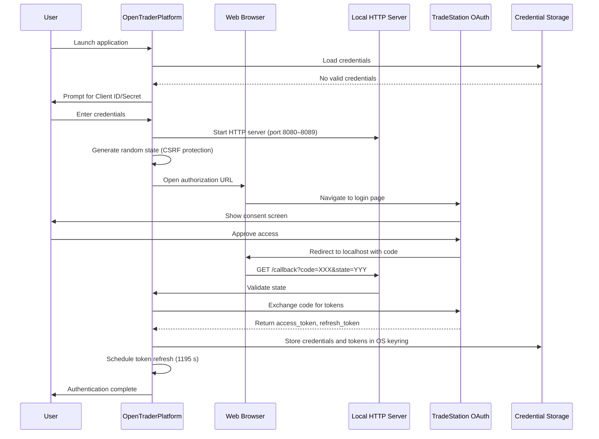
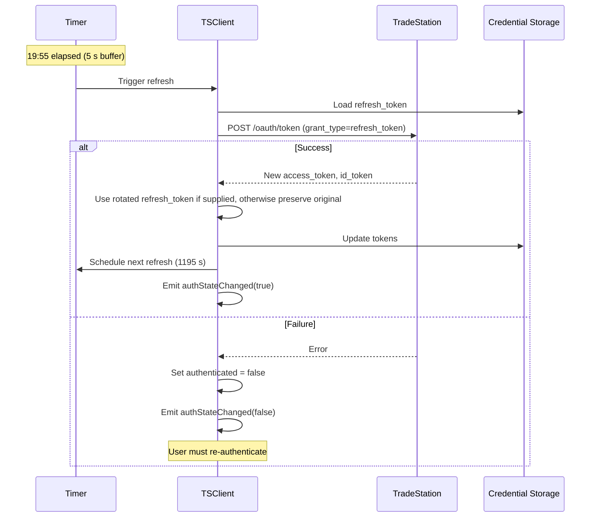

# OpenTraderPlatform Authentication & Security

## Table of Contents

1. [Overview](#overview)
2. [TradeStation OAuth 2.0](#tradestation-oauth-20)
3. [Databento API Key](#databento-api-key)
4. [Token Management](#token-management)
5. [Credential Storage](#credential-storage)
6. [Security Best Practices](#security-best-practices)

## Overview

OpenTraderPlatform uses two separate authentication mechanisms:

| Service | Auth Method | Purpose |
|---------|------------|---------|
| **TradeStation** | OAuth 2.0 Authorization Code Flow | Brokerage: order execution, position/account streaming |
| **Databento** | API key (stored in SecureStorage.ini) | Market data: live Level 2, trades, historical bars, replay downloads |

Credentials must not be committed or logged. OAuth callback query strings, authorization codes, state values, and token response bodies are omitted from authentication logs.

---

## TradeStation OAuth 2.0

### Key Concepts

| Component | Description | Lifetime |
|-----------|-------------|----------|
| **Access Token** | Bearer token for API requests | 20 minutes |
| **Refresh Token** | Long-lived token for obtaining new access tokens | Persistent |
| **Authorization Code** | Temporary code exchanged for tokens | Single use |
| **Client ID & Secret** | Application credentials from TradeStation | Persistent |
| **State Parameter** | Random string for CSRF protection | Per-auth session |

### Required Scopes

TradeStation OAuth scopes requested by OpenTraderPlatform (brokerage operations only — market data now comes from Databento):

```
openid           # OpenID Connect authentication
profile          # User profile information
offline_access   # Enables refresh token issuance
ReadAccount      # Read account information and positions
Trade            # Execute trades and manage orders
```

### Initial Authentication Flow



### Token Refresh Flow

Access tokens expire after 20 minutes and are automatically refreshed 5 seconds before expiry:



> **Important**: TradeStation may return a new refresh token when rotation is enabled. Use the replacement if supplied; preserve the previous token only when the field is absent. An explicitly empty replacement is invalid. A keyring persistence failure is reported as authentication failure, while the replacement remains in memory to avoid losing it during the running session.

---

## Databento API Key

Databento uses a simple API key — no OAuth flow is required.

### Setup

1. Obtain an API key from [app.databento.com](https://app.databento.com)
2. In the OpenTraderPlatform GUI, click the **Databento** connection button in the toolbar
3. Enter the API key in the dialog that appears
4. The key is stored in the native OS keyring.

### Key Storage

The Databento API key is stored as `api_key` under the `Databento` keyring service.

### Connection Lifecycle

```
User enters API key
    │
    ▼
DBClient::connectLive(apiKey, symbol)
    │
    ▼
Databento LiveThreaded starts (internal thread)
    │
    ├── MetadataCallback → ConnectionState::Connected
    │       → subscribeLive(symbol) called
    │
    ├── RecordCallback → newLevel2 / newTrade / newStatus signals
    │
    └── ExceptionCallback → ConnectionState::Reconnecting
            → Databento restarts session (ExceptionAction::Restart)
```

State transitions are emitted via `DBClient::liveConnectionStateChanged(ConnectionState)`.

### Subscription Model

Each `subscribeLive(symbol)` subscribes to three schemas simultaneously:
- `Mbp10` → `newLevel2(symbol, level2)` signal (10-level book)
- `Trades` → `newTrade(symbol, trade)` signal
- `Status` → `newStatus(symbol, isHalted, haltReason, isSsr)` signal

Subscriptions **accumulate** — Databento does not support unsubscribe within a session. To switch symbols, reconnect.

### Gateway Errors

`ErrorMsg` records emit `liveGatewayError(errorText, isFatal)`. Fatal error codes:

| Code | Meaning |
|------|---------|
| 1 | AuthFailed |
| 2 | ApiKeyDeactivated |
| 3 | ConnectionLimitExceeded |
| 5 | InvalidSubscription |

On a fatal error, the GUI shows a `QMessageBox` and the Databento button displays "Databento: Subscription Error" in amber.

---

## Token Management

### AuthToken Class (TradeStation)

Manages OAuth access and refresh tokens:

```cpp
class AuthToken {
public:
    static AuthToken receiveAuthToken(const QJsonObject& json);

    bool isValid() const;                 // Full validation
    bool isValidRefreshedToken() const;   // Validation without refresh_token check
    bool isExpired() const;               // Check with 5 s buffer

    int secondsUntilExpiration() const;
    int secondsToNextRefreshRequest() const;  // expire - 5 s

    static bool storeToSettings(const AuthToken& token);
    static AuthToken loadFromSettings();

    QString getAccessToken() const;
    QString getRefreshToken() const;
    QString getIdToken() const;
};
```

### ClientToken Class (TradeStation)

Manages TradeStation API client credentials:

```cpp
class ClientToken {
public:
    ClientToken(const QString& clientId, const QString& clientSecret);
    bool isValid() const;

    static bool storeToSettings(const ClientToken& token);
    static ClientToken loadFromSettings();
    static void clearSettings();
};
```

---

## Credential Storage

### Optional YubiKey Backend

The **Credentials** GUI tab (formerly Statistics) contains a two-position storage
slider. OS Keyring is the default. Changes take effect only after restart and do
not interrupt existing connections. The stores are independent: no secrets are
copied or deleted when switching, and credentials must be entered separately.
Keyring credentials left behind remain accessible through that keyring.

YubiKey mode uses `ykman otp calculate 2` with a random 64-byte challenge. An
OTP-capable YubiKey must have Slot 2 configured for HMAC-SHA1 challenge-response
with touch required. The app rejects responses without ykman's touch-required
keepalive message; unsupported CLI output fails closed. It never programs the
device. Install the optional `yubikey-manager` package yourself. Back up access
to your service accounts before changing any hardware configuration.

#### One-time hardware setup

The Credentials tab displays these steps with selectable commands in a scrollable
page. Setup is manual; the app does not execute programming commands.

1. Use an OTP-capable YubiKey. FIDO-only Security Key models do not support this
   backend. Install YubiKey Manager (`sudo apt install yubikey-manager` on
   Debian/Ubuntu).
2. Connect only the intended key and run `ykman otp info` to inspect its slots.
   **Stop if Slot 2 is already configured and you do not know what uses it.**
   Replacing it may break another application or make its protected data
   inaccessible. Reuse an existing touch-required HMAC-SHA1 credential only when
   it is intended for this vault.
3. For an unused Slot 2, or one you knowingly intend to replace, run
   `ykman otp chalresp --touch --generate 2` and read its confirmation.
   This programs a random HMAC-SHA1 secret with touch required. **Do not rerun
   this command after creating the vault:** it generates a different secret.
4. The command prints the generated secret. Never paste it into the app, logs,
   screenshots, or support requests. An optional recovery copy must be stored
   securely offline: possession of this secret allows reproducing the vault's
   encryption key without the hardware. It cannot be read back from the YubiKey.
5. Select YubiKey in Credentials and restart the app with the key connected.
   Touch when prompted; use **Unlock / retry YubiKey** after a failed attempt.
6. Log in to TradeStation and enter the Databento API key again as needed. The
   independent vault starts empty; existing keyring credentials remain untouched.

The HMAC response feeds HKDF-SHA256 to derive a 256-bit key. The versioned vault
in the application's config directory, `Credentials.yubikey`, uses AES-256-GCM
with fresh random nonces on every atomic write. The version/challenge/nonce
header is authenticated. The challenge remains stable for the vault so the
cached session key can save refreshed tokens without another touch.

One unlock authorizes both TradeStation and Databento credential storage for the
session. The encryption key and decrypted credentials remain in process memory;
removing the device does not disconnect services, block orders, or prevent
refreshes. This protects the vault at rest, not against a compromised running
process. No access tokens or API keys are logged.

Failed unlocks are not automatically retried by each credential read. Use
**Unlock / retry YubiKey** to try again. There is no fallback to the OS keyring.
Wrong keys, damaged files, missing software, cancellation, and timeouts are
reported. Losing the key or reprogramming Slot 2 may make the vault unrecoverable.
The old branch's `L2Trader/Tokens.ini.enc` format is not migrated.

Qt6Keychain is mandatory in all builds and supplies the default OS Keyring backend.
TradeStation credentials/tokens and the Databento API key use the backend active
for the session. QtKeychain's insecure fallback is disabled for every operation.

TradeStation credentials are saved automatically; there is no save-choice dialog. A failed credential or initial token write prevents authentication from being reported as successful. Refresh tokens are written before other token values so a later write failure does not lose a rotated token. Non-sensitive token metadata remains in QSettings and is updated only after the keyring writes succeed.

On Linux, run within a desktop session with a working, unlocked keyring, such as GNOME Keyring or KWallet. Backend support detection does not guarantee that the keyring is unlocked; individual operation errors and timeouts are logged without sensitive values.

All QtKeychain jobs execute on the Main/GUI thread because QtKeychain 0.14 uses a process-wide job executor. Worker-thread callers synchronously marshal operations to that thread; the GUI event loop must remain running while they wait. Jobs are heap-owned by the application and automatically deleted after completion, including when a caller times out. Async results are delivered on the storage object's thread and dropped if it has been destroyed.

This is a hard cutover: obsolete entries in the application's `SecureStorage.ini` are cleared without decoding or migrating them. Users must re-enter TradeStation and Databento credentials. Backups and historical logs are not erased by this change.

### SecureStorage API

```cpp
class SecureStorage {
public:
    bool storeValuesSync(const QString& service,
                         const QMap<QString, QString>& values,
                         int timeoutMs);

    QMap<QString, QString> retrieveValuesSync(const QString& service,
                                              const QStringList& keys,
                                              int timeoutMs);

    bool deleteValuesSync(const QString& service,
                          const QStringList& keys,
                          int timeoutMs);

    static bool isSecureStorageAvailable();
};
```

---


### GUI Mode Authentication

**TradeStation**:
- Qt dialog (`QInputDialog`) prompts for Client ID/Secret if not stored
- System browser opens automatically to TradeStation authorization page
- Success/error feedback via `QMessageBox`
- Password-masked credential input

**Databento**:
- Toolbar button opens `QInputDialog` for API key entry
- Connection status shown in toolbar button color/text


**TradeStation**:
```
=== TradeStation API Credentials Setup ===

Enter your Client ID: my-client-id-123
Enter your Client Secret (hidden): ********

=== Authentication Required ===

Copy and paste this URL into your browser:
https://signin.tradestation.com/authorize?...

Waiting for callback...
```

- Password masking via `termios` echo disable (Unix)
- Manual URL copy-paste workflow


### Comparison

|---------|----------|----------|
| **TS Credential Input** | QInputDialog | stdin with termios |
| **TS Password Masking** | QLineEdit::Password | termios echo disable |
| **TS Browser** | Automatic (QDesktopServices) | Manual URL |
| **TS Errors** | QMessageBox | stderr output |
| **Databento Key** | Toolbar dialog | CLI argument / env var |

---

## Security Best Practices

### 1. Never Commit Credentials

```gitignore
# .gitignore
*.ini
*SecureStorage*
```

Sensitive values are stored in the OS keyring, not in the repository or application configuration files. Non-sensitive token metadata remains in the user's configuration directory.

### 2. Native Keyring Required

Install `qtkeychain-qt6-dev` to build on Ubuntu/Debian. A working desktop keyring is required at runtime; no insecure file-backed fallback is permitted. The keyring does not protect against a compromised application or an attacker with access to the unlocked desktop session.

### 3. Token Rotation

- TradeStation access tokens expire every 20 minutes
- Automatic refresh 5 seconds before expiry
- Refresh tokens are long-lived but can be revoked via TradeStation developer portal

### 4. CSRF Protection

```cpp
// Generate random state
QString state;
for (int i = 0; i < 32; ++i)
    state += QChar('A' + QRandomGenerator::global()->bounded(26));

// Validate on callback
if (receivedState != expectedState) {
    qCCritical() << "CSRF attack detected — rejecting auth callback";
    return;
}
```

### 5. Minimal Scopes

Only brokerage scopes are requested. Market data scopes (`MarketData`, `Matrix`) are NOT requested because Databento handles all market data.

### 6. Thread Safety

All token operations run exclusively on the TSClient thread:
```cpp
OBJ_ASSUME_EQUAL(QThread::currentThread(), &m_thread);
```

### 7. Error Handling

| Error | Severity | Action |
|-------|----------|--------|
| Port binding failure | Recoverable | Try next port (8080–8089) |
| State mismatch | Critical | Reject auth callback |
| Token exchange failure | Recoverable | Show error dialog, retry |
| Token refresh failure | Degraded | Emit authStateChanged(false), require re-auth |
| Storage failure | Warning | Use in-memory only |
| Databento auth failed | Fatal | Show QMessageBox, stop connection |

### 8. Logging Categories

```cpp
Q_LOGGING_CATEGORY(TSAuthTokenLog,   "TSClient.token.auth")
Q_LOGGING_CATEGORY(TSAuthWindowLog,  "TSClient.authwindow")
Q_LOGGING_CATEGORY(tsClientToken,    "TSClient.token.client")
Q_LOGGING_CATEGORY(secureStorage,    "SecureStorage")
Q_LOGGING_CATEGORY(dbClientLog,      "DBClient")
```

Sensitive data (tokens, API keys) is **never** logged.

---

## Related Documentation

- [ARCHITECTURE.md](ARCHITECTURE.md) — Overall system architecture and threading
- [DEVELOPMENT.md](DEVELOPMENT.md) — Development setup and build instructions
- [CONTRIBUTING.md](CONTRIBUTING.md) — Contribution guidelines

## References

- TradeStation OAuth Guide: https://api.tradestation.com/docs/fundamentals/authentication/auth-overview
- OAuth 2.0 RFC: https://datatracker.ietf.org/doc/html/rfc6749
- Databento API documentation: https://databento.com/docs
