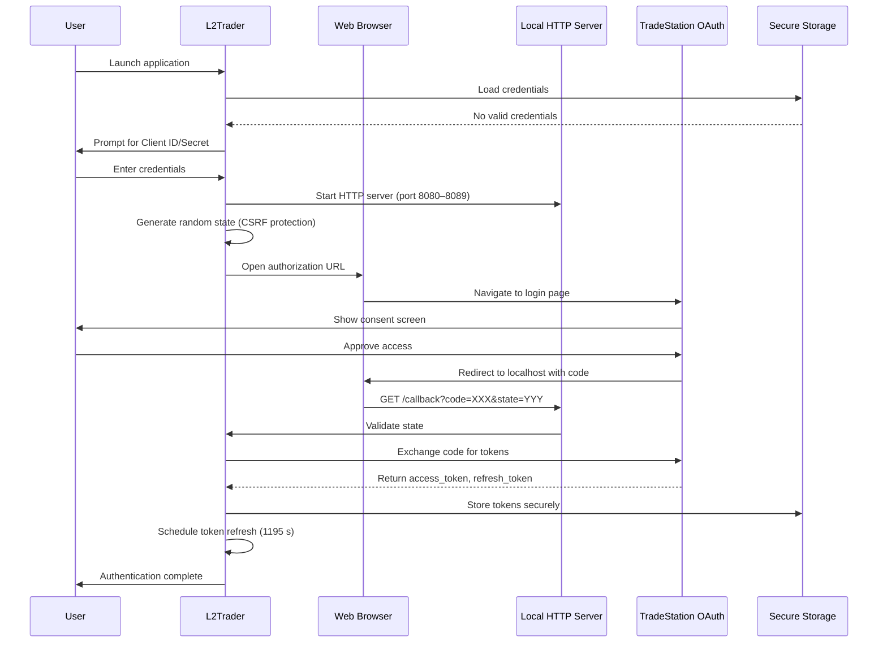
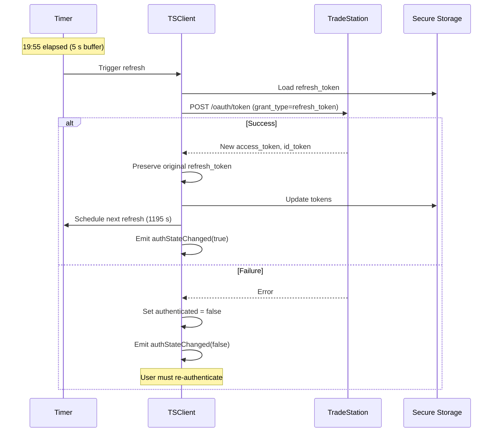

# L2Trader Authentication & Security

## Table of Contents

1. [Overview](#overview)
2. [TradeStation OAuth 2.0](#tradestation-oauth-20)
3. [Databento API Key](#databento-api-key)
4. [Token Management](#token-management)
5. [Secure Storage](#secure-storage)
6. [GUI vs TUI Mode](#gui-vs-tui-mode)
7. [Security Best Practices](#security-best-practices)

## Overview

L2Trader uses two separate authentication mechanisms:

| Service | Auth Method | Purpose |
|---------|------------|---------|
| **TradeStation** | OAuth 2.0 Authorization Code Flow | Brokerage: order execution, position/account streaming |
| **Databento** | API key (stored in SecureStorage.ini) | Market data: live Level 2, trades, historical bars, replay downloads |

Neither mechanism ever exposes credentials in logs or source code.

---

## TradeStation OAuth 2.0

### Key Concepts

| Component | Description | Lifetime |
|-----------|-------------|----------|
| **Access Token** | Bearer token for API requests | 20 minutes |
| **Refresh Token** | Long-lived token for obtaining new access tokens | Persistent |
| **Authorization Code** | Temporary code exchanged for tokens | Single use |
| **Client ID & Secret** | Application credentials from TradeStation | Persistent |
| **State Parameter** | Random string for CSRF protection | Per-auth session |

### Required Scopes

TradeStation OAuth scopes requested by L2Trader (brokerage operations only — market data now comes from Databento):

```
openid           # OpenID Connect authentication
profile          # User profile information
offline_access   # Enables refresh token issuance
ReadAccount      # Read account information and positions
Trade            # Execute trades and manage orders
```

### Initial Authentication Flow



### Token Refresh Flow

Access tokens expire after 20 minutes and are automatically refreshed 5 seconds before expiry:



> **Important**: TradeStation does NOT return a new refresh_token during refresh operations. The original refresh_token must be preserved across refreshes.

---

## Databento API Key

Databento uses a simple API key — no OAuth flow is required.

### Setup

1. Obtain an API key from [app.databento.com](https://app.databento.com)
2. In the L2Trader GUI, click the **Databento** connection button in the toolbar
3. Enter the API key in the dialog that appears
4. The key is stored securely (see [Secure Storage](#secure-storage) below)

### Key Storage

Databento API key is stored under `[Databento]/api_key` in `SecureStorage.ini` using XOR obfuscation (same mechanism as the fallback for OAuth tokens when QKeychain is unavailable).

### Connection Lifecycle

```
User enters API key
    │
    ▼
DBClient::connectLive(apiKey, symbol)
    │
    ▼
Databento LiveThreaded starts (internal thread)
    │
    ├── MetadataCallback → ConnectionState::Connected
    │       → subscribeLive(symbol) called
    │
    ├── RecordCallback → newLevel2 / newTrade / newStatus signals
    │
    └── ExceptionCallback → ConnectionState::Reconnecting
            → Databento restarts session (ExceptionAction::Restart)
```

State transitions are emitted via `DBClient::liveConnectionStateChanged(ConnectionState)`.

### Subscription Model

Each `subscribeLive(symbol)` subscribes to three schemas simultaneously:
- `Mbp10` → `newLevel2(symbol, level2)` signal (10-level book)
- `Trades` → `newTrade(symbol, trade)` signal
- `Status` → `newStatus(symbol, isHalted, haltReason, isSsr)` signal

Subscriptions **accumulate** — Databento does not support unsubscribe within a session. To switch symbols, reconnect.

### Gateway Errors

`ErrorMsg` records emit `liveGatewayError(errorText, isFatal)`. Fatal error codes:

| Code | Meaning |
|------|---------|
| 1 | AuthFailed |
| 2 | ApiKeyDeactivated |
| 3 | ConnectionLimitExceeded |
| 5 | InvalidSubscription |

On a fatal error, the GUI shows a `QMessageBox` and the Databento button displays "Databento: Subscription Error" in amber.

---

## Token Management

### AuthToken Class (TradeStation)

Manages OAuth access and refresh tokens:

```cpp
class AuthToken {
public:
    static AuthToken receiveAuthToken(const QJsonObject& json);

    bool isValid() const;                 // Full validation
    bool isValidRefreshedToken() const;   // Validation without refresh_token check
    bool isExpired() const;               // Check with 5 s buffer

    int secondsUntilExpiration() const;
    int secondsToNextRefreshRequest() const;  // expire - 5 s

    static bool storeToSettings(const AuthToken& token);
    static AuthToken loadFromSettings();

    QString getAccessToken() const;
    QString getRefreshToken() const;
    QString getIdToken() const;
};
```

### ClientToken Class (TradeStation)

Manages TradeStation API client credentials:

```cpp
class ClientToken {
public:
    ClientToken(const QString& clientId, const QString& clientSecret);
    bool isValid() const;

    static bool storeToSettings(const ClientToken& token);
    static ClientToken loadFromSettings();
    static void clearSettings();
};
```

---

## Secure Storage

L2Trader uses a two-tier secure storage system for sensitive credentials.

### Primary: QKeychain (OS-Level Encryption)

When QKeychain is available (recommended for production):

| Platform | Storage Backend | Encryption |
|----------|----------------|------------|
| **Linux** | GNOME Keyring / KWallet | libsecret |
| **macOS** | macOS Keychain | OS-managed |
| **Windows** | Credential Manager | DPAPI |

Build with QKeychain support:
```bash
sudo apt-get install libqtkeychain-qt6-dev   # Ubuntu/Debian
brew install qtkeychain                       # macOS
```

### Fallback: Obfuscated QSettings

When QKeychain is unavailable (development only):

```cpp
// XOR-based obfuscation (NOT secure encryption)
QByteArray key = QCryptographicHash::hash("L2TraderSecureStorage",
                                          QCryptographicHash::Sha256);
for (int i = 0; i < data.size(); ++i)
    data[i] = data[i] ^ key[i % key.size()];
```

> **Warning**: XOR obfuscation is NOT secure encryption. Always compile with QKeychain for any environment where security matters.

### What Is Stored Where

```
Sensitive (OS-encrypted via QKeychain):
    access_token, refresh_token, id_token
    client_id, client_secret

Non-sensitive metadata (plain QSettings):
    token_type: Bearer
    scope: permissions list
    expires_in: 1200
    received_at: timestamp

Databento key (SecureStorage.ini — XOR obfuscated):
    [Databento]
    api_key = <obfuscated>
```

### SecureStorage API

```cpp
class SecureStorage {
public:
    bool storeValuesSync(const QString& service,
                         const QMap<QString, QString>& values,
                         int timeoutMs);

    QMap<QString, QString> retrieveValuesSync(const QString& service,
                                              const QStringList& keys,
                                              int timeoutMs);

    bool deleteValuesSync(const QString& service,
                          const QStringList& keys,
                          int timeoutMs);

    static bool isSecureStorageAvailable();
};
```

---

## GUI vs TUI Mode

### GUI Mode Authentication

**TradeStation**:
- Qt dialog (`QInputDialog`) prompts for Client ID/Secret if not stored
- System browser opens automatically to TradeStation authorization page
- Success/error feedback via `QMessageBox`
- Password-masked credential input

**Databento**:
- Toolbar button opens `QInputDialog` for API key entry
- Connection status shown in toolbar button color/text

### TUI Mode Authentication

**TradeStation**:
```
=== TradeStation API Credentials Setup ===

Enter your Client ID: my-client-id-123
Enter your Client Secret (hidden): ********

Save credentials? (y/N): y

=== Authentication Required ===

Copy and paste this URL into your browser:
https://signin.tradestation.com/authorize?...

Waiting for callback...
```

- Password masking via `termios` echo disable (Unix)
- Manual URL copy-paste workflow
- All prompts on `stderr` (keeps ncurses TUI clean)

**Databento** (TUI):
- API key provided via command-line argument or environment variable (TUI mode has no interactive API key dialog)

### Comparison

| Feature | GUI Mode | TUI Mode |
|---------|----------|----------|
| **TS Credential Input** | QInputDialog | stdin with termios |
| **TS Password Masking** | QLineEdit::Password | termios echo disable |
| **TS Browser** | Automatic (QDesktopServices) | Manual URL |
| **TS Errors** | QMessageBox | stderr output |
| **Databento Key** | Toolbar dialog | CLI argument / env var |
| **Dependencies** | Qt Widgets | Qt Core + ncurses only |

---

## Security Best Practices

### 1. Never Commit Credentials

```gitignore
# .gitignore
*.ini
*SecureStorage*
```

All sensitive data stored outside the repository in OS-managed locations.

### 2. Compile with QKeychain

```cmake
find_package(Qt6Keychain REQUIRED)
target_link_libraries(L2Trader PRIVATE Qt6Keychain)
target_compile_definitions(L2Trader PRIVATE QT_KEYCHAIN_LIB)
```

### 3. Token Rotation

- TradeStation access tokens expire every 20 minutes
- Automatic refresh 5 seconds before expiry
- Refresh tokens are long-lived but can be revoked via TradeStation developer portal

### 4. CSRF Protection

```cpp
// Generate random state
QString state;
for (int i = 0; i < 32; ++i)
    state += QChar('A' + QRandomGenerator::global()->bounded(26));

// Validate on callback
if (receivedState != expectedState) {
    qCCritical() << "CSRF attack detected — rejecting auth callback";
    return;
}
```

### 5. Minimal Scopes

Only brokerage scopes are requested. Market data scopes (`MarketData`, `Matrix`) are NOT requested because Databento handles all market data.

### 6. Thread Safety

All token operations run exclusively on the TSClient thread:
```cpp
OBJ_ASSUME_EQUAL(QThread::currentThread(), &m_thread);
```

### 7. Error Handling

| Error | Severity | Action |
|-------|----------|--------|
| Port binding failure | Recoverable | Try next port (8080–8089) |
| State mismatch | Critical | Reject auth callback |
| Token exchange failure | Recoverable | Show error dialog, retry |
| Token refresh failure | Degraded | Emit authStateChanged(false), require re-auth |
| Storage failure | Warning | Use in-memory only |
| Databento auth failed | Fatal | Show QMessageBox, stop connection |

### 8. Logging Categories

```cpp
Q_LOGGING_CATEGORY(TSAuthTokenLog,   "TSClient.token.auth")
Q_LOGGING_CATEGORY(TSAuthWindowLog,  "TSClient.authwindow")
Q_LOGGING_CATEGORY(tsClientToken,    "TSClient.token.client")
Q_LOGGING_CATEGORY(secureStorage,    "SecureStorage")
Q_LOGGING_CATEGORY(dbClientLog,      "DBClient")
```

Sensitive data (tokens, API keys) is **never** logged.

---

## Related Documentation

- [ARCHITECTURE.md](ARCHITECTURE.md) — Overall system architecture and threading
- [DEVELOPMENT.md](DEVELOPMENT.md) — Development setup and build instructions
- [CONTRIBUTING.md](CONTRIBUTING.md) — Contribution guidelines

## References

- TradeStation OAuth Guide: https://api.tradestation.com/docs/fundamentals/authentication/auth-overview
- OAuth 2.0 RFC: https://datatracker.ietf.org/doc/html/rfc6749
- Databento API documentation: https://databento.com/docs
- Qt QKeychain: https://github.com/frankosterfeld/qtkeychain
