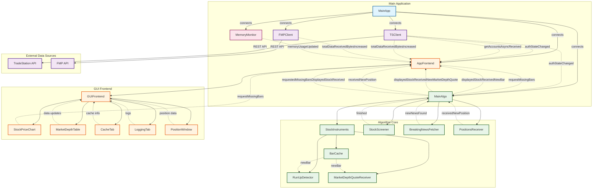

# Trading Algorithm Application Architecture

## Key Signal/Slot Interactions

### Authentication & Data Flow
- **TSClient** ↔ **MainAlgo**: Authentication state changes trigger algorithm initialization
- **TSClient** ↔ **AppFrontend**: Account data and authentication status updates UI
- **FMPClient** ↔ **AppFrontend**: Financial data usage monitoring

### Market Data Pipeline
- **MainAlgo** → **AppFrontend**: New bars and market depth quotes for display
- **AppFrontend** → **MainAlgo**: Requests for missing historical data
- **StockPriceChart** → **AppFrontend**: Zoom/pan requests trigger data fetching

### Internal Algorithm Communication
- **StockScreener** → **MainAlgo**: Stock selection results
- **BreakingNewsFetcher** → **MainAlgo**: News events for analysis
- **PositionsReceiver** → **MainAlgo**: Real-time position updates
- **BarCache** → **RunUpDetector/MarketDepthQuoteReceiver**: Bar data for analysis

### GUI Updates
- **MemoryMonitor** → **AppFrontend**: System resource monitoring
- **MainAlgo** → **GUIFrontend**: Position updates and market data
- **GUIFrontend** → **UI Components**: Data distribution to charts and tables

## Architecture Overview

The application follows a **Model-View-Controller** pattern with Qt's signal/slot mechanism:

1. **Data Sources** (TSClient, FMPClient): Handle external API communications
2. **Business Logic** (MainAlgo): Processes data and executes trading algorithms
3. **Presentation** (AppFrontend/GUIFrontend): Manages user interface and data visualization
4. **Monitoring** (MemoryMonitor): System resource tracking

All components communicate asynchronously through Qt's signal/slot system, ensuring thread-safe data flow and loose coupling between modules.