# Trading Algorithm Application Architecture

```mermaid
graph TD
    subgraph "Main Application"
        MA[MainApp] -->|singleton| TS[TSClient]
        MA -->|singleton| MAL[MainAlgo]
        MA -->|creates| AF[AppFrontend]
        MA -->|creates| MM[MemoryMonitor]
    end

    subgraph "External Data Sources"
        TS -->|REST API & Streaming| TS_API[TradeStation API]
    end

    subgraph "Algorithm Core"
        MAL --> SI[StockInstruments]
        SI --> BC[BarCache]
        SI --> MDQR[MarketDepthQuoteReceiver]
        MAL --> PR[PositionsReceiver]
        MAL --> OR[OrdersReceiver]
    end

    subgraph "GUI Frontend"
        AF --> GFW[GUIFrontend]
        GFW --> SPC[StockPriceChart]
        GFW --> MDT[MarketDepthTable]
        GFW --> CT[CacheTab]
        GFW --> LT[LoggingTab]
        GFW --> RT[RecorderTab]
        GFW --> PW[PositionWindow]
        GFW --> OW[OrderWindow]
        GFW --> BW[BalanceWindow]
        GFW --> OEW[OrderEntryWidget]
    end

    %% Signal/Slot Connections
    TS -.->|authStateChanged| AF
    TS -.->|authStateChanged| MAL
    TS -.->|totalDataReceivedBytesIncreased| AF
    TS -.->|openStreamCountChanged| AF
    MM -.->|memoryUsageUpdated| AF

    MAL -.->|tradeStationAccountsReceived| AF
    MAL -.->|displayedStockReceivedNewBar| AF
    MAL -.->|displayedStockReceivedNewMarketDepthQuote| AF
    MAL -.->|receivedNewPosition| AF
    MAL -.->|positionDeleted| AF
    MAL -.->|receivedNewOrder| AF
    MAL -.->|balanceUpdated| AF

    GFW -.->|onSelectDisplayedStock| MAL
    SPC -.->|requestMissingBars| GFW
    GFW -.->|forwards to| MAL

    %% Internal Algorithm Connections
    PR -.->|receivedNewPosition| MAL
    OR -.->|receivedNewOrder| MAL

    %% GUI Component Interactions
    MDT -.->|displays data| GFW
    CT -.->|cache management| GFW
    LT -.->|log display| GFW
    RT -.->|recording controls| GFW
    PW -.->|position data| GFW
    OW -.->|order data| GFW
    BW -.->|balance data| GFW
    OEW -.->|order placement| GFW

    %% Styling
    classDef mainApp fill:#e1f5fe,stroke:#01579b,stroke-width:2px
    classDef clients fill:#f3e5f5,stroke:#4a148c,stroke-width:2px
    classDef algo fill:#e8f5e8,stroke:#1b5e20,stroke-width:2px
    classDef gui fill:#fff3e0,stroke:#e65100,stroke-width:2px
    classDef external fill:#fce4ec,stroke:#880e4f,stroke-width:2px

    class MA mainApp
    class TS,TS_API clients
    class MAL,SI,BC,RUD,MDQR,PR,OR algo
    class AF,GFW,SPC,MDT,CT,LT,RT,PW,OW,BW,OEW gui
    class MM external
```

## Key Signal/Slot Interactions

### Authentication & Data Flow
- **TSClient** ↔ **MainAlgo**: Authentication state changes trigger algorithm initialization
- **TSClient** ↔ **AppFrontend**: Authentication status and data usage updates UI
- **TSClient**: REST API client and streaming data handler for TradeStation

### Market Data Pipeline
- **MainAlgo** → **AppFrontend**: New bars and market depth quotes for display
- **GUIFrontend** → **MainAlgo**: Symbol selection and missing bar requests
- **StockPriceChart** → **GUIFrontend** → **MainAlgo**: Zoom/pan requests trigger historical data fetching via BarCache

### Internal Algorithm Communication
- **PositionsReceiver** → **MainAlgo**: Real-time position updates from stream
- **OrdersReceiver** → **MainAlgo**: Real-time order updates from stream
- **StockInstruments**: Contains BarCache and MarketDepthQuoteReceiver per symbol
- **BarCache**: Manages bar data with memory and SQLite caching

### Trading Operations
- **MainAlgo**: Manages balance polling via timer
- **OrderEntryWidget** → **TSClient**: Order placement requests
- **PositionsReceiver/OrdersReceiver**: Stream-based real-time updates
- **BalanceWindow**: Displays account balance information

### GUI Updates
- **MemoryMonitor** → **AppFrontend**: System resource monitoring
- **MainAlgo** → **GUIFrontend**: Position, order, balance, and market data updates
- **GUIFrontend** → **UI Components**: Data distribution to charts, tables, and widgets

## Architecture Overview

The application follows a **Model-View-Controller** pattern with Qt's signal/slot mechanism:

1. **Data Source** (TSClient): Handles TradeStation REST API and streaming connections
   - Singleton pattern for centralized API access
   - Runs in separate QThread for async operations
   - OAuth 2.0 authentication with automatic token refresh
2. **Business Logic** (MainAlgo): Processes market data and manages trading state
   - Singleton pattern for centralized algorithm control
   - Runs in separate QThread
   - Per-symbol StockInstruments with BarCache and MarketDepthQuoteReceiver
   - Manages PositionsReceiver and OrdersReceiver streams
   - Balance polling with configurable timer
3. **Presentation** (AppFrontend/GUIFrontend): Manages user interface and data visualization
   - Runs in main GUI thread
   - Multiple specialized windows and widgets for different views
   - CacheTab, LoggingTab, RecorderTab for developer/debug features
4. **Monitoring** (MemoryMonitor): System resource tracking
   - Reports memory usage to frontend

All components communicate asynchronously through Qt's signal/slot system, ensuring thread-safe data flow and loose coupling between modules. TSClient and MainAlgo are singletons accessed via `getInstance()` methods.