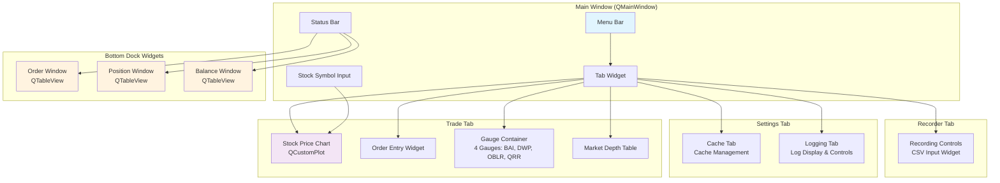
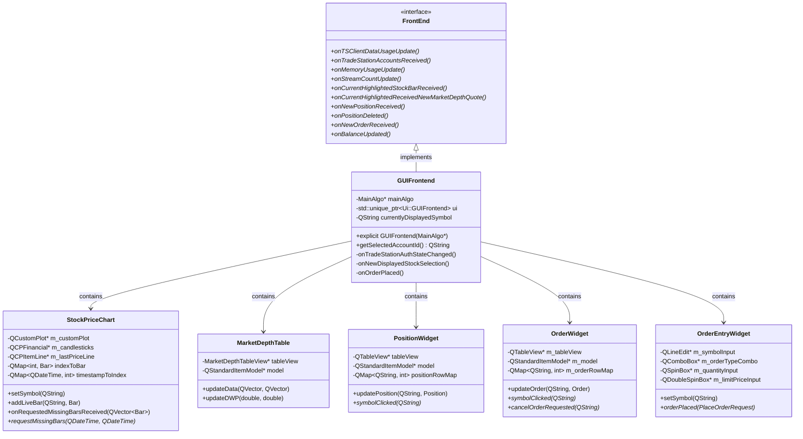
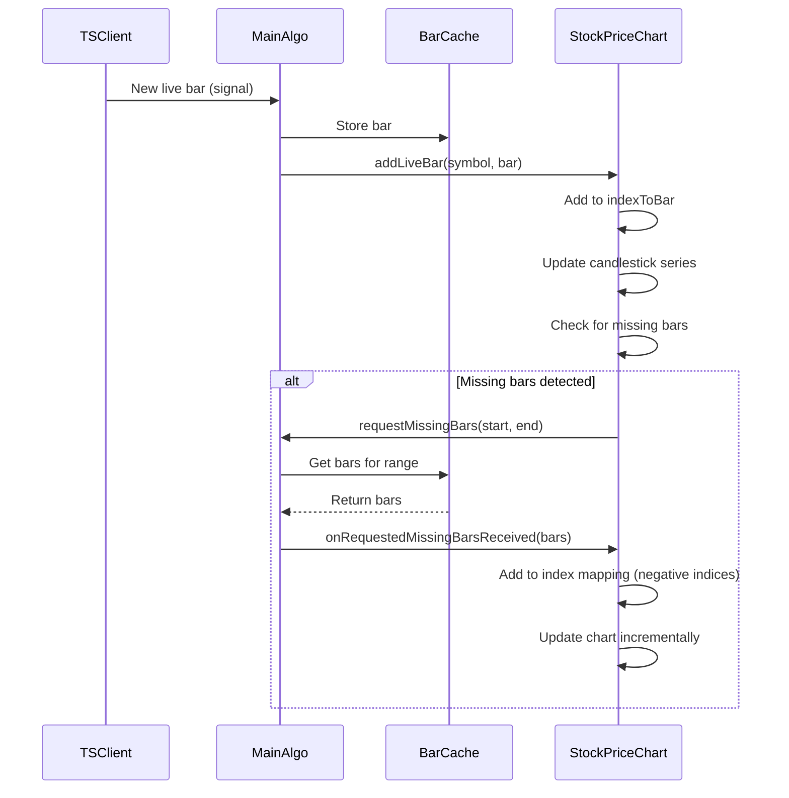
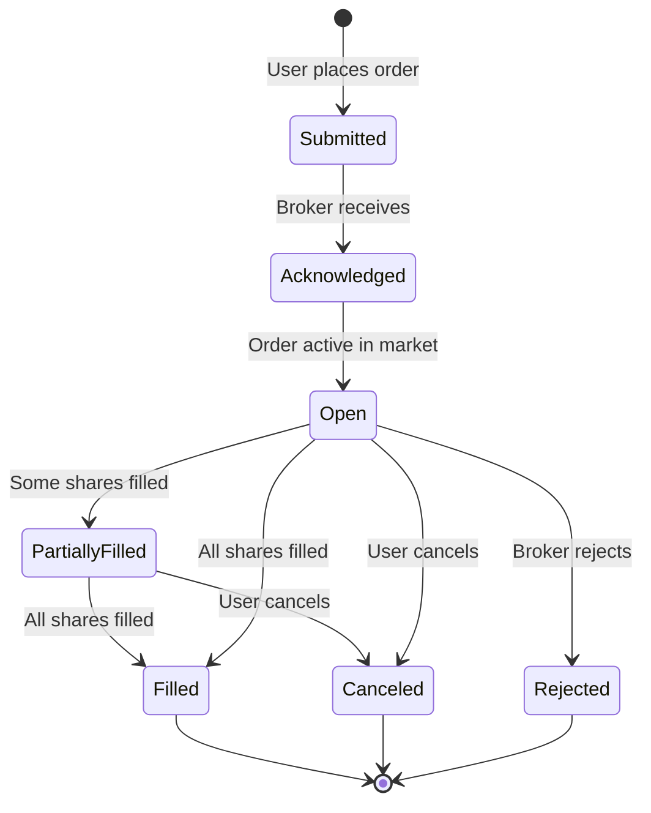

# L2Trader Frontend Architecture

## Table of Contents

1. [Overview](#overview)
2. [Frontend Abstraction](#frontend-abstraction)
3. [GUI Implementation](#gui-implementation)
4. [TUI Implementation](#tui-implementation)
5. [Stock Price Chart](#stock-price-chart)
6. [Market Depth Display](#market-depth-display)
7. [Order & Position Management](#order--position-management)

## Overview

L2Trader provides two frontend implementations for different use cases:

- **GUI (Graphical User Interface)**: Full-featured Qt Widgets desktop application
- **TUI (Text User Interface)**: Lightweight ncurses terminal application for headless servers

Both implementations share the same backend logic and conform to a common interface defined by the abstract `FrontEnd` base class.

## Frontend Abstraction

### FrontEnd Base Class

```cpp
class FrontEnd : public QObject {
    Q_OBJECT

signals:
    // User actions
    void selectedDisplayedStock(const QString& symbol);

public slots:
    // Data updates from backend
    virtual void onTSClientDataUsageUpdate(qsizetype bytes) = 0;
    virtual void onTradeStationAccountsReceived(const QVector<Account>& accounts) = 0;
    virtual void onMemoryUsageUpdate(qsizetype bytes) = 0;
    virtual void onStreamCountUpdate(int count) = 0;
    virtual void onCurrentHighlightedStockBarReceived(const QString& symbol, const Bar& bar) = 0;
    virtual void onCurrentHighlightedReceivedNewMarketDepthQuote(
        const QString& symbol, 
        const MarketDepthQuote& quote,
        double dwp, double bidTotalVol, double askTotalVol) = 0;
    virtual void onNewPositionReceived(const QString& accountId, const Position& position) = 0;
    virtual void onPositionDeleted(const QString& accountId, const QString& positionId) = 0;
    virtual void onNewOrderReceived(const QString& accountId, const Order& order) = 0;
    virtual void onBalanceUpdated(const Balance& balance) = 0;
};
```

### Build-Time Selection

```cmake
# CMakeLists.txt
option(ENABLE_GUI "Enable GUI frontend (Qt Widgets)" ON)

if(ENABLE_GUI)
    target_compile_definitions(L2Trader PRIVATE GUI_ENABLED)
    # Include GUI-specific files
else()
    # Include TUI-specific files
endif()
```

```cpp
// main.cpp
#ifdef GUI_ENABLED
    FrontEnd* frontend = new GUIFrontend(&mainAlgo);
#else
    FrontEnd* frontend = new TUIFrontend(&mainAlgo);
    static_cast<TUIFrontend*>(frontend)->initialize();
#endif
```

## GUI Implementation

### Window Layout



### Component Hierarchy



### Key Components

#### 1. StockPriceChart

Real-time candlestick chart using QCustomPlot library.

**Features**:
- Live bar updates with bidirectional index system
- Historical data loading on pan/zoom
- Session background rectangles (pre-market, after-hours)
- Last price line with label
- Volume bars (positive/negative)
- Market hours indicators

**Interaction**:
- **Ctrl + Shift + Scroll**: Vertical panning
- **Alt + Scroll**: Horizontal panning
- **Ctrl + Scroll**: Horizontal zoom
- **Shift + Scroll**: Vertical zoom
- **Scroll**: Both axes zoom
- **Right Click**: Reset to last 30 bars

**Data Structure**:
```cpp
// Bidirectional index system
QMap<int, Bar> indexToBar;               // Index → Bar
QMap<QDateTime, int> timestampToIndex;   // Timestamp → Index

// Origin bar (first received) at index 0:
// Future bars: 1, 2, 3, 4...
// Historical bars: -1, -2, -3, -4...
```

**Performance**:
- O(m) complexity for inserting m historical bars
- No full rebuild required
- Efficient missing bar detection

#### 2. MarketDepthTable

Level 2 market depth display showing bid/ask order book.

**Display**:
```
Bid Price | Bid Size | Bid Count || Ask Price | Ask Size | Ask Count
-----------------------------------------------------------------
  $99.95  |   1,500  |     5     ||   $100.05 |   2,000  |     8
  $99.90  |   2,200  |     9     ||   $100.10 |   1,800  |     6
  $99.85  |   1,000  |     3     ||   $100.15 |   3,500  |    12
```

**Metrics**:
- **Spread**: Ask - Bid
- **DWP (Depth-Weighted Price)**: Order book imbalance indicator

#### 3. PositionWidget

Real-time position tracking with P/L calculations.

**Columns**:
- Symbol
- Quantity
- Average Price
- Last Price
- P/L (dollars, color-coded)
- P/L %
- Market Value

**Color Coding**:
- 🟢 Green: Profitable (P/L > 0)
- 🔴 Red: Loss (P/L < 0)
- ⚪ White: Break-even (P/L = 0)

#### 4. OrderWidget

Order management and status tracking.

**Columns**:
- Order ID
- Symbol
- Action (Buy, Sell, etc.)
- Quantity
- Type (Market, Limit, etc.)
- Price
- DateTime
- Status (ACK, Open, Filled, Canceled)

**Features**:
- Click symbol to auto-populate chart
- Context menu for order cancellation
- Real-time status updates

#### 5. OrderEntryWidget

Order placement interface.

**Fields**:
- Account selection (dropdown)
- Symbol input
- Trade action (Buy/Sell radio buttons)
- Order type (Market, Limit, Stop, etc.)
- Quantity
- Sticky controls (separate row, visible for Limit/Stop Limit orders):
  - **Sticky checkbox**: Enable auto-price tracking
  - **Aggressive/Passive radio buttons**: Choose fill strategy
  - **Price offset spinbox**: Adds buffer ($0.00-$10.00) to best bid/ask
- Limit price (if applicable)
- Time in force (Day, GTC)

**Validation**:
- Required fields check
- Price validation for limit orders
- Quantity must be positive

**Sticky Limit Price Feature**:

The sticky price feature automatically updates the limit price based on real-time Level 2 market depth data, with two distinct modes for different trading strategies.

*When to Use*:
- Pre-market or after-hours trading when market orders may not be accepted
- Wanting to guarantee fills with minimal slippage (Aggressive mode)
- Trying to get better prices by entering on the bid/ask (Passive mode)
- Needing to stay competitive with dynamic bid/ask spreads

*Two Modes*:

**Aggressive Mode** (Default):
- **Buy**: Limit price = Best Ask + Offset (crosses spread for guaranteed fill)
- **Sell**: Limit price = Best Bid - Offset (crosses spread for guaranteed fill)
- Use when you want immediate execution and are willing to pay/accept current market prices
- Mimics market order behavior during pre-market/after-hours

**Passive Mode**:
- **Buy**: Limit price = Best Bid + Offset (enters on bid, may not fill immediately)
- **Sell**: Limit price = Best Ask - Offset (enters on ask, may not fill immediately)
- Use when you want better prices and are patient
- Risk: May not get filled if market moves away

*How it Works*:
- Price updates automatically on every market depth quote
- Visual green flash indicates automatic price update
- Recalculates when trade action, mode, or offset changes

*Configuration*:
1. Select Limit or Stop Limit order type
2. Check the "Sticky" checkbox
3. Select mode:
   - **Aggressive**: For guaranteed fills (cross the spread)
   - **Passive**: For better prices (enter on bid/ask)
4. Set desired price offset (default: $0.00)
   - $0.00: Match best bid/ask exactly
   - $0.01-$0.05: Small buffer for better fills
   - $0.10+: Larger buffer for volatile stocks
5. Limit price auto-updates as market depth changes

*Behavior*:
- User can manually override (will be overwritten on next update)
- State persists across application restarts
- Only visible for Limit and Stop Limit order types

*Safety*:
- Prevents negative prices (minimum $0.01)
- Handles all trade actions (Buy, Sell, BuyToCover, etc.)
- Uses last known value if market depth unavailable

#### 6. Tabs

**Cache Tab**:
- View bar cache status per symbol
- Clear cache (selected or all)
- Disk usage statistics

**Logging Tab**:
- Live log display (QTextEdit)
- Category checkboxes for filtering
- Runtime log level control

**Recorder Tab**:
- Start/stop recording
- CSV file input for stock list
- Recording status display

### Keyboard Shortcuts

Managed by ShortcutSettings singleton:

```cpp
QKeySequence::Quit           # Ctrl+Q - Quit application
QKeySequence::Refresh        # F5 - Refresh display
QKeySequence::Close          # Ctrl+W - Close window
// Custom shortcuts configurable per user
```

### Dark Theme

```cpp
void setupDarkTheme(QMainWindow* window) {
    // Custom dark color scheme
    QPalette palette;
    palette.setColor(QPalette::Window, QColor(53, 53, 53));
    palette.setColor(QPalette::WindowText, Qt::white);
    palette.setColor(QPalette::Base, QColor(25, 25, 25));
    palette.setColor(QPalette::AlternateBase, QColor(53, 53, 53));
    palette.setColor(QPalette::Text, Qt::white);
    palette.setColor(QPalette::Button, QColor(53, 53, 53));
    palette.setColor(QPalette::ButtonText, Qt::white);
    palette.setColor(QPalette::Highlight, QColor(142, 45, 197));
    window->setPalette(palette);
}
```

## TUI Implementation

### Window Layout

```
┌─────────────────────────────────────────┐
│         ORDERS WINDOW (top 40%)         │
│  Order ID | Symbol | Action | Qty | ... │
│  abc123   | AAPL   | Buy    | 100 | ... │
│  def456   | MSFT   | Sell   | 50  | ... │
├─────────────────────────────────────────┤
│        POSITIONS WINDOW (middle 40%)    │
│ Symbol | Qty | Avg $ | Last $ | P/L | % │
│  AAPL  | 100 |$150.00|$155.00|+$500|+3.3│
├─────────────────────────────────────────┤
│         STATUS BAR (height 2)           │
│ Data: 1.2MB | Memory: 45MB | Streams: 3 │
├─────────────────────────────────────────┤
│         HELP BAR (height 1)             │
│ q:Quit | r:Refresh | ?:Help             │
└─────────────────────────────────────────┘
```

### TUIFrontend Implementation

```cpp
class TUIFrontend : public FrontEnd {
    Q_OBJECT

public:
    explicit TUIFrontend(MainAlgo* p_mainAlgo, QObject* parent = nullptr);
    ~TUIFrontend();

    void initialize();  // Must be called after constructor

    // FrontEnd interface implementation
    void onNewOrderReceived(const QString& accountId, const Order& order) override;
    void onNewPositionReceived(const QString& accountId, const Position& position) override;
    void onPositionDeleted(const QString& accountId, const QString& positionId) override;
    void onTSClientDataUsageUpdate(qsizetype bytes) override;
    void onMemoryUsageUpdate(qsizetype bytes) override;
    void onStreamCountUpdate(int count) override;
    
    // Not implemented in minimal TUI
    void onTradeStationAccountsReceived(const QVector<Account>&) override {}
    void onCurrentHighlightedStockBarReceived(const QString&, const Bar&) override {}
    void onCurrentHighlightedReceivedNewMarketDepthQuote(...) override {}
    void onBalanceUpdated(const Balance&) override {}

private:
    MainAlgo* m_mainAlgo;
    
    // ncurses windows
    WINDOW* m_ordersWindow;
    WINDOW* m_positionsWindow;
    WINDOW* m_statusWindow;
    WINDOW* m_helpWindow;
    
    // Data storage
    QHash<QString, Order> m_orders;           // OrderID → Order
    QHash<QString, Position> m_positions;     // PositionID → Position
    
    // Status metrics
    qsizetype m_dataUsage;
    qsizetype m_memoryUsage;
    int m_streamCount;
    
    // Input handling
    QSocketNotifier* m_inputNotifier;
    
    void setupNcurses();
    void cleanupNcurses();
    void createWindows();
    void destroyWindows();
    void refreshDisplay();
    void drawOrders();
    void drawPositions();
    void drawStatus();
    void drawHelp();
    void handleInput();
};
```

### Key Features

#### Input Handling

Integration with Qt event loop:

```cpp
// QSocketNotifier monitors stdin
m_inputNotifier = new QSocketNotifier(STDIN_FILENO, QSocketNotifier::Read, this);
connect(m_inputNotifier, &QSocketNotifier::activated, this, &TUIFrontend::handleInput);

void TUIFrontend::handleInput() {
    int ch = getch();
    switch (ch) {
        case 'q':
        case 'Q':
            QCoreApplication::quit();
            break;
        case 'r':
        case 'R':
            refreshDisplay();
            break;
        case KEY_RESIZE:
            destroyWindows();
            createWindows();
            refreshDisplay();
            break;
    }
}
```

#### Color Scheme

```cpp
// Initialize colors if terminal supports them
if (has_colors()) {
    start_color();
    init_pair(1, COLOR_WHITE, COLOR_BLUE);    // Headers
    init_pair(2, COLOR_GREEN, COLOR_BLACK);   // Positive P/L
    init_pair(3, COLOR_RED, COLOR_BLACK);     // Negative P/L
    init_pair(4, COLOR_YELLOW, COLOR_BLACK);  // Status
    init_pair(5, COLOR_CYAN, COLOR_BLACK);    // Help
}
```

#### Terminal Resize Handling

```cpp
// Automatically handle terminal resize
case KEY_RESIZE:
    destroyWindows();      // Delete old windows
    createWindows();       // Create with new dimensions
    refreshDisplay();      // Repaint
    break;
```

#### Scrolling Prevention

```cpp
// Prevent mouse wheel from scrolling terminal
scrollok(stdscr, FALSE);      // Disable scrolling on main screen
idlok(stdscr, FALSE);         // Disable hardware scrolling
nonl();                       // Disable newline translation
scrollok(window, FALSE);      // Per-window scrolling disabled
```

### Logging in TUI Mode

To avoid interfering with ncurses display:

```cpp
// Logs written to stderr (not stdout)
qInstallMessageHandler(customMessageHandler);

void customMessageHandler(QtMsgType type, const QMessageLogContext& context, const QString& msg) {
    QTextStream err(stderr);  // Use stderr, not stdout
    err << formatLogMessage(type, msg) << Qt::endl;
    
    // Also write to log file
    writeToFile(msg);
}
```

**Usage**:
```bash
# Run TUI with logs to file
./L2Trader 2>app.log

# Run TUI with logs hidden
./L2Trader 2>/dev/null
```

### Limitations

Current TUI implementation is minimal and does NOT support:

- Order entry/modification
- Stock symbol selection
- Real-time charts
- Market depth quotes
- Configuration dialogs
- Mouse input

TUI is designed for **monitoring only**.

## Stock Price Chart

### Architecture

See [Chart Architecture](#stockpricechart-details) for comprehensive details.

**Key Features**:
- **Bidirectional index system**: Efficient historical data loading
- **QCustomPlot-based**: High-performance rendering
- **Live updates**: Real-time bar reception
- **Session backgrounds**: Visual indicators for market hours
- **Volume chart**: Separate axis for volume display
- **Last price line**: Horizontal line tracking current price

### Data Flow



### Bidirectional Index System

```
Historical ← | Origin | → Future/Live
       -3  -2  -1   0   1   2   3   4
       ↑   ↑   ↑    ↑   ↑   ↑   ↑   ↑
     9:27 9:28 9:29 9:30 9:31 9:32 9:33 9:34
                     ↑
              First bar received
```

**Benefits**:
- O(m) insertion complexity for m historical bars
- No full rebuild on historical data load
- Preserves existing bar indices
- Efficient missing bar detection

### Session Background Colors

```cpp
// Pre-market (4:00 AM - 9:30 AM ET): Orange
drawBackgroundForTimeRange(preMarketStart, preMarketEnd, 
                          QColor(255, 165, 0, 180), m_preMarketRects);

// After-hours (4:00 PM - 8:00 PM ET): Violet
drawBackgroundForTimeRange(afterHoursStart, afterHoursEnd,
                          QColor(138, 43, 226, 180), m_afterHoursRects);
```

## Market Depth Display

### MarketDepthQuote Structure

```cpp
struct MarketDepthQuote {
    QDateTime TimeStamp;
    QString Symbol;
    int Level;                 // Depth level (0 = best bid/ask)
    
    // Bid side
    double BidPrice;
    int BidSize;
    int BidOrderCount;
    
    // Ask side
    double AskPrice;
    int AskSize;
    int AskOrderCount;
};
```

### Display Format

MarketDepthTable shows aggregated levels:

| Bid Price | Bid Size | Bid Count | | Ask Price | Ask Size | Ask Count |
|-----------|----------|-----------|---|-----------|----------|-----------|
| **$99.95** | **1,500** | **5** | | **$100.05** | **2,000** | **8** |
| $99.90 | 2,200 | 9 | | $100.10 | 1,800 | 6 |
| $99.85 | 1,000 | 3 | | $100.15 | 3,500 | 12 |

### Metrics Calculation

**Spread**:
```cpp
double spread = bestAskPrice - bestBidPrice;
```

**DWP (Depth-Weighted Price)**:
```cpp
double totalBidVolume = sum(bidSizes);
double totalAskVolume = sum(askSizes);
double dwp = (totalBidVolume - totalAskVolume) / (totalBidVolume + totalAskVolume);
```

**Interpretation**:
- DWP > 0: More buying pressure
- DWP < 0: More selling pressure
- DWP = 0: Balanced order book

## Order & Position Management

### Order Lifecycle



### Position Updates

```cpp
void GUIFrontend::onNewPositionReceived(const QString& accountId, const Position& position) {
    // Update PositionWidget display
    m_positionWidget->updatePosition(accountId, position);
    
    // Calculate P/L
    double pnl = (position.getLastPrice() - position.getAveragePrice()) * position.getQuantity();
    double pnlPercent = (pnl / (position.getAveragePrice() * position.getQuantity())) * 100.0;
    
    // Color-code based on P/L
    QColor color = pnl > 0 ? Qt::green : (pnl < 0 ? Qt::red : Qt::white);
}
```

## Related Documentation

- [ARCHITECTURE.md](ARCHITECTURE.md) - Overall system architecture
- [AUTHENTICATION.md](AUTHENTICATION.md) - OAuth and security
- [DEVELOPMENT.md](DEVELOPMENT.md) - Development setup and tools
- [CONTRIBUTING.md](CONTRIBUTING.md) - Contribution guidelines
