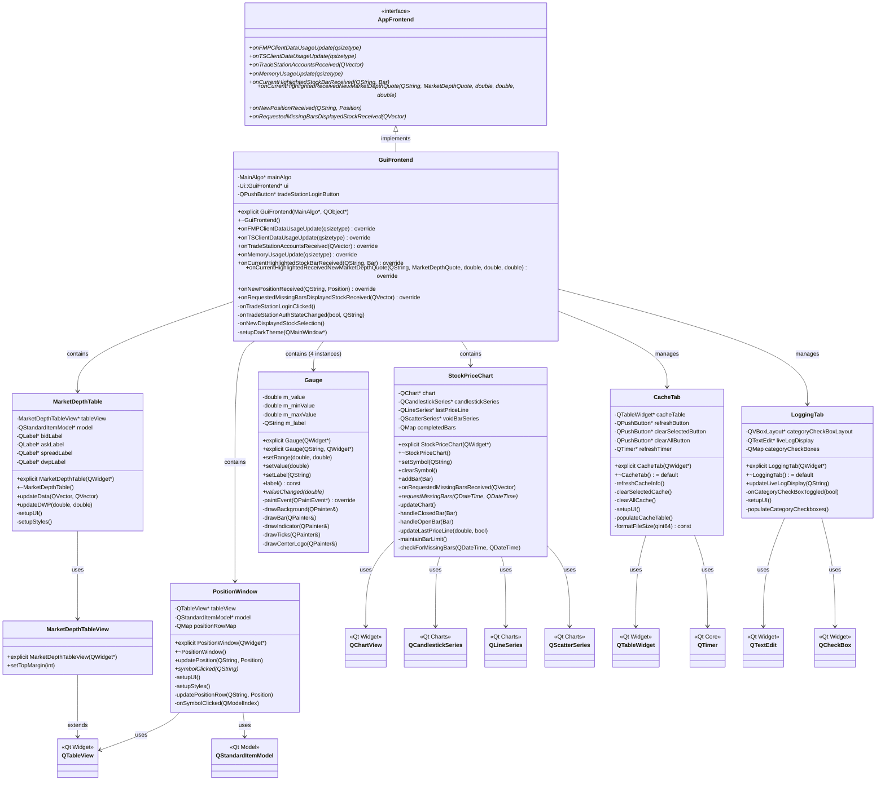
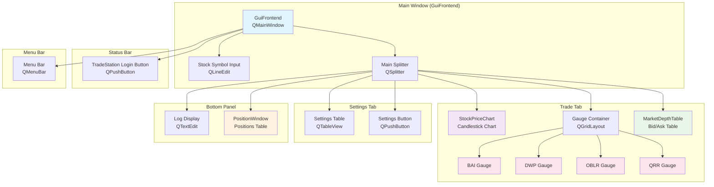

```mermaid
stateDiagram-v2
    [*] --> GuiFrontend: Application Start
    GuiFrontend --> StockPriceChart: User selects symbol
    GuiFrontend --> MarketDepthTable: Receives market depth data
    GuiFrontend --> PositionWindow: Receives position updates
    GuiFrontend --> Gauge: Receives metric updates (BAI, DWP, OBLR, QRR)

    StockPriceChart --> StockPriceChart: addBar() / onRequestedMissingBarsReceived()
    MarketDepthTable --> MarketDepthTable: updateData() / updateDWP()
    PositionWindow --> PositionWindow: updatePosition()
    Gauge --> Gauge: setValue()

    StockPriceChart --> GuiFrontend: requestMissingBars()
    GuiFrontend --> StockPriceChart: Bars received

    note right of GuiFrontend : Main coordinator receives data\nfrom MainAlgo and updates UI components

    GuiFrontend --> [*]: Application exit
```</content>
<parameter name="filePath">/home/simon/Documents/TradingAlgorithm/src/GUI/GUI_Architecture.md