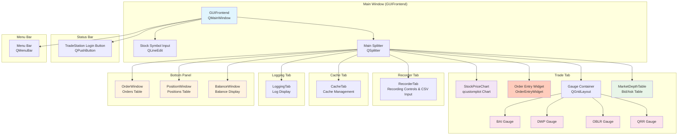

```mermaid
classDiagram
    class AppFrontend {
        <<interface>>
        +onTSClientDataUsageUpdate(qsizetype)*
        +onTradeStationAccountsReceived(QVector<Account>)*
        +onMemoryUsageUpdate(qsizetype)*
        +onStreamCountUpdate(int)*
        +onCurrentHighlightedStockBarReceived(QString, Bar)*
        +onCurrentHighlightedReceivedNewMarketDepthQuote(QString, MarketDepthQuote, double, double, double)*
        +onNewPositionReceived(QString, Position)*
        +onPositionDeleted(QString, QString)*
        +onNewOrderReceived(QString, Order)*
        +onBalanceUpdated(Balance)*
    }

    class GUIFrontend {
        -MainAlgo* mainAlgo
        -Ui::GUIFrontend* ui
        -QPushButton* tradeStationLoginButton
        -QString currentlyDisplayedSymbol
        +explicit GUIFrontend(MainAlgo*, QObject*)
        +~GUIFrontend()
        +onTSClientDataUsageUpdate(qsizetype) override
        +onTradeStationAccountsReceived(QVector<Account>) override
        +onMemoryUsageUpdate(qsizetype) override
        +onStreamCountUpdate(int) override
        +onCurrentHighlightedStockBarReceived(QString, Bar) override
        +onCurrentHighlightedReceivedNewMarketDepthQuote(QString, MarketDepthQuote, double, double, double) override
        +onNewPositionReceived(QString, Position) override
        +onPositionDeleted(QString, QString) override
        +onNewOrderReceived(QString, Order) override
        +onBalanceUpdated(Balance) override
        +getSelectedAccountId() QString
        -onTradeStationAuthStateChanged(bool, QString)
        -onNewDisplayedStockSelection()
        -onOrderPlaced(PlaceOrderRequest)
        -setupDarkTheme(QMainWindow*)
    }

    class StockPriceChart {
        -QCustomPlot* m_customPlot
        -QCPFinancial* m_candlesticks
        -QCPItemLine* m_lastPriceLine
        -QCPItemText* m_priceLabel
        -QMap<int, Bar> indexToBar
        -QMap<QDateTime, int> timestampToIndex
        +explicit StockPriceChart(QWidget*)
        +~StockPriceChart()
        +setSymbol(QString)
        +clearSymbol()
        +addLiveBar(QString, Bar)
        +onRequestedMissingBarsReceived(QVector<Bar>)
        +requestMissingBars(QDateTime, QDateTime)*
        -updateCandlestickData()
        -updateVolumeData()
        -maintainBarLimit()
        -checkForMissingBars(QDateTime, QDateTime)
        -addHistoricalBarsToIndexMapping(QVector<Bar>)
    }

    class MarketDepthTable {
        -MarketDepthTableView* tableView
        -QStandardItemModel* model
        -QLabel* bidLabel
        -QLabel* askLabel
        -QLabel* spreadLabel
        -QLabel* dwpLabel
        +explicit MarketDepthTable(QWidget*)
        +~MarketDepthTable()
        +updateData(QVector<MarketDepthLevel>, QVector<MarketDepthLevel>)
        +updateDWP(double, double)
        -setupUI()
        -setupStyles()
    }

    class MarketDepthTableView {
        +explicit MarketDepthTableView(QWidget*)
        +setTopMargin(int)
    }

    class PositionWindow {
        -QTableView* tableView
        -QStandardItemModel* model
        -QMap<QString, int> positionRowMap
        +explicit PositionWindow(QWidget*)
        +~PositionWindow()
        +updatePosition(QString, Position)
        +symbolClicked(QString)*
        -setupUI()
        -setupStyles()
        -updatePositionRow(QString, Position)
        -onSymbolClicked(QModelIndex)
    }

    class Gauge {
        -double m_value
        -double m_minValue
        -double m_maxValue
        -QString m_label
        +explicit Gauge(QWidget*)
        +explicit Gauge(QString, QWidget*)
        +setRange(double, double)
        +setValue(double)
        +setLabel(QString)
        +label() const
        +valueChanged(double)*
        -paintEvent(QPaintEvent*) override
        -drawBackground(QPainter&)
        -drawBar(QPainter&)
        -drawIndicator(QPainter&)
        -drawTicks(QPainter&)
        -drawCenterLogo(QPainter&)
    }

    class CacheTab {
        -QTableWidget* cacheTable
        -QPushButton* refreshButton
        -QPushButton* clearSelectedButton
        -QPushButton* clearAllButton
        -QTimer* refreshTimer
        +explicit CacheTab(QWidget*)
        +~CacheTab() = default
        -refreshCacheInfo()
        -clearSelectedCache()
        -clearAllCache()
        -setupUI()
        -populateCacheTable()
        -formatFileSize(qint64) const
    }

    class LoggingTab {
        -QVBoxLayout* categoryCheckBoxLayout
        -QTextEdit* liveLogDisplay
        -QMap<QString, QCheckBox*> categoryCheckBoxes
        +explicit LoggingTab(QWidget*)
        +~LoggingTab() = default
        +updateLiveLogDisplay(QString)
        -onCategoryCheckBoxToggled(bool)
        -setupUI()
        -populateCategoryCheckboxes()
    }

    class RecorderTab {
        -QPushButton* m_startButton
        -QPushButton* m_stopButton
        -QLineEdit* m_stockCsvFileInput
        -QString m_stockCsvFilePath
        +explicit RecorderTab(QWidget*)
        +~RecorderTab() = default
        -onStartRecording()
        -onStopRecording()
        -onBrowseButtonClicked()
        -setupUI()
    }

    class BalanceWindow {
        -QTableView* tableView
        -QStandardItemModel* model
        -QLabel* headerLabel
        +explicit BalanceWindow(QWidget*)
        +~BalanceWindow()
        +updateBalance(Balance)
        -setupUI()
        -setupStyles()
        -updateBalanceData(Balance)
    }

    class OrderWindow {
        -QTableView* m_tableView
        -QStandardItemModel* m_model
        -QLabel* m_headerLabel
        -QMap<QString, int> m_orderRowMap
        +explicit OrderWindow(QWidget*)
        +~OrderWindow()
        +updateOrder(QString, Order)
        +symbolClicked(QString)*
        +cancelOrderRequested(QString)*
        -setupUI()
        -setupStyles()
        -updateOrderRow(QString, Order)
    }

    class OrderEntryWidget {
        -QLineEdit* m_symbolInput
        -QRadioButton* m_buyRadio
        -QComboBox* m_orderTypeCombo
        -QSpinBox* m_quantityInput
        -QDoubleSpinBox* m_limitPriceInput
        -QPushButton* m_submitButton
        -GUIFrontend* m_guiFrontend
        +explicit OrderEntryWidget(QWidget*)
        +~OrderEntryWidget()
        +setAccounts(QList<Account>)
        +setSymbol(QString)
        +orderPlaced(PlaceOrderRequest)*
        -onSubmitClicked()
        -validateInputs()
        -buildOrderRequest()
    }

    %% Relationships
    AppFrontend <|-- GUIFrontend : implements
    GUIFrontend --> StockPriceChart : contains
    GUIFrontend --> MarketDepthTable : contains
    GUIFrontend --> PositionWindow : contains
    GUIFrontend --> OrderWindow : contains
    GUIFrontend --> BalanceWindow : contains
    GUIFrontend --> OrderEntryWidget : contains
    GUIFrontend --> Gauge : contains (4 instances)
    GUIFrontend --> CacheTab : manages
    GUIFrontend --> LoggingTab : manages
    GUIFrontend --> RecorderTab : manages

    MarketDepthTable --> MarketDepthTableView : uses
    MarketDepthTableView --> QTableView : extends

    StockPriceChart --> QCustomPlot : uses
    StockPriceChart --> QCPFinancial : uses

    PositionWindow --> QTableView : uses
    PositionWindow --> QStandardItemModel : uses

    OrderWindow --> QTableView : uses
    OrderWindow --> QStandardItemModel : uses

    BalanceWindow --> QTableView : uses
    BalanceWindow --> QStandardItemModel : uses

    CacheTab --> QTableWidget : uses
    CacheTab --> QTimer : uses

    LoggingTab --> QTextEdit : uses
    LoggingTab --> QCheckBox : uses

    OrderEntryWidget --> QComboBox : uses
    OrderEntryWidget --> QLineEdit : uses
    OrderEntryWidget --> QSpinBox : uses
    OrderEntryWidget --> QDoubleSpinBox : uses

    %% Qt Base Classes
    class QTableView {
        <<Qt Widget>>
    }

    class QCustomPlot {
        <<qcustomplot>>
    }

    class QCPFinancial {
        <<qcustomplot>>
    }

    class QStandardItemModel {
        <<Qt Model>>
    }

    class QTableWidget {
        <<Qt Widget>>
    }

    class QTimer {
        <<Qt Core>>
    }

    class QTextEdit {
        <<Qt Widget>>
    }

    class QCheckBox {
        <<Qt Widget>>
    }
```

```mermaid
stateDiagram-v2
    [*] --> GUIFrontend: Application Start
    GUIFrontend --> StockPriceChart: User selects symbol
    GUIFrontend --> MarketDepthTable: Receives market depth data
    GUIFrontend --> PositionWindow: Receives position updates
    GUIFrontend --> OrderWindow: Receives order updates
    GUIFrontend --> BalanceWindow: Receives balance updates
    GUIFrontend --> Gauge: Receives metric updates (BAI, DWP, OBLR, QRR)
    GUIFrontend --> OrderEntryWidget: User places order

    StockPriceChart --> StockPriceChart: addLiveBar() / onRequestedMissingBarsReceived()
    MarketDepthTable --> MarketDepthTable: updateData() / updateDWP()
    PositionWindow --> PositionWindow: updatePosition()
    OrderWindow --> OrderWindow: updateOrder()
    BalanceWindow --> BalanceWindow: updateBalance()
    Gauge --> Gauge: setValue()
    OrderEntryWidget --> GUIFrontend: orderPlaced signal

    StockPriceChart --> GUIFrontend: requestMissingBars()
    GUIFrontend --> StockPriceChart: Bars received

    note right of GUIFrontend : Main coordinator receives data\nfrom MainAlgo and updates UI components.\nManages order placement and trading operations.

    GUIFrontend --> [*]: Application exit
```</content>
<parameter name="filePath">/home/simon/Documents/TradingAlgorithm/src/GUI/GUI_Architecture.md