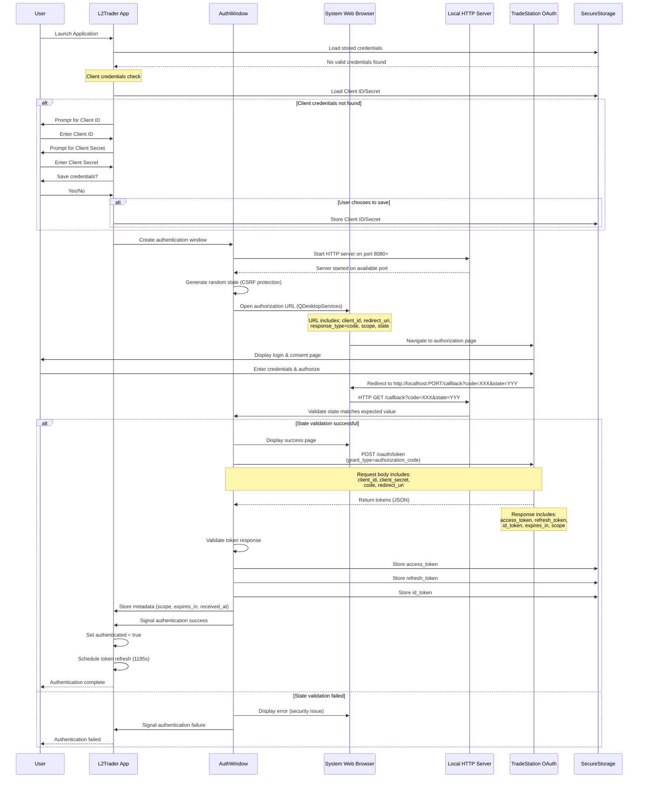
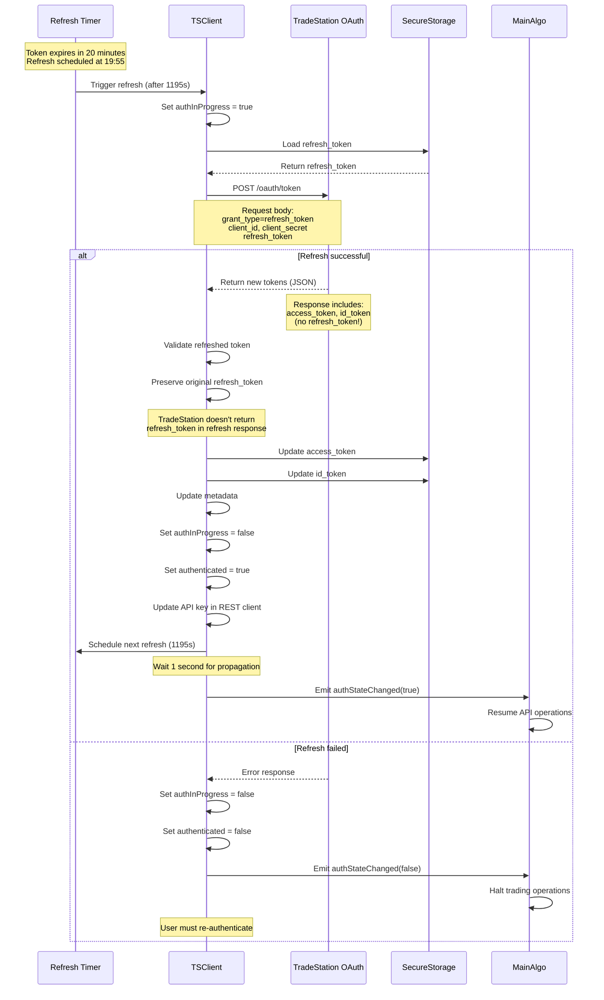
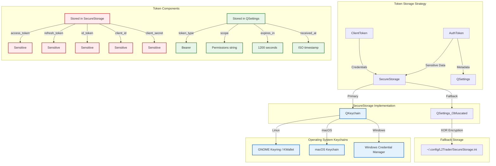

# TradeStation OAuth Authentication Process

## Table of Contents
1. [OAuth 2.0 Overview](#oauth-20-overview)
2. [TradeStation OAuth Implementation](#tradestation-oauth-implementation)
3. [Initial Authentication Flow](#initial-authentication-flow)
4. [Token Refresh Flow](#token-refresh-flow)
5. [Secure Storage](#secure-storage)
6. [Implementation Details](#implementation-details)

---

## OAuth 2.0 Overview

OAuth 2.0 is an industry-standard authorization framework that enables applications to obtain limited access to user accounts on an HTTP service. It works by delegating user authentication to the service that hosts the user account and authorizing third-party applications to access that user account.

### Key Concepts

- **Access Token**: Short-lived token used to authenticate API requests (expires in 20 minutes for TradeStation)
- **Refresh Token**: Long-lived token used to obtain new access tokens without user interaction
- **Authorization Code**: Temporary code exchanged for tokens during initial authentication
- **Client ID & Secret**: Application credentials provided by TradeStation
- **Redirect URI**: Local callback URL where authorization codes are received
- **Scope**: Permissions requested from the user (e.g., `MarketData`, `Trade`, `ReadAccount`)

### Benefits of OAuth 2.0

- **Security**: Users never share credentials directly with the application
- **Limited Access**: Applications only receive permissions explicitly granted by the user
- **Token Expiration**: Access tokens expire, limiting the window of vulnerability
- **Revocable Access**: Users can revoke access at any time through TradeStation

---

## TradeStation OAuth Implementation

TradeStation uses the **OAuth 2.0 Authorization Code Flow** with PKCE (Proof Key for Code Exchange) for secure authentication. This implementation follows TradeStation's API specifications.

### Official Documentation

- **TradeStation OAuth Guide**: [https://api.tradestation.com/docs/fundamentals/authentication/auth-overview](https://api.tradestation.com/docs/fundamentals/authentication/auth-overview)
- **Authorization Endpoint**: `https://signin.tradestation.com/authorize`
- **Token Endpoint**: `https://signin.tradestation.com/oauth/token`

### Required Scopes

The application requests the following scopes:

- `openid`: OpenID Connect authentication
- `profile`: User profile information
- `offline_access`: Enables refresh token issuance
- `MarketData`: Access to market data streams
- `Matrix`: Access to Level 2 market depth data
- `ReadAccount`: Read account information and positions
- `Trade`: Execute trades and manage orders

### Token Specifications

- **Access Token Lifetime**: 1200 seconds (20 minutes)
- **Token Type**: Bearer
- **Refresh Strategy**: Automatic refresh 5 seconds before expiration

---

## Initial Authentication Flow

The initial authentication occurs when the user first launches the application or when stored credentials are invalid/expired.



### Authentication Steps

1. **Application Startup**: Check for existing valid credentials
2. **Client Credentials**: Prompt user for Client ID/Secret if not stored
3. **Local Server**: Start HTTP server on localhost (ports 8080-8089)
4. **State Generation**: Create random 32-character state for CSRF protection
5. **Authorization Request**: Open browser to TradeStation authorization page
6. **User Consent**: User logs in and grants permissions
7. **Authorization Code**: TradeStation redirects to local server with code
8. **State Validation**: Verify state parameter matches to prevent CSRF attacks
9. **Token Exchange**: Exchange authorization code for access/refresh tokens
10. **Secure Storage**: Store tokens securely using QKeychain or encrypted fallback
11. **Schedule Refresh**: Automatically schedule token refresh before expiration

---

## Token Refresh Flow

Access tokens expire after 20 minutes. The application automatically refreshes them using the refresh token, ensuring uninterrupted API access.



### Refresh Process Details

1. **Automatic Scheduling**: Refresh triggered 5 seconds before token expiration (at 1195s)
2. **Refresh Token Usage**: Original refresh token sent to obtain new access token
3. **Token Preservation**: Refresh token is NOT returned by TradeStation, so we preserve the original
4. **Validation**: New token validated using `isValidRefreshedToken()` (doesn't check refresh_token field)
5. **Secure Update**: Access and ID tokens updated in secure storage
6. **API Update**: REST client updated with new access token
7. **Propagation Delay**: 1-second delay before resuming operations (TradeStation server propagation)
8. **Next Refresh**: New refresh scheduled for 1195 seconds later

### Token Refresh Security Features

- **Refresh tokens are single-use**: Each refresh may invalidate the previous token
- **Automatic retry logic**: Failed refreshes can trigger re-authentication (TODO in code)
- **Expiry buffer**: 5-second buffer prevents race conditions at expiration boundary
- **Thread-safe operations**: Refresh happens on TSClient thread with proper locking

---

## Secure Storage

The application implements a two-tier secure storage system for sensitive credentials:

### Storage Architecture



### QKeychain Integration (Primary Method)

When available, the application uses **QKeychain** library for maximum security:

- **Linux**: Integrates with GNOME Keyring (via libsecret) or KWallet
- **macOS**: Uses native macOS Keychain (encrypted, OS-managed)
- **Windows**: Uses Windows Credential Manager (DPAPI encryption)

#### Benefits of QKeychain

- **OS-Level Encryption**: Credentials encrypted by operating system
- **Access Control**: OS manages access permissions and user authentication
- **Secure Storage**: Protected from unauthorized application access
- **Automatic Unlocking**: Unlocked when user logs into their system

#### Storage Locations

- **Linux**: `~/.local/share/keyrings/` (GNOME Keyring) or KWallet database
- **macOS**: `~/Library/Keychains/login.keychain-db`
- **Windows**: Windows Credential Manager vault

### Fallback Storage (When QKeychain Unavailable)

If QKeychain is not available (missing library or compilation without QT_KEYCHAIN_LIB), the application falls back to obfuscated QSettings storage:

#### Obfuscation Method

```cpp
// Simple XOR-based obfuscation (NOT secure encryption)
QByteArray data = value.toUtf8();
QByteArray key = QCryptographicHash::hash("L2TraderSecureStorage", QCryptographicHash::Sha256);

for (int i = 0; i < data.size(); ++i) {
    data[i] = data[i] ^ key[i % key.size()];
}

QString obfuscated = QString::fromUtf8(data.toBase64());
```

#### Important Notes

- **NOT Secure Encryption**: XOR obfuscation only protects against casual inspection
- **Recommendation**: Always compile with QKeychain for production use
- **Storage Location**: `~/.config/L2Trader/SecureStorage.ini` (Linux)
- **Warning Logged**: Application logs warning when using fallback method

### What Gets Stored Where

| Data Type | Storage Location | Reason |
|-----------|------------------|--------|
| `access_token` | SecureStorage | Highly sensitive, grants API access |
| `refresh_token` | SecureStorage | Highly sensitive, can generate new access tokens |
| `id_token` | SecureStorage | Contains user identity information |
| `client_id` | SecureStorage | Application credentials |
| `client_secret` | SecureStorage | Application credentials (most sensitive) |
| `token_type` | QSettings | Public metadata ("Bearer") |
| `scope` | QSettings | Public metadata (permission list) |
| `expires_in` | QSettings | Public metadata (1200 seconds) |
| `received_at` | QSettings | Public metadata (ISO timestamp) |

### Storage Operations

#### Synchronous Operations
The application uses synchronous wrappers around QKeychain's asynchronous API for simplicity:

```cpp
// Store multiple values
QMap<QString, QString> values;
values["access_token"] = token.getAccessToken();
values["refresh_token"] = token.getRefreshToken();
bool success = storage->storeValuesSync("TradeStation", values, 5000);

// Retrieve multiple values
QStringList keys = {"access_token", "refresh_token", "id_token"};
QMap<QString, QString> results = storage->retrieveValuesSync("TradeStation", keys, 5000);

// Delete values
storage->deleteValuesSync("TradeStation", keys, 5000);
```

#### Event Loop for Async-to-Sync Conversion
Synchronous operations use Qt event loops with timeout protection:

```cpp
QEventLoop loop;
QTimer timer;
timer.setSingleShot(true);
timer.start(timeoutMs);
connect(&timer, &QTimer::timeout, &loop, &QEventLoop::quit);
// ... async operation ...
loop.exec();  // Blocks until operation completes or timeout
```

### Security Best Practices

1. **Never commit credentials**: All sensitive data stored outside repository
2. **Compile with QKeychain**: Always enable QKeychain for production builds
3. **Regular token rotation**: Tokens automatically refreshed every 20 minutes
4. **Secure prompts**: Credential input uses password-masked fields
5. **Optional persistence**: Users can choose not to save credentials for maximum security

---

## Implementation Details

### File Structure

```
src/Clients/TSClient/Auth/
├── AuthToken.h/cpp          # Access/refresh token management
├── AuthWindow.h/cpp         # OAuth authentication UI
├── ClientToken.h/cpp        # Client credentials management
src/Misc/
└── SecureStorage.h/cpp      # Secure credential storage
```

### Key Classes

#### AuthToken
Manages OAuth access and refresh tokens with validation and expiration tracking.

**Key Features:**
- Token validation against TradeStation specifications
- Expiration tracking with 5-second safety buffer
- Automatic refresh scheduling calculation
- Secure storage integration
- Separate validation for initial vs. refreshed tokens

**Methods:**
```cpp
static AuthToken receiveAuthToken(const QJsonObject &json);  // Create from API response
bool isValid() const;                                         // Validate complete token
bool isValidRefreshedToken() const;                          // Validate refreshed token (no refresh_token)
bool isExpired() const;                                      // Check expiration (with 5s buffer)
int secondsUntilExpiration();                                // Time until actual expiration
int secondsToNextRefreshRequest();                           // Time until refresh needed (expire - 5s)
static bool storeToSettings(const AuthToken &token);         // Persist to secure storage
static AuthToken loadFromSettings();                         // Load from secure storage
```

**Validation Rules:**
- Access token must not be empty
- Refresh token must not be empty (except for refreshed tokens)
- ID token must not be empty
- Token type must be "Bearer"
- Expires in must be exactly 1200 seconds
- Scope must include all required permissions: `openid`, `profile`, `MarketData`, `ReadAccount`, `Trade`, `offline_access`

#### AuthWindow
Qt dialog for OAuth authentication flow using system browser and local HTTP server.

**Key Features:**
- Uses system's default web browser via QDesktopServices::openUrl()
- Local HTTP server for redirect URI handling
- CSRF protection via random state parameter
- Port auto-selection (8080-8089)
- Credential prompting with optional persistence
- Graceful error handling
- Compatible with both GUI and TUI modes

**Authentication Process:**
1. Load or prompt for client credentials
2. Start local HTTP server on available port
3. Generate random state for CSRF protection
4. Open TradeStation authorization page in system's default browser
5. Listen for redirect callback with authorization code
6. Validate state parameter
7. Exchange code for tokens
8. Store tokens securely
9. Emit success signal to TSClient

**Server Features:**
- Automatic port selection from range 8080-8089
- Detailed error handling for port binding failures
- State validation for security
- HTML response pages for user feedback
- Socket lifecycle management

#### ClientToken
Manages TradeStation API client credentials (Client ID and Secret).

**Key Features:**
- Secure storage of client credentials
- Validation of credential format
- Synchronous load/store operations
- Optional credential persistence

**Methods:**
```cpp
ClientToken(const QString &clientId, const QString &clientSecret);  // Constructor
bool isValid() const;                                               // Validate credentials
static bool storeToSettings(const ClientToken &token);              // Persist to SecureStorage
static ClientToken loadFromSettings();                              // Load from SecureStorage
static void clearSettings();                                        // Delete stored credentials
```

#### SecureStorage
Platform-independent secure credential storage with QKeychain integration and encrypted fallback.

**Key Features:**
- Primary storage via QKeychain (OS keychains)
- Fallback to obfuscated QSettings
- Synchronous operations with timeout protection
- Batch operations for efficiency
- Compile-time feature detection

**Architecture:**
```cpp
#ifdef QT_KEYCHAIN_LIB
    // Use QKeychain for secure platform storage
#else
    // Fall back to obfuscated QSettings
#endif
```

**Methods:**
```cpp
bool storeValuesSync(const QString& service, const QMap<QString, QString>& values, int timeout);
QMap<QString, QString> retrieveValuesSync(const QString& service, const QStringList& keys, int timeout);
bool deleteValuesSync(const QString& service, const QStringList& keys, int timeout);
static bool isSecureStorageAvailable();  // Check QKeychain availability
```

### TSClient Integration

The TSClient class orchestrates the entire authentication lifecycle:

**Startup Sequence:**
1. Load client credentials from SecureStorage
2. Load auth token from SecureStorage
3. Validate token status:
   - **Invalid/Missing**: Require full authentication via AuthWindow
   - **Expired**: Immediately schedule token refresh
   - **Valid**: Schedule refresh 5 seconds before expiration

**Authentication States:**
```cpp
bool authenticated;      // Current authentication status
bool authInProgress;     // Authentication/refresh in progress (prevents concurrent operations)
AuthToken authToken;     // Current OAuth tokens
ClientToken clientToken; // Application credentials
```

**Refresh Logic:**
```cpp
void TSClient::refreshAsyncAccessToken() {
    // 1. Validate state
    // 2. Build refresh request
    // 3. Send POST to /oauth/token with grant_type=refresh_token
    // 4. Handle response in onAsyncRefreshTokenFinished()
}

void TSClient::onAsyncRefreshTokenFinished(bool completed, const AuthToken &newToken) {
    // 1. Validate refreshed token
    // 2. Preserve original refresh_token (not returned by TradeStation)
    // 3. Update secure storage
    // 4. Update REST client API key
    // 5. Schedule next refresh (1195 seconds)
    // 6. Wait 1 second for server propagation
    // 7. Emit authStateChanged signal
}
```

**Signal Emission:**
```cpp
signals:
    void authStateChanged(bool authenticated, QString reason);
```

### Security Considerations

1. **CSRF Protection**: Random state parameter validated on callback
2. **Secure Transport**: All OAuth requests use HTTPS
3. **Credential Isolation**: Tokens stored separately from application code
4. **Limited Scope**: Only request necessary permissions
5. **Token Rotation**: Access tokens expire every 20 minutes
6. **Encrypted Storage**: QKeychain provides OS-level encryption
7. **User Control**: Users can opt out of credential persistence
8. **Thread Safety**: All token operations happen on TSClient thread

### Error Handling

**Common Error Scenarios:**

1. **Port Binding Failure**: Try ports 8080-8089, show error if all fail
2. **State Mismatch**: Reject authentication, possible CSRF attack
3. **Token Exchange Failure**: Display error dialog, retry or re-authenticate
4. **Refresh Failure**: Set authenticated=false, emit signal, require re-authentication
5. **Storage Failure**: Log warning, continue with in-memory tokens only
6. **Missing Credentials**: Prompt user with input dialogs

**Logging Categories:**
```cpp
Q_LOGGING_CATEGORY(TSAuthTokenLog, "TSClient.token.auth")
Q_LOGGING_CATEGORY(TSAuthWindowLog, "TSClient.authwindow")
Q_LOGGING_CATEGORY(tsClientToken, "TSClient.token.client")
Q_LOGGING_CATEGORY(secureStorage, "SecureStorage")
```

### Testing Considerations

The authentication system can be tested through:

1. **Unit Tests**: Token validation, expiration calculations, state generation
2. **Integration Tests**: Full OAuth flow with mock TradeStation server
3. **Manual Testing**: Real TradeStation authentication in simulation environment
4. **Security Audits**: Review secure storage implementation and token handling

---

## GUI vs TUI Mode Support

The authentication system now supports both GUI and TUI (Text User Interface) modes, allowing the application to run in headless environments without a graphical interface.

### Architecture Overview

The authentication logic has been refactored into a layered architecture:

```
AuthHandler (Base Class)
├── Core OAuth logic (HTTP server, token exchange)
├── Protected virtual methods for UI interaction
└── Used by both GUI and TUI implementations

AuthWindow (GUI Mode)
├── QDialog-based GUI implementation
├── GUIAuthHandler (inner class inherits AuthHandler)
└── Uses QInputDialog, QMessageBox, QDesktopServices

HeadlessAuthHandler (TUI Mode)
├── Console-based implementation
├── Inherits from AuthHandler
└── Uses stdin/stdout for user interaction
```

### Build Configuration

The mode is controlled at compile time using CMake options:

```bash
# Build with GUI support (default)
cmake -DENABLE_GUI=ON ..

# Build for TUI/headless mode
cmake -DENABLE_GUI=OFF ..
```

When `GUI_ENABLED` is defined, the GUI authentication path is used. Otherwise, the headless handler is used.

### GUI Mode Authentication

**User Experience:**
1. Application displays a Qt dialog window
2. If credentials are missing, QInputDialog prompts for Client ID and Secret
3. System web browser automatically opens to TradeStation login page
4. After authentication, dialog shows success message and closes

**Implementation:**
```cpp
#ifdef GUI_ENABLED
AuthWindow* m_authWindow = new AuthWindow();
connect(m_authWindow, &AuthWindow::authFinished, this, &TSClient::onAuthFinished);
m_authWindow->show();
#endif
```

### TUI Mode Authentication

**User Experience:**
1. Console prompts for Client ID (visible input)
2. Console prompts for Client Secret (hidden input on Unix systems)
3. Authentication URL is displayed in the terminal
4. User manually copies URL to web browser
5. After authentication, callback is received by local HTTP server
6. Success/failure message displayed in console

**Example Output:**
```
=== TradeStation API Credentials Setup ===

Please enter your TradeStation API credentials.

Enter your Client ID: my-client-id-123
Enter your Client Secret (input will be hidden): ********

Would you like to save these credentials for future use? (y/N): y
Credentials will be saved.

=== TradeStation Authentication Required ===

Please complete the authentication in your web browser.
Copy and paste the following URL into your browser:

https://signin.tradestation.com/authorize?response_type=code&client_id=...

Waiting for authentication callback...
(Keep this application running until authentication is complete)
```

**Implementation:**
```cpp
#ifndef GUI_ENABLED
HeadlessAuthHandler* m_authHandler = new HeadlessAuthHandler();
connect(m_authHandler, &HeadlessAuthHandler::authFinished, this, &TSClient::onAuthFinished);
m_authHandler->startAuthentication();
#endif
```

### Key Differences

| Feature | GUI Mode | TUI Mode |
|---------|----------|----------|
| Credential Input | QInputDialog | stdin with termios |
| Password Masking | QLineEdit::Password | termios echo disable |
| Browser Launch | Automatic (QDesktopServices) | Manual URL copy-paste |
| Error Display | QMessageBox | stderr output |
| Save Prompt | QMessageBox::question | stdin y/N prompt |
| Dependencies | Qt Widgets | Qt Core only |

### Shared Core Logic

Both modes share the same core OAuth implementation:

- **HTTP Server**: Local server on localhost:8080-8089
- **CSRF Protection**: Random state generation and validation
- **Token Exchange**: POST to TradeStation OAuth endpoint
- **Token Storage**: Secure storage via QKeychain/encrypted fallback
- **Token Refresh**: Automatic refresh scheduling

### Implementation Files

**Base Classes:**
- `Src/Clients/TSClient/Auth/AuthHandler.h/cpp` - Core OAuth logic

**GUI Implementation:**
- `Src/Clients/TSClient/Auth/AuthWindow.h/cpp` - GUI dialog and handler

**TUI Implementation:**
- `Src/Clients/TSClient/Auth/HeadlessAuthHandler.h/cpp` - Console-based handler

**Integration:**
- `Src/Clients/TSClient/TSClient.h` - Mode selection at compile time
- `Src/Clients/TSClient/TSClientRefreshToken.cpp` - Authentication launching

### Security Considerations for TUI Mode

1. **Password Input**: On Unix systems, terminal echo is disabled during secret input using termios
2. **Non-Unix Systems**: Displays warning that input will be visible
3. **Manual URL Handling**: User must manually open browser, reducing automatic attack surface
4. **Same CSRF Protection**: State validation works identically in both modes
5. **Same Storage Security**: Uses identical QKeychain secure storage

### Future Enhancements

Potential improvements for TUI mode:
- Support for Windows secure console input
- ASCII art progress indicators
- Color-coded output for better UX
- QR code generation for mobile browser authentication
- SSH port forwarding instructions for remote server deployments

---

## Summary

The L2Trader OAuth implementation provides robust, secure authentication with TradeStation's API using industry-standard OAuth 2.0 practices. Key features include:

- ✅ Full OAuth 2.0 Authorization Code Flow
- ✅ Automatic token refresh before expiration
- ✅ Platform-native secure storage via QKeychain
- ✅ CSRF protection with state validation
- ✅ User-friendly authentication UI in both GUI and TUI modes
- ✅ Headless/console mode support for server deployments
- ✅ Graceful error handling and recovery
- ✅ Comprehensive logging for debugging

The system balances security, usability, and reliability to ensure uninterrupted access to TradeStation's trading platform in both graphical and headless environments.
