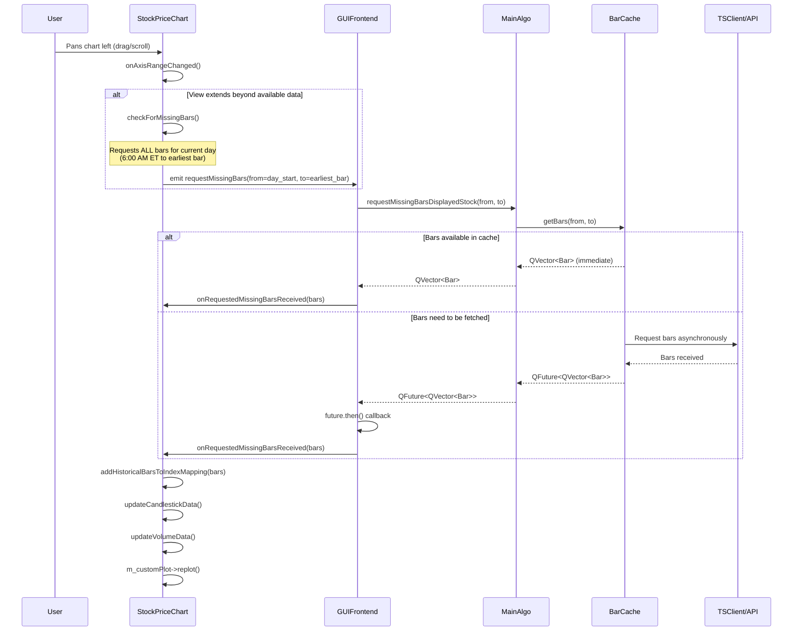

# Price Chart Data Loading Flow

This document describes the complete flow of events from when a user pans the price chart to the left (revealing missing historical bars) to the moment those bars are received and displayed on the chart.

## Overview

The flow involves several key components:
- **StockPriceChart**: The GUI widget displaying the chart
- **GUIFrontend**: Connects the chart to the business logic
- **MainAlgo**: Manages the displayed stock and its data sources
- **BarCache**: Handles data retrieval from cache/database or API

**Optimization Strategy**: Instead of requesting bars for every small pan operation, the system requests all bars for the current trading day (from 6:00 AM ET to the earliest available bar). This reduces API calls and provides better user experience by pre-loading data for the entire day.

## Sequence Diagram



## Detailed Function Call Flow

### 1. User Interaction Triggers Range Change

**File**: `StockPriceChart.cpp`
- **Function**: `onAxisRangeChanged()` (lines 848-863)
- **Trigger**: Connected to `QCPAxis::rangeChanged` signal for both x and y axes
- **Purpose**: Called whenever the chart view changes (pan, zoom, resize)

```cpp
void StockPriceChart::onAxisRangeChanged()
{
    updateAxisLabelsDensity();
    redrawLastPriceLine();
    updateSessionBackgrounds();

    // Check for missing bars when view extends beyond available data
    if (!indexToBar.isEmpty()) {
        double minIndex = m_customPlot->xAxis->range().lower;
        if (minIndex < indexToBar.firstKey()) {
            QDateTime requestTime = getTimestampForIndex(static_cast<int>(minIndex));
            checkForMissingBars(requestTime, indexToBar.first().getTimeStamp());
        }
    }
}
```

### 2. Detect Missing Bars

**File**: `StockPriceChart.cpp`
- **Function**: `checkForMissingBars()` (lines 626-663)
- **Optimization**: Instead of requesting only the visible range, requests ALL bars for the current trading day
- **Logic**:
  - Rounds view start time down to nearest minute
  - Adjusts to valid trading hours
  - Compares with earliest available bar timestamp
  - If view extends beyond available data, requests from start of trading day (6:00 AM ET) to earliest bar

```cpp
void StockPriceChart::checkForMissingBars(const QDateTime& viewStartTime, const QDateTime& viewEndTime) {
    // ... time rounding and validation ...

    QDateTime firstBarTime = timestampToIndex.firstKey();

    if (viewStartTimeRounded >= firstBarTime) {
        return; // View is within available bars
    }

    if (currentGetBarsRequestInProcess) {
        return; // Request already in progress
    }

    currentGetBarsRequestInProcess = true;

    // Instead of requesting from viewStartTimeRounded, request all bars for the current day
    // from the beginning of trading hours to the earliest bar we have
    QTimeZone nyZone("America/New_York");
    QDateTime firstBarInNY = firstBarTime.toTimeZone(nyZone);
    QDateTime dayStart = QDateTime(firstBarInNY.date(), QTime(TRADING_START_HOUR, 0, 0), nyZone);
    QDateTime requestStartTime = dayStart.toTimeZone(firstBarTime.timeZone());

    emit requestMissingBars(requestStartTime, firstBarTime);
}
```

### 3. Signal Propagation to Business Logic

**File**: `GUIFrontend.cpp`
- **Connection**: Lambda connected to `StockPriceChart::requestMissingBars` signal (lines 103-122)
- **Purpose**: Bridges GUI to business logic layer

```cpp
connect(ui->priceChart, &StockPriceChart::requestMissingBars,
    this, [this](QDateTime from, QDateTime to) mutable {
        BarCache::GetBarsResult_t result = MainAlgo::getInstance()->requestMissingBarsDisplayedStock(from, to);

        if (std::holds_alternative<QVector<Bar>>(result)) {
            // Immediate result from cache
            ui->priceChart->onRequestedMissingBarsReceived(std::move(std::get<QVector<Bar>>(result)));
        } else {
            // Asynchronous result via future
            QFuture<QVector<Bar>> future = std::move(std::get<QFuture<QVector<Bar>>>(result));
            future.then(this, [this](const QVector<Bar>& bars){
                ui->priceChart->onRequestedMissingBarsReceived(std::move(bars));
            });
        }
    });
```

### 4. Business Logic Request

**File**: `MainAlgo.cpp`
- **Function**: `requestMissingBarsDisplayedStock()` (lines 111-122)
- **Purpose**: Delegates to the current displayed stock's BarCache

```cpp
BarCache::GetBarsResult_t MainAlgo::requestMissingBarsDisplayedStock(QDateTime first, QDateTime last)
{
    qCDebug(MainAlgoLog) << "Requested bars from current displayed stock cache: " << first << " to " << last;

    Q_ASSERT(first.timeZone() == QTimeZone("America/New_York"));
    Q_ASSERT(last.timeZone() == QTimeZone("America/New_York"));
    Q_ASSERT(first < last);

    BarCache::GetBarsResult_t result = currentDisplayedStockInstrument->barCache.getBars(first, last);
    return result;
}
```

### 5. Data Retrieval (BarCache)

**File**: `BarCache.h` / `BarCache.cpp`
- **Function**: `getBars()` (returns `GetBarsResult_t`)
- **Return Type**: `std::variant<QVector<Bar>, QFuture<QVector<Bar>>>`
- **Logic**:
  - Check in-memory cache first
  - Check database if not in memory
  - Request from API if not in database
  - Return immediate result or future for async completion

### 6. Bars Integration into Chart

**File**: `StockPriceChart.cpp`
- **Function**: `onRequestedMissingBarsReceived()` (lines 568-584)
- **Purpose**: Process received bars and update display

```cpp
void StockPriceChart::onRequestedMissingBarsReceived(const QVector<Bar>& bars) {
    Q_ASSERT(currentGetBarsRequestInProcess == true);
    currentGetBarsRequestInProcess = false;
    Q_ASSERT(!bars.isEmpty());

    addHistoricalBarsToIndexMapping(bars);
    maintainBarLimit();

    // Update candlestick data
    updateCandlestickData();
    updateVolumeData();

    m_customPlot->replot();
}
```

### 7. Index Mapping Update

**File**: `StockPriceChart.cpp`
- **Function**: `addHistoricalBarsToIndexMapping()` (lines 783-809)
- **Purpose**: Add historical bars using negative indices (extending chart to the left)

```cpp
void StockPriceChart::addHistoricalBarsToIndexMapping(const QVector<Bar>& bars) {
    int minIndex = indexToBar.firstKey();

    for (auto it = bars.rbegin(); it != bars.rend(); ++it) {
        const Bar& bar = *it;
        const QDateTime& timestamp = bar.getTimeStamp();

        if (timestampToIndex.contains(timestamp)) {
            continue; // Skip duplicates
        }

        --minIndex;
        indexToBar[minIndex] = bar;
        timestampToIndex[timestamp] = minIndex;
    }
}
```

### 8. Visual Data Update

**File**: `StockPriceChart.cpp`
- **Functions**:
  - `updateCandlestickData()` (lines 311-332): Converts bars to QCPFinancialData format
  - `updateVolumeData()` (lines 334-365): Updates volume bars (positive/negative)
- **Final Step**: `m_customPlot->replot()` triggers visual refresh

## Key Data Structures

### Index-to-Bar Mapping
- `QMap<int, Bar> indexToBar`: Maps chart indices to bar data
- `QMap<QDateTime, int> timestampToIndex`: Maps timestamps to chart indices
- Historical bars use negative indices, live bars use positive indices

### BarCache Result Types
```cpp
typedef std::variant<QVector<Bar>, QFuture<QVector<Bar>>> GetBarsResult_t;
```

## Threading Considerations

- **Immediate Results**: Bars returned synchronously from cache/database
- **Asynchronous Results**: API requests return `QFuture`, processed in callback
- All UI updates happen on main thread via signal/slot mechanism

## Error Handling

- Timeout exceptions from TSClient are asserted (should not happen in normal operation)
- JSON parsing errors from API responses trigger assertions
- Duplicate bars are skipped during integration
- Request state tracking prevents concurrent requests for same data

## Performance Optimizations

- **Day-based loading**: Requests all bars for entire trading day (6:00 AM ET to earliest bar) instead of just visible range, reducing API calls during panning
- In-memory cache in BarCache reduces database hits
- Database storage prevents repeated API calls
- Index-based chart rendering for efficient scrolling
- Bar limit enforcement prevents memory bloat</content>
<parameter name="filePath">/home/simon/Documents/L2Trader/Doc/Price_Chart_Data_Loading_Flow.md