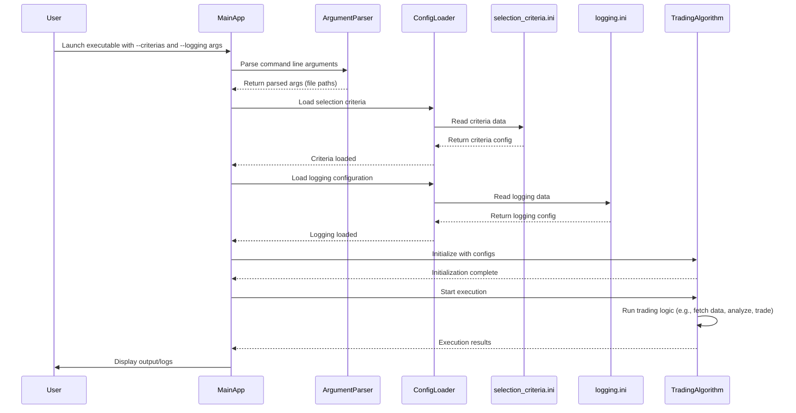

# Program Startup Sequence

```mermaid
sequenceDiagram
    participant User
    participant MainApp
    participant ArgumentParser
    participant ConfigLoader
    participant CriteriaFile as selection_criteria.ini
    participant LoggingFile as logging.ini
    participant TradingAlgorithm

    User->>MainApp: Launch executable with --criterias and --logging args
    MainApp->>ArgumentParser: Parse command line arguments
    ArgumentParser-->>MainApp: Return parsed args (file paths)
    MainApp->>ConfigLoader: Load selection criteria
    ConfigLoader->>CriteriaFile: Read criteria data
    CriteriaFile-->>ConfigLoader: Return criteria config
    ConfigLoader-->>MainApp: Criteria loaded
    MainApp->>ConfigLoader: Load logging configuration
    ConfigLoader->>LoggingFile: Read logging data
    LoggingFile-->>ConfigLoader: Return logging config
    ConfigLoader-->>MainApp: Logging loaded
    MainApp->>TradingAlgorithm: Initialize with configs
    TradingAlgorithm-->>MainApp: Initialization complete
    MainApp->>TradingAlgorithm: Start execution
    TradingAlgorithm->>TradingAlgorithm: Run trading logic (e.g., fetch data, analyze, trade)
    TradingAlgorithm-->>MainApp: Execution results
    MainApp->>User: Display output/logs
```
