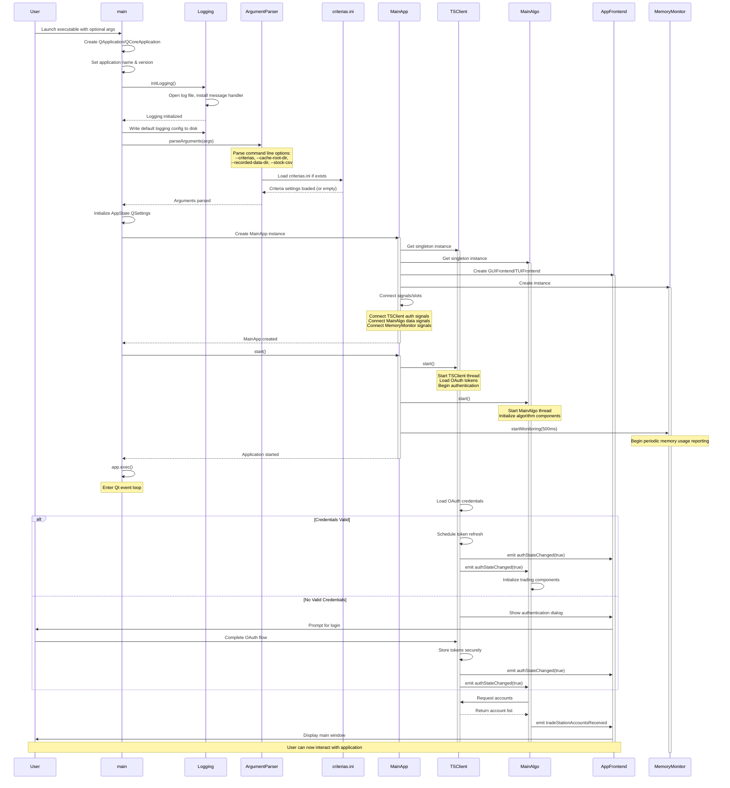

# Program Startup Sequence

```mermaid
sequenceDiagram
    participant User
    participant main
    participant Logging
    participant ArgumentParser
    participant CriteriaFile as criterias.ini
    participant MainApp
    participant TSClient
    participant MainAlgo
    participant AppFrontend
    participant MemoryMonitor

    User->>main: Launch executable with optional args
    main->>main: Create QApplication/QCoreApplication
    main->>main: Set application name & version
    main->>Logging: initLogging()
    Logging->>Logging: Open log file, install message handler
    Logging-->>main: Logging initialized
    
    main->>Logging: Write default logging config to disk
    main->>ArgumentParser: parseArguments(args)
    
    Note over ArgumentParser: Parse command line options:<br/>--criterias, --cache-root-dir,<br/>--recorded-data-dir, --stock-csv
    
    ArgumentParser->>CriteriaFile: Load criterias.ini if exists
    CriteriaFile-->>ArgumentParser: Criteria settings loaded (or empty)
    ArgumentParser-->>main: Arguments parsed
    
    main->>main: Initialize AppState QSettings
    
    main->>MainApp: Create MainApp instance
    activate MainApp
    
    MainApp->>TSClient: Get singleton instance
    activate TSClient
    MainApp->>MainAlgo: Get singleton instance
    activate MainAlgo
    MainApp->>AppFrontend: Create GUIFrontend/TUIFrontend
    activate AppFrontend
    MainApp->>MemoryMonitor: Create instance
    activate MemoryMonitor
    
    MainApp->>MainApp: Connect signals/slots
    Note over MainApp: Connect TSClient auth signals<br/>Connect MainAlgo data signals<br/>Connect MemoryMonitor signals
    
    MainApp-->>main: MainApp created
    deactivate MainApp
    
    main->>MainApp: start()
    activate MainApp
    
    MainApp->>TSClient: start()
    Note over TSClient: Start TSClient thread<br/>Load OAuth tokens<br/>Begin authentication
    
    MainApp->>MainAlgo: start()
    Note over MainAlgo: Start MainAlgo thread<br/>Initialize algorithm components
    
    MainApp->>MemoryMonitor: startMonitoring(500ms)
    Note over MemoryMonitor: Begin periodic memory usage reporting
    
    MainApp-->>main: Application started
    deactivate MainApp
    
    main->>main: app.exec()
    Note over main: Enter Qt event loop
    
    TSClient->>TSClient: Load OAuth credentials
    
    alt Credentials Valid
        TSClient->>TSClient: Schedule token refresh
        TSClient->>AppFrontend: emit authStateChanged(true)
        TSClient->>MainAlgo: emit authStateChanged(true)
        MainAlgo->>MainAlgo: Initialize trading components
    else No Valid Credentials
        TSClient->>AppFrontend: Show authentication dialog
        AppFrontend->>User: Prompt for login
        User->>TSClient: Complete OAuth flow
        TSClient->>TSClient: Store tokens securely
        TSClient->>AppFrontend: emit authStateChanged(true)
        TSClient->>MainAlgo: emit authStateChanged(true)
    end
    
    MainAlgo->>TSClient: Request accounts
    TSClient-->>MainAlgo: Return account list
    MainAlgo->>AppFrontend: emit tradeStationAccountsReceived
    
    AppFrontend->>User: Display main window
    Note over User,AppFrontend: User can now interact with application
    
    deactivate TSClient
    deactivate MainAlgo
    deactivate AppFrontend
    deactivate MemoryMonitor
```
