# StockPriceChart Architecture Documentation

This document provides comprehensive documentation of the StockPriceChart implementation to assist in debugging crashes and understanding the chart mechanics, particularly related to zoom and drag operations.

## Table of Contents
1. [Overview](#overview)
2. [Class Architecture](#class-architecture)
3. [Data Flow](#data-flow)
4. [Event Handling](#event-handling)
5. [State Management](#state-management)
6. [Missing Bars Detection](#missing-bars-detection)
7. [View State Preservation](#view-state-preservation)
8. [Potential Crash Points](#potential-crash-points)

---

## Overview

The `StockPriceChart` is a Qt-based widget that displays real-time stock price data using candlestick charts. It provides interactive features including:
- Zoom (horizontal, vertical, both axes)
- Pan (mouse drag and keyboard modifiers)
- Real-time price updates
- Market hours visualization (pre-market, regular hours, after-hours, closed)
- Dynamic bar loading when viewing historical data

---

## Class Architecture

### Class Diagram

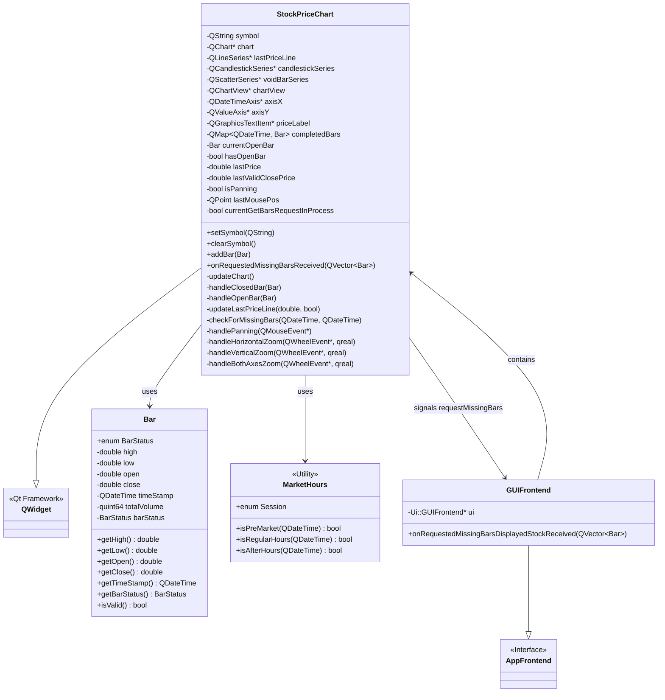

### Component Dependencies

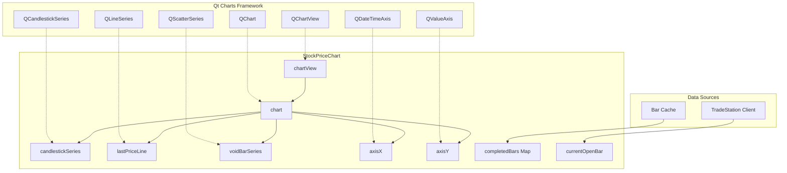

---

## Data Flow

### Bar Addition Flow

This diagram shows how bars flow from external sources into the chart display:

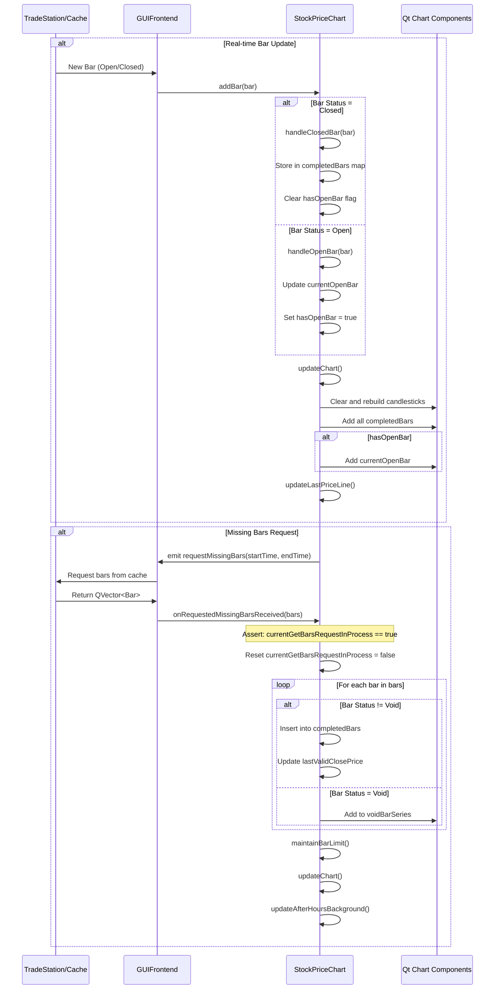

### Bar Data Structure Flow

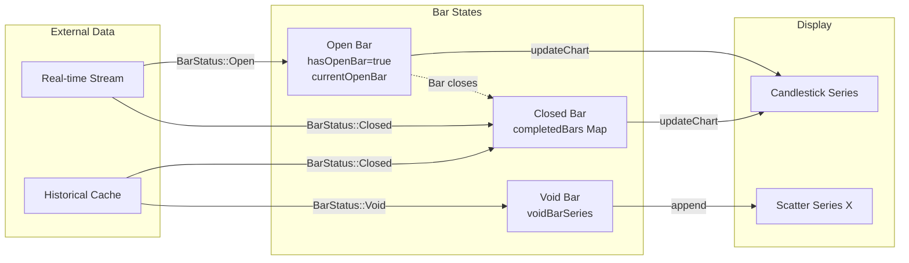

---

## Event Handling

### Mouse and Wheel Event Processing

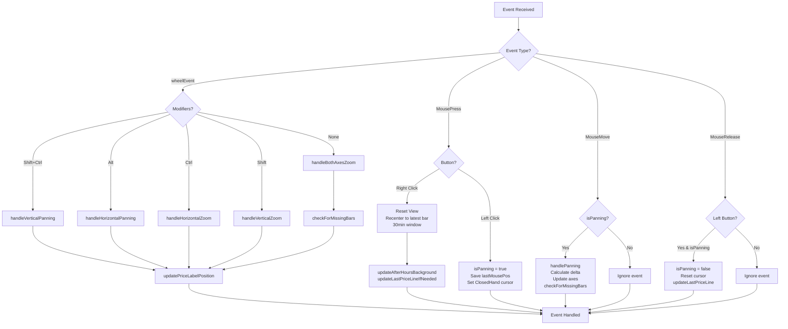

### Zoom Operations Detail

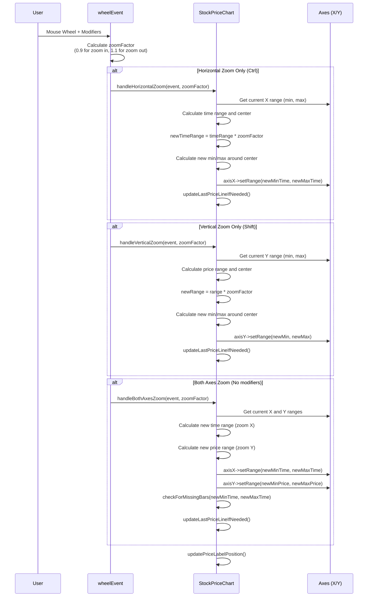

### Pan Operations Detail

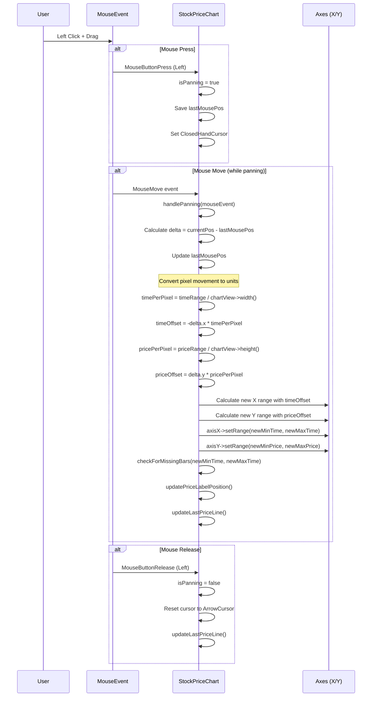

---

## State Management

### Chart State Variables

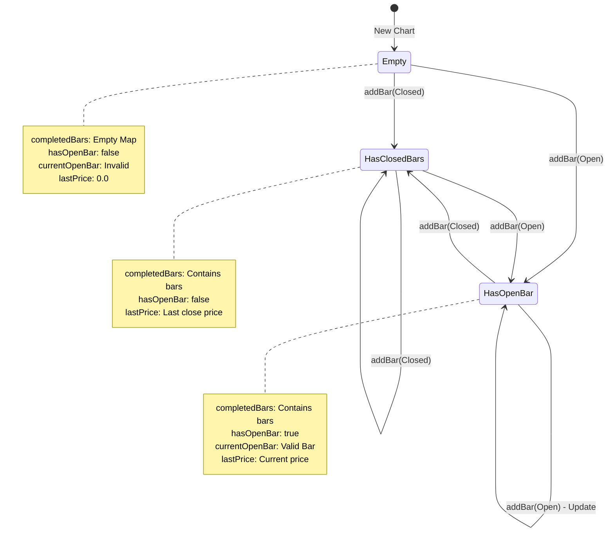

**View States:**

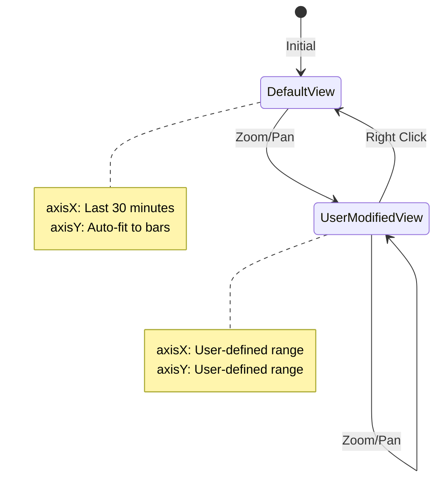

### Bar Limit Management

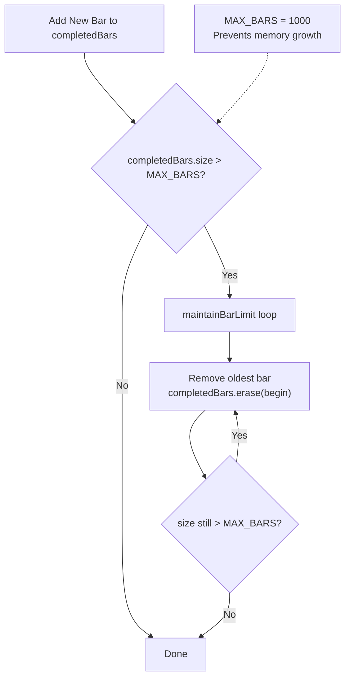

---

## Missing Bars Detection

### Detection and Loading Flow

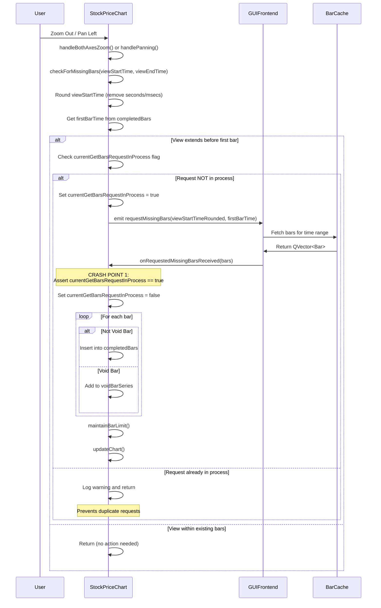

### Request State Management

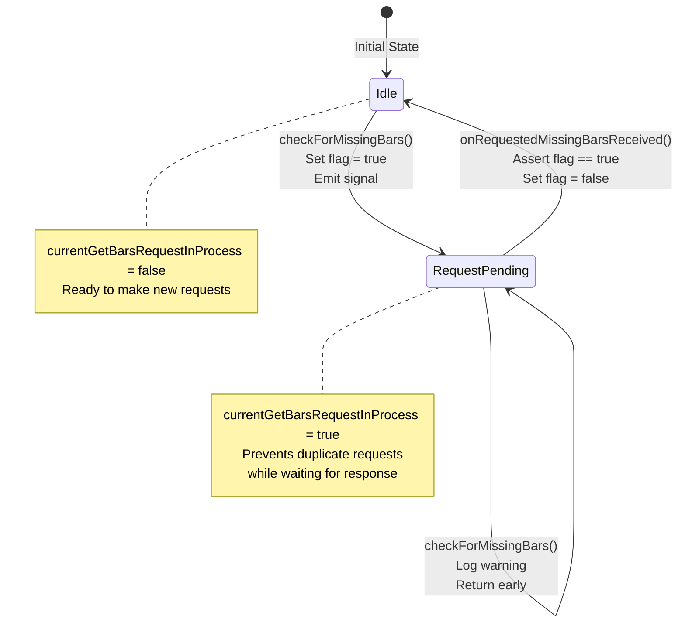

---

## View State Preservation

### View State During Chart Updates

```mermaid
graph TD
    Start[updateChart Called] --> SaveState[Save Current View State]
    SaveState --> GetMin[currentMin = axisX->min]
    GetMin --> GetMax[currentMax = axisX->max]
    GetMax --> GetYMin[currentYMin = axisY->min]
    GetYMin --> GetYMax[currentYMax = axisY->max]
    GetYMax --> CheckInit{hadInitialView?<br/>currentMin != currentMax<br/>currentMin != 0}
    
    CheckInit -->|Yes - Preserve View| ClearSeries[Clear candlestickSeries]
    ClearSeries --> RebuildLoop[Loop through completedBars]
    RebuildLoop --> AddCandles[Add candlestick for each bar]
    AddCandles --> AddOpen{hasOpenBar?}
    AddOpen -->|Yes| AddOpenCandle[Add currentOpenBar candlestick]
    AddOpen -->|No| RestoreRange[Restore View State]
    AddOpenCandle --> RestoreRange
    RestoreRange --> SetX[axisX->setRange(currentMin, currentMax)]
    SetX --> SetY[axisY->setRange(currentYMin, currentYMax)]
    SetY --> End[Done]
    
    CheckInit -->|No - First Time| ClearSeries2[Clear candlestickSeries]
    ClearSeries2 --> RebuildLoop2[Loop through completedBars]
    RebuildLoop2 --> AddCandles2[Add candlestick for each bar]
    AddCandles2 --> CalcRange[Calculate default 30-min window]
    CalcRange --> SetInitial[Set initial X and Y ranges]
    SetInitial --> CalcYRange[Calculate Y range from visible bars]
    CalcYRange --> End
```

### State Preservation During Bar Addition

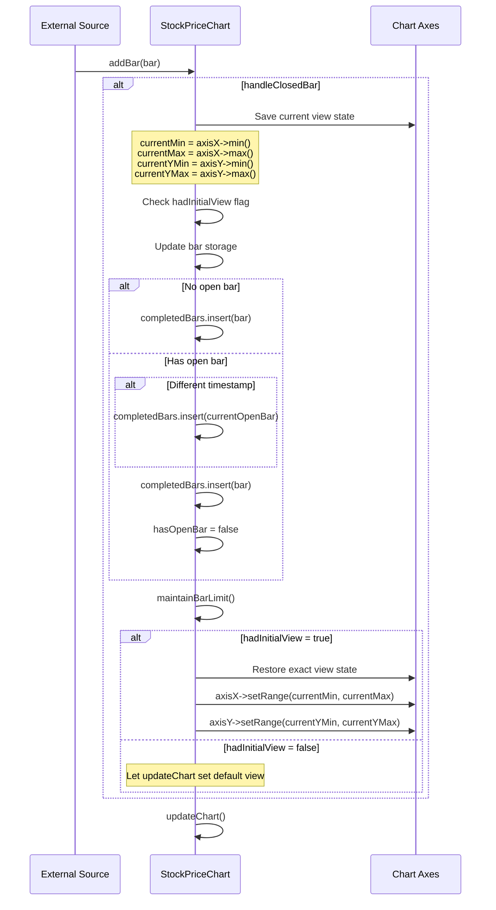

---

## Potential Crash Points

### Critical Assert and Edge Cases

```mermaid
graph TB
    subgraph "CRASH POINT 1: onRequestedMissingBarsReceived"
        CP1[Q_ASSERT currentGetBarsRequestInProcess == true]
        CP1Cause1[Race Condition:<br/>Multiple rapid zoom/pan operations]
        CP1Cause2[Signal/Slot Connection Issue:<br/>Duplicate connections]
        CP1Cause3[Logic Bug:<br/>Flag not set before emit]
        
        CP1Cause1 -.-> CP1
        CP1Cause2 -.-> CP1
        CP1Cause3 -.-> CP1
    end
    
    subgraph "CRASH POINT 2: Empty Bars Response"
        CP2[bars.isEmpty in onRequestedMissingBarsReceived]
        CP2Cause1[Cache returns no data<br/>for requested range]
        CP2Cause2[Database query fails]
        
        CP2Cause1 -.-> CP2
        CP2Cause2 -.-> CP2
        
        CP2Fix[Currently: Log critical and return<br/>Previously: Q_ASSERT !bars.isEmpty]
    end
    
    subgraph "CRASH POINT 3: Map Access"
        CP3[Accessing completedBars.firstKey<br/>when map is empty]
        CP3Cause1[checkForMissingBars called<br/>before any bars added]
        CP3Cause2[clearSymbol followed by<br/>immediate pan operation]
        
        CP3Cause1 -.-> CP3
        CP3Cause2 -.-> CP3
        
        CP3Fix[Check: if completedBars.isEmpty]
    end
    
    subgraph "CRASH POINT 4: Iterator Issues"
        CP4[updateChart line 329:<br/>it == --completedBars.end]
        CP4Cause1[Decrement on begin iterator<br/>when map has 1 element]
        CP4Cause2[Concurrent modification<br/>during iteration]
        
        CP4Cause1 -.-> CP4
        CP4Cause2 -.-> CP4
    end
    
    subgraph "CRASH POINT 5: Division by Zero"
        CP5[handlePanning calculations]
        CP5Cause1[chartView->width = 0<br/>during resize]
        CP5Cause2[chartView->height = 0<br/>during resize]
        
        CP5Cause1 -.-> CP5
        CP5Cause2 -.-> CP5
    end
    
    style CP1 fill:#ff6666
    style CP2 fill:#ffaa66
    style CP3 fill:#ffaa66
    style CP4 fill:#ff6666
    style CP5 fill:#ffaa66
```

### Zoom Out and Drag Crash Scenario

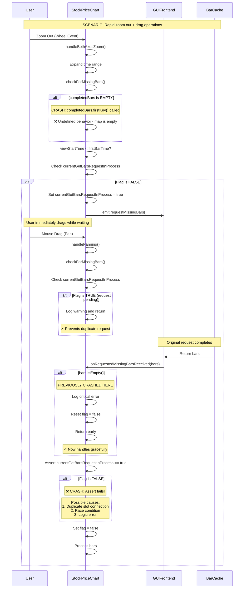

### Thread Safety Concerns

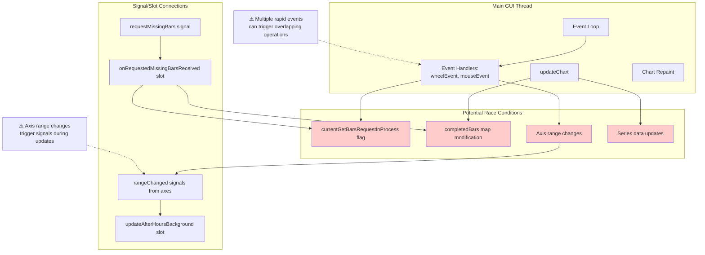

---

## Debugging Recommendations

### Key Areas to Investigate for Zoom/Drag Crashes

1. **Assert in onRequestedMissingBarsReceived (Line 144)**
   - Check for duplicate signal/slot connections
   - Verify flag state management in checkForMissingBars
   - Add logging before emit to confirm flag is set
   - Consider using QMutex for thread-safe flag access

2. **Empty completedBars Map Access**
   - Add guards: `if (!completedBars.isEmpty())` before `completedBars.firstKey()`
   - Particularly in checkForMissingBars (line 834)
   - Consider defensive checks after clearSymbol()

3. **Iterator Arithmetic (Line 329, 734)**
   - Review: `it == --completedBars.end()`
   - This is undefined if map has 0 or 1 elements
   - Replace with: `it.key() == completedBars.lastKey()`

4. **Division by Zero in handlePanning**
   - Add checks before: `timePerPixel` and `pricePerPixel` calculations
   - Verify chartView dimensions are valid
   - Handle resize events that may create zero-size views

5. **Rapid Event Handling**
   - Consider debouncing zoom/pan events
   - Use QTimer to coalesce rapid checkForMissingBars calls
   - Implement event throttling for better performance

### Suggested Code Improvements

```cpp
// In checkForMissingBars (line 824):
void StockPriceChart::checkForMissingBars(const QDateTime& viewStartTime, const QDateTime& viewEndTime) {
    // ADD: Early return if no bars
    if (completedBars.isEmpty()) {
        qCDebug(ChartLog) << "No bars available yet";
        return;
    }
    
    // ... rest of function
}

// In onRequestedMissingBarsReceived (line 142):
void StockPriceChart::onRequestedMissingBarsReceived(const QVector<Bar>& bars) {
    // ADD: More detailed logging
    qCDebug(ChartLog) << "Received" << bars.size() << "bars, flag state:" << currentGetBarsRequestInProcess;
    
    if (!currentGetBarsRequestInProcess) {
        qCCritical(ChartLog) << "LOGIC ERROR: Received bars without pending request!";
        qCCritical(ChartLog) << "This indicates duplicate connections or race condition";
        // Consider returning instead of asserting
        return;
    }
    
    // ... rest of function
}

// In updateChart (line 329):
// REPLACE:
if (it == --completedBars.end()) {
    currentPrice = bar.getClose();
}
// WITH:
if (it.key() == completedBars.lastKey()) {
    currentPrice = bar.getClose();
}
```

---

## Summary

The StockPriceChart is a complex component with multiple interacting systems:
- Real-time data updates
- Interactive zoom and pan
- Dynamic bar loading
- View state preservation
- Market hours visualization

The most likely crash scenario during zoom out and drag operations involves:
1. The `currentGetBarsRequestInProcess` flag state management
2. Empty map access in `completedBars.firstKey()`
3. Iterator arithmetic issues
4. Potential race conditions from rapid user interactions

Key defensive programming patterns needed:
- Always check if `completedBars.isEmpty()` before accessing keys
- Validate flag state before and after async operations
- Add bounds checking for iterator arithmetic
- Consider thread-safe access patterns
- Implement event throttling for better UX and stability
