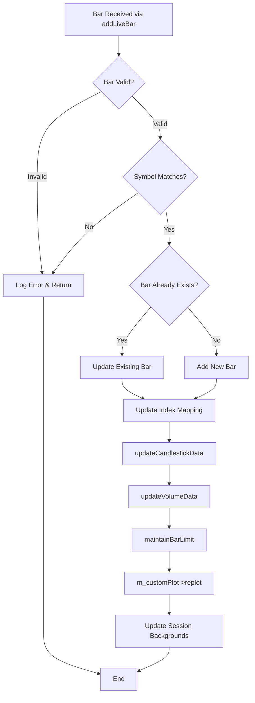
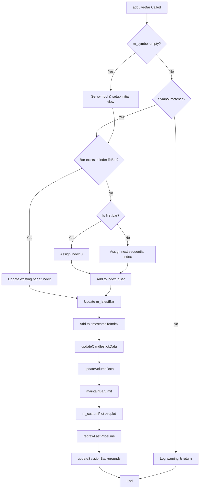
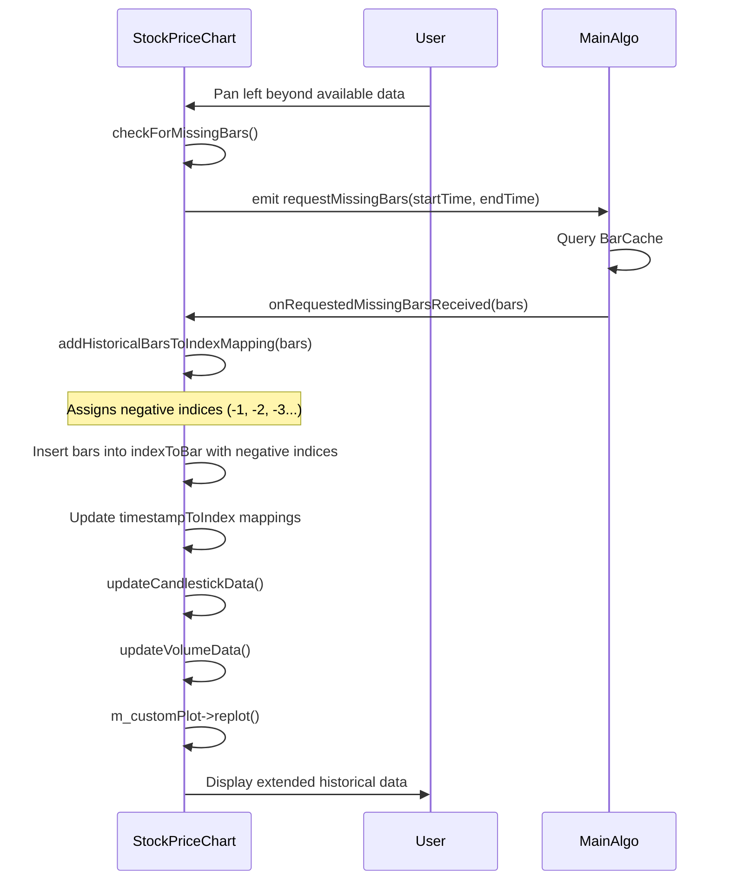

# Stock Price Chart Architecture and Bar Reception Flow

## Overview

The Stock Price Chart component in L2Trader is responsible for displaying real-time and historical candlestick charts for stock prices. It uses **qcustomplot's** QCPFinancial to render price data and implements a **bidirectional index mapping system** to handle continuous time-based data efficiently.

The chart receives bars through the `addLiveBar()` method and processes them based on their status (Open or Closed). The system maintains an index-based positioning system where timestamps are mapped to integer indices for efficient chart rendering and navigation.

## Key Components

### Data Structures
- **indexToBar**: QMap<int, Bar> - Maps chart indices to Bar objects (bidirectional: negative for historical, positive for future)
- **timestampToIndex**: QMap<QDateTime, int> - Maps timestamps to chart indices
- **m_latestBar**: Bar - The currently open/unfinished bar
- **m_latestBarIndex**: int - Index of the latest bar in the chart

### Core Methods
- `addLiveBar(const QString& symbol, const Bar& bar)` - Entry point for new bars
- `onRequestedMissingBarsReceived(const QVector<Bar>& bars)` - Handles historical bars
- `addHistoricalBarsToIndexMapping(const QVector<Bar>& bars)` - Updates index mapping for historical data
- `updateCandlestickData()` - Rebuilds QCPFinancialData from indexToBar
- `updateVolumeData()` - Updates volume bars (positive/negative)
- `maintainBarLimit()` - Enforces MAX_BARS limit (1000 bars)

## Bar Reception Flow

### Main Entry Point

### Live Bar Processing

### Historical Bar Loading

When missing historical bars are requested and received:

## Error Handling and Edge Cases

### Duplicate Timestamps
- Handled by checking `indexToBar.contains(index)` before insertion
- Existing bar is updated with new data

### First Bar Handling
- Special logic for initial chart setup
- Assigns index 0 to origin bar
- Sets appropriate axis ranges (30-minute default view)
- Initializes view state

### Bar Limit Management
- `maintainBarLimit()` removes oldest bars when `MAX_BARS` (1000) is exceeded
- Preserves most recent data for real-time trading
- Cleans up both `indexToBar` and `timestampToIndex` mappings

### Symbol Mismatch
- Logs warning if received bar symbol doesn't match current symbol
- Silently ignores mismatched bars

## Performance Considerations

### qcustomplot Rendering
- Complete data rebuild via `updateCandlestickData()` for each update
- QCPFinancialData populated from indexToBar map
- Explicit `m_customPlot->replot()` triggers rendering
- Background session rendering uses QCPItemRect objects

### Incremental Updates
- Normal bar reception uses incremental index updates
- O(1) for sequential bars (no reindexing needed)
- Index mapping updated directly in `addLiveBar()`

### Data Rebuild
- Full candlestick data rebuild on every update
- QCPFinancialData cleared and repopulated from indexToBar
- O(n) operation where n is number of bars
- Necessary for qcustomplot architecture

### Series Management
- QCPFinancial data() cleared and refilled each update
- Volume bars (QCPBars) rebuilt similarly
- All rendering happens via explicit replot() calls

## Integration Points

### Data Sources
- **Live Bars**: Received via `addLiveBar()` from MainAlgo signal
- **Historical Bars**: Loaded via `onRequestedMissingBarsReceived()`
- **Missing Data**: Requested through `requestMissingBars()` signal

### UI Interactions
- **Panning**: Handled by wheelEvent() and eventFilter(), preserves index-based view
- **Zooming**: Maintains index ranges for consistent navigation
- **Symbol Changes**: `clearSymbol()` resets all data structures
- **Volume Display**: Toggle volume chart visibility via TimeFrameSelector

### Rendering Pipeline
- **qcustomplot**: Uses QCustomPlot widget for all rendering
- **QCPFinancial**: Candlestick financial chart plottable
- **QCPBars**: Volume bars (separate for positive/negative)
- **QCPItemLine**: Last price line indicator
- **QCPItemText**: Price label display
- **QCPItemRect**: Market session background coloring

### Time Zone Handling
- All timestamps converted to America/New_York timezone
- Consistent time handling across the application
- Market hours defined as constants (6am-8pm ET)

## Debugging and Monitoring

### Logging Categories
- `ChartLog`: Detailed logging of chart operations
- Index mapping changes
- Bar reception events
- Performance metrics

### Assertions
- `Q_CHECK_PTR()` for all dynamically allocated objects
- Validation checks for bar data
- Symbol matching verification

This documentation provides a comprehensive view of how bars are received and processed in the Stock Price Chart component using qcustomplot, ensuring maintainable and efficient real-time charting functionality.</content>
<filePath>/home/simon/Documents/L2Trader/Doc/StockPriceChart_BarReception.md