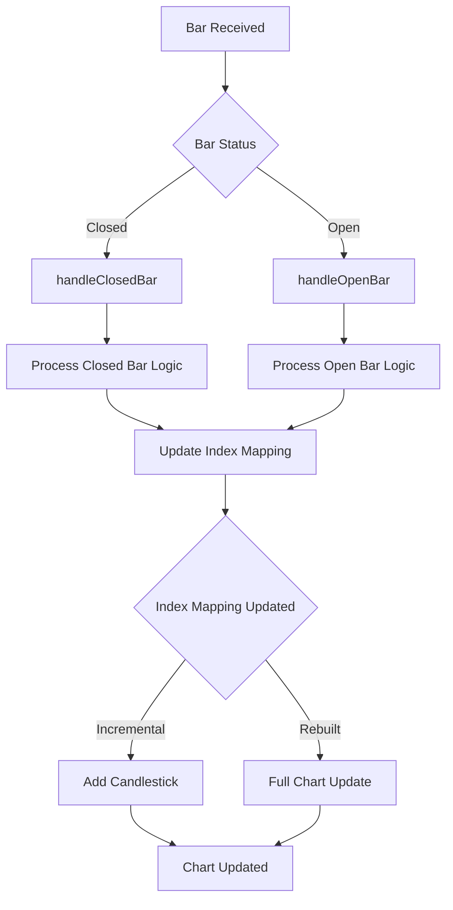
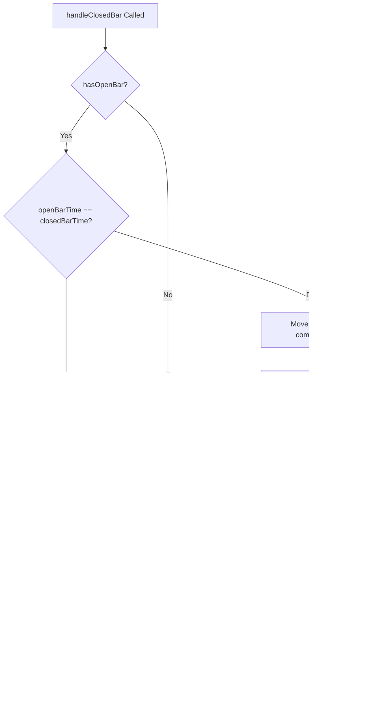
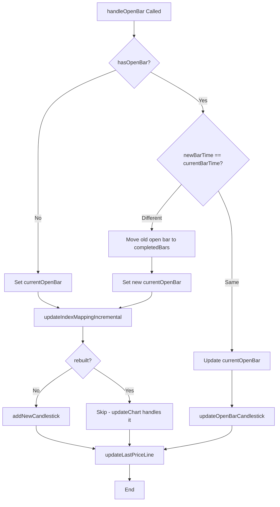
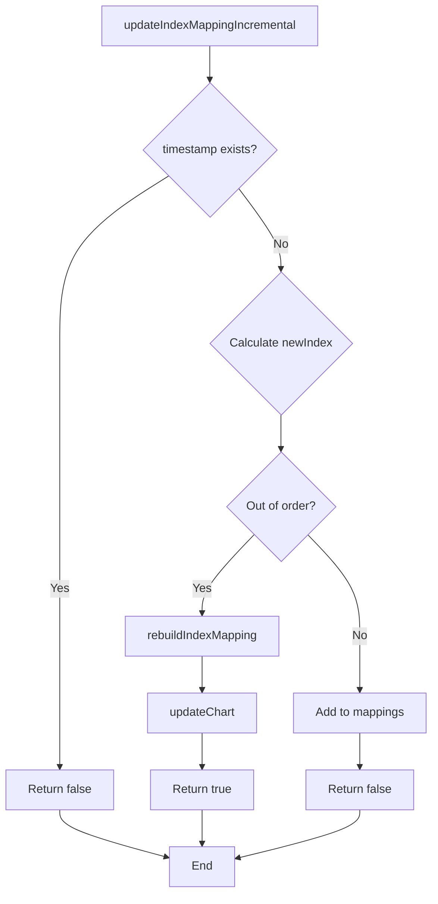
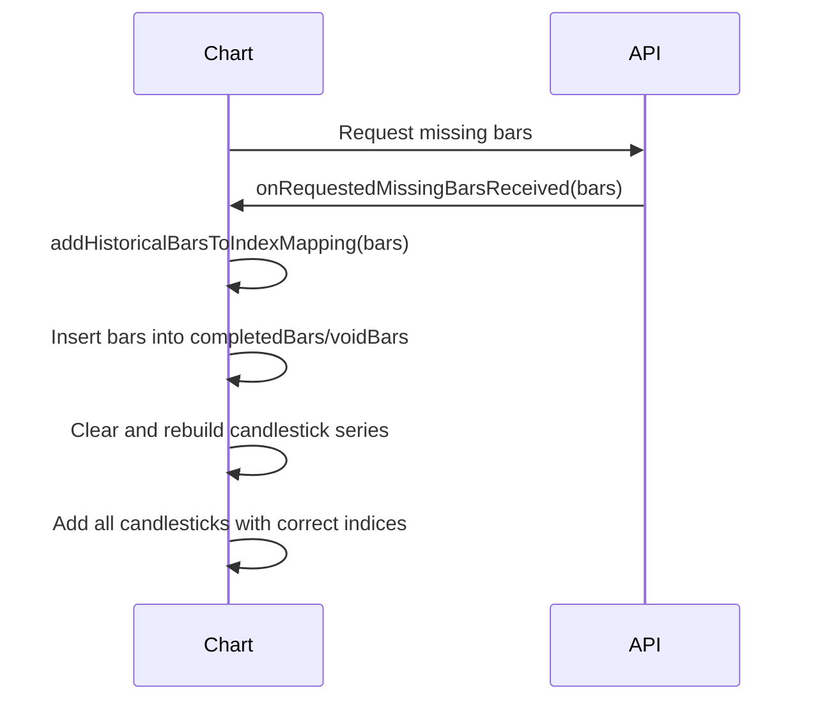

# Stock Price Chart Architecture and Bar Reception Flow

## Overview

The Stock Price Chart component in L2Trader is responsible for displaying real-time and historical candlestick charts for stock prices. It uses Qt Charts' QCandlestickSeries to render price data and implements a bidirectional index mapping system to handle continuous time-based data efficiently.

The chart receives bars through the `addBar()` method and processes them based on their status (Open or Closed). The system maintains an index-based positioning system where timestamps are mapped to integer indices for efficient chart rendering and navigation.

## Key Components

### Data Structures
- **completedBars**: QMap<QDateTime, Bar> - Stores closed bars by timestamp
- **voidBars**: QMap<QDateTime, double> - Stores void bars (missing data points) by timestamp
- **currentOpenBar**: Bar - The currently open/unfinished bar
- **indexToTimestamp**: QMap<int, QDateTime> - Maps chart indices to timestamps
- **timestampToIndex**: QMap<QDateTime, int> - Maps timestamps to chart indices
- **candlestickSeries**: QCandlestickSeries - The main chart series containing candlestick sets

### Core Methods
- `addBar(const Bar& bar)` - Entry point for new bars
- `handleClosedBar(const Bar& bar)` - Processes closed bars
- `handleOpenBar(const Bar& bar)` - Processes open bars
- `updateIndexMappingIncremental(const QDateTime& timestamp)` - Updates the index mapping
- `addNewCandlestick(const QDateTime& timestamp, const Bar& bar)` - Adds candlesticks to the series
- `rebuildIndexMapping()` - Rebuilds the entire index mapping when needed

## Bar Reception Flow

### Main Entry Point

### Closed Bar Processing

### Open Bar Processing

### Index Mapping Update Logic

## Index-Based Positioning System

The chart uses an index-based system instead of direct timestamp positioning for several reasons:

1. **Gap Handling**: Missing bars (void bars) are assigned indices to maintain continuous chart display
2. **Performance**: Integer indices are faster for chart rendering than timestamp calculations
3. **Navigation**: Easier to implement panning and zooming with integer ranges
4. **Historical Data**: Negative indices allow seamless addition of historical bars

### Index Assignment Rules

- **Sequential Bars**: New bars get `lastIndex + 1`
- **Historical Bars**: Added with negative indices (e.g., -1, -2, -3...)
- **Out-of-Order Bars**: Trigger full rebuild with sorted indices
- **Void Bars**: Assigned indices to maintain gaps in the chart

### Timestamp Handling

Bars use their native TradeStation API timestamps, which represent the closing time of each minute bar (e.g., a bar from 9:00-9:01 has timestamp 9:01). The system works directly with these closing timestamps without adjustment.

## Historical Bar Loading

When missing historical bars are requested and received:

## Error Handling and Edge Cases

### Out-of-Order Bars
- Detected when `timestamp < indexToTimestamp.last()`
- Triggers full index mapping rebuild
- Chart series is completely rebuilt to ensure correct positioning
- View state is preserved during rebuild

### Duplicate Timestamps
- Handled by checking `timestampToIndex.contains(timestamp)`
- No action taken for duplicates

### First Bar Handling
- Special logic for initial chart setup
- Sets appropriate axis ranges
- Initializes view state

### Bar Limit Management
- `maintainBarLimit()` removes oldest bars when `MAX_BARS` is exceeded
- Preserves most recent data for real-time trading

## Performance Considerations

### Incremental Updates
- Normal bar reception uses incremental updates
- Avoids full chart rebuilds for better performance
- Index mapping updated in O(1) for sequential bars

### Rebuild Triggers
- Only triggered for out-of-order bars
- O(n) operation where n is number of bars
- Necessary to maintain correct positioning

### Series Management
- QCandlestickSeries append operations are efficient
- Clear/rebuild operations used only when necessary
- Axis detachment/reattachment prevents rendering artifacts

## Integration Points

### Data Sources
- **Live Bars**: Received via `addBar()` from TradeStation API
- **Historical Bars**: Loaded via `onRequestedMissingBarsReceived()`
- **Missing Data**: Requested through `requestMissingBars()` signal

### UI Interactions
- **Panning**: Handled by mouse events, preserves index-based view
- **Zooming**: Maintains index ranges for consistent navigation
- **Symbol Changes**: `clearSymbol()` resets all data structures

### Time Zone Handling
- All timestamps converted to America/New_York timezone
- Consistent time handling across the application

## Debugging and Monitoring

### Logging Categories
- `ChartLog`: Detailed logging of chart operations
- Index mapping changes
- Bar reception events
- Performance metrics

### Assertions
- `Q_ASSERT(bar.isValid())` in `addBar()`
- `Q_ASSERT(currentGetBarsRequestInProcess)` in historical bar handling
- Various validation checks throughout

## Future Improvements

### Potential Optimizations
- Batch processing for multiple bars
- Lazy loading for large historical datasets
- Improved out-of-order handling algorithms

### Feature Enhancements
- Multiple timeframe support
- Advanced technical indicators
- Custom drawing tools

This documentation provides a comprehensive view of how bars are received and processed in the Stock Price Chart component, ensuring maintainable and efficient real-time charting functionality.</content>
<filePath>/home/simon/Documents/L2Trader/Doc/StockPriceChart_BarReception.md