# StockPriceChart Architecture

This document provides a comprehensive overview of the StockPriceChart component architecture using Mermaid diagrams.

## Table of Contents
- [Class Diagram](#class-diagram)
- [Data Flow Sequence](#data-flow-sequence)
- [User Interaction Flow](#user-interaction-flow)
- [Chart Update State Machine](#chart-update-state-machine)
- [Component Interaction Architecture](#component-interaction-architecture)
- [Bar Processing Pipeline](#bar-processing-pipeline)
- [Zoom and Pan Interaction Matrix](#zoom-and-pan-interaction-matrix)
- [Market Hours Background System](#market-hours-background-system)
- [Event Handling Architecture](#event-handling-architecture)
- [Rendering Pipeline](#rendering-pipeline)
- [Data Synchronization Flow](#data-synchronization-flow)
- [Memory Management Strategy](#memory-management-strategy)
- [Thread Safety and Signal Flow](#thread-safety-and-signal-flow)
- [Error Handling and Edge Cases](#error-handling-and-edge-cases)
- [Key Features and Implementation Details](#key-features-and-implementation-details)
- [Dependencies](#dependencies)

## Class Diagram

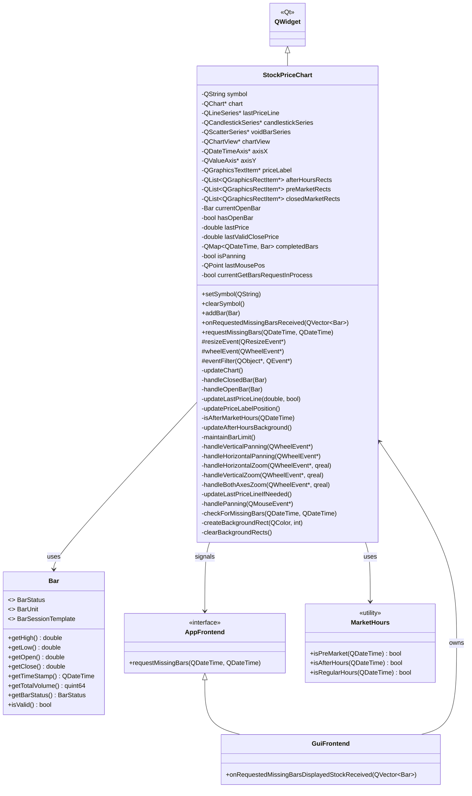

## Data Flow Sequence

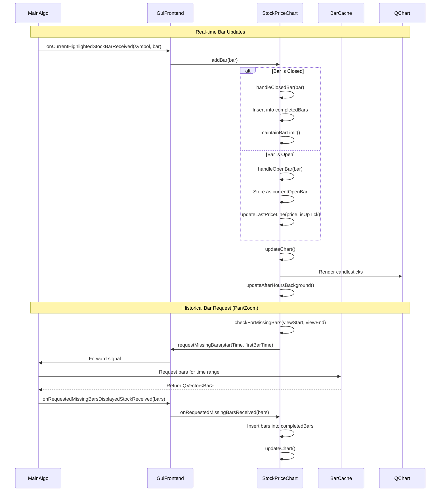

## User Interaction Flow

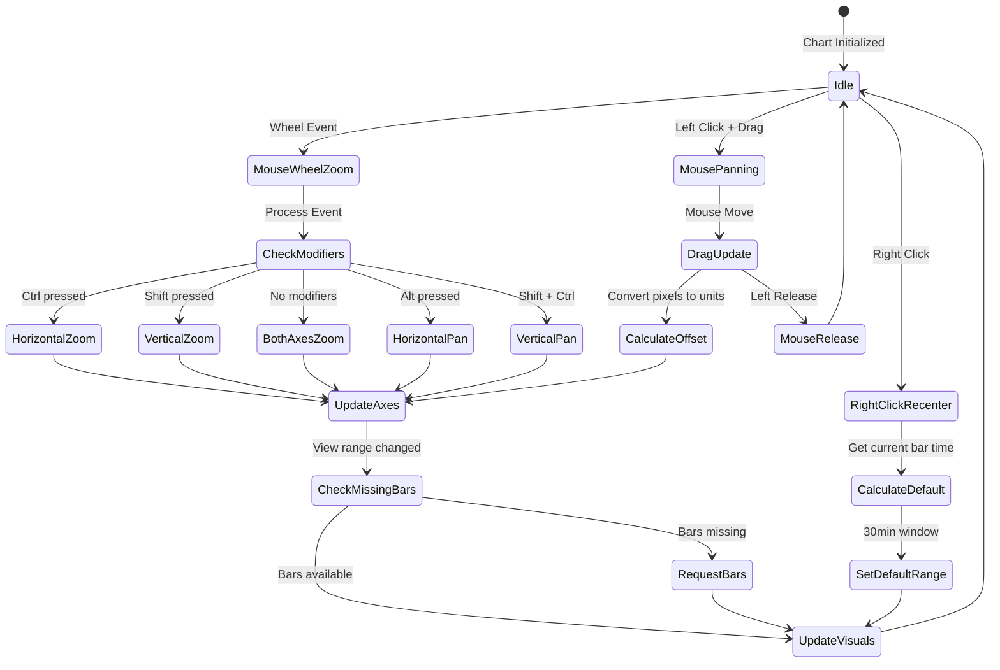

## Chart Update State Machine

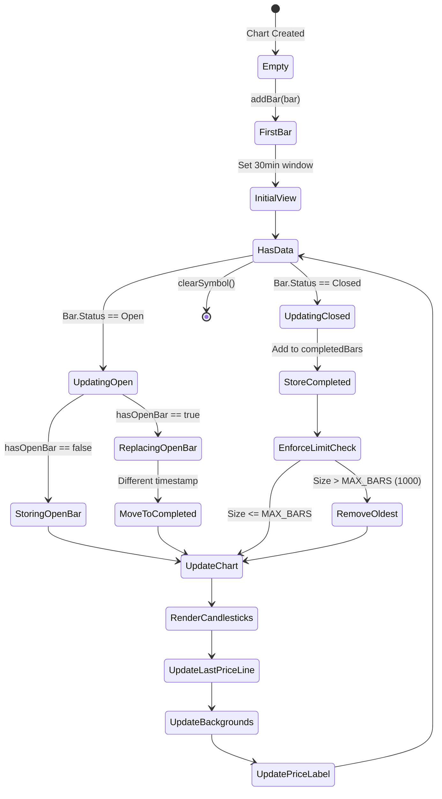

## Component Interaction Architecture

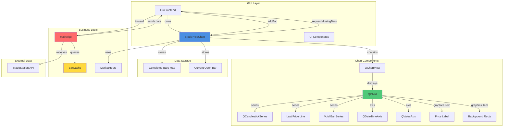

## Bar Processing Pipeline

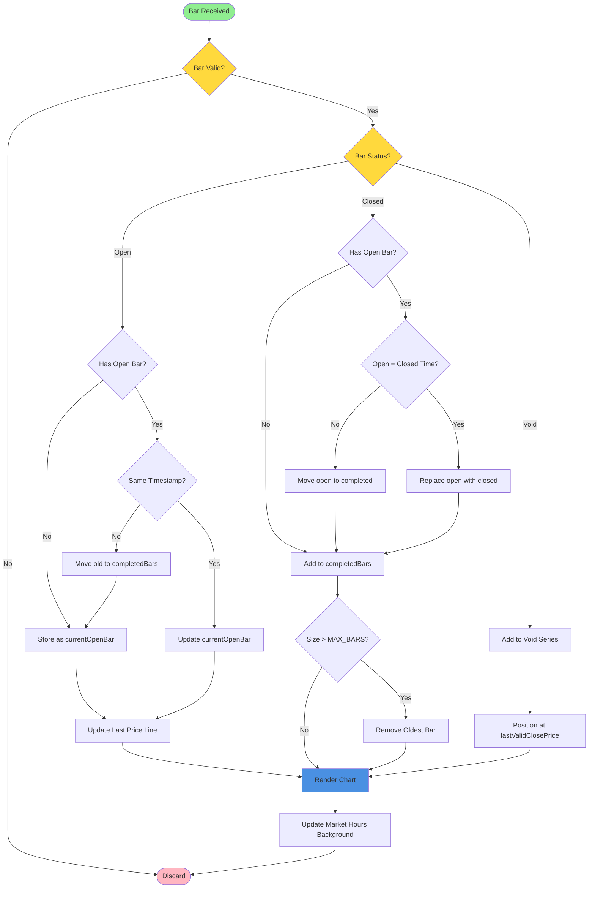

## Zoom and Pan Interaction Matrix

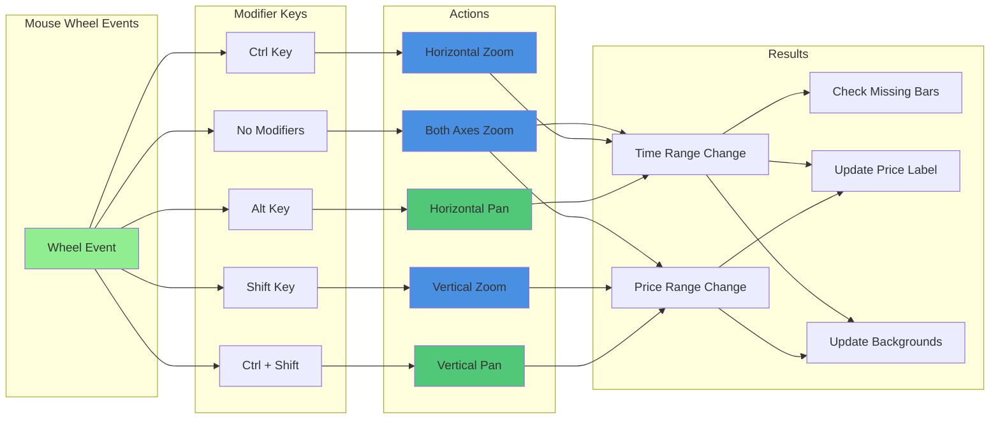

## Market Hours Background System

```mermaid
flowchart TD
    Start([updateAfterHoursBackground]) --> Clear[Clear existing rectangles]
    Clear --> GetRange[Get visible time range]
    GetRange --> ConvertNY[Convert to NY timezone]
    ConvertNY --> InitLoop[Initialize date loop]
    
    InitLoop --> LoopDate{For each date}
    LoopDate -->|Next| CheckWeekend{Is Weekend?}
    LoopDate -->|Done| End([Complete])
    
    CheckWeekend -->|Yes| DrawClosed[Draw closed market rect]
    CheckWeekend -->|No| LoopHours[Loop through hours 0-23]
    
    DrawClosed --> LoopDate
    
    LoopHours --> CheckHour{Check hour type}
    
    CheckHour -->|Pre-market| DrawPre[Draw pre-market rect<br/>Color: Brown tint<br/>Z-Value: -1]
    CheckHour -->|Regular hours| NextHour[Continue to next hour]
    CheckHour -->|After-hours| DrawAfter[Draw after-hours rect<br/>Color: Blue tint<br/>Z-Value: -1]
    CheckHour -->|Closed| DrawClosed2[Draw closed rect<br/>Color: Dark gray<br/>Z-Value: -2]
    
    DrawPre --> NextHour
    DrawAfter --> NextHour
    DrawClosed2 --> NextHour
    NextHour --> MoreHours{More hours?}
    
    MoreHours -->|Yes| LoopHours
    MoreHours -->|No| LoopDate
    
    style Start fill:#90ee90
    style End fill:#ffb6c1
    style DrawPre fill:#d2691e
    style DrawAfter fill:#4169e1
    style DrawClosed fill:#2f4f4f
    style DrawClosed2 fill:#2f4f4f
```

## Event Handling Architecture

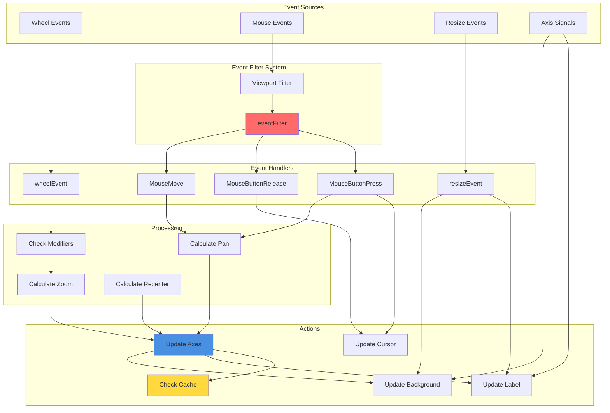

## Rendering Pipeline

```mermaid
flowchart LR
    subgraph "Data Preparation"
        CB[Completed Bars Map]
        OB[Current Open Bar]
        VB[Void Bars]
    end
    
    subgraph "Series Population"
        CCS[Clear Candlestick Series]
        ACB[Add Completed Bars]
        AOB[Add Open Bar]
        AVB[Add Void Markers]
    end
    
    subgraph "Axis Management"
        CVR[Check View Range]
        SXR[Set X Range]
        SYR[Set Y Range]
        CTR[Calculate Tick Range]
    end
    
    subgraph "Visual Elements"
        RC[Render Candlesticks]
        RPL[Render Price Line]
        RVM[Render Void Markers]
        RBG[Render Backgrounds]
        RLB[Render Label]
    end
    
    subgraph "Output"
        QCV[QChartView]
        SCN[QGraphicsScene]
    end
    
    CB --> CCS
    OB --> CCS
    VB --> CCS
    
    CCS --> ACB
    ACB --> AOB
    AOB --> AVB
    
    AVB --> CVR
    CVR --> SXR
    CVR --> SYR
    SXR --> CTR
    
    CTR --> RC
    RC --> RPL
    RPL --> RVM
    RVM --> RBG
    RBG --> RLB
    
    RLB --> QCV
    QCV --> SCN
    
    style CCS fill:#ff6b6b
    style CVR fill:#ffd93d
    style RC fill:#4a90e2
    style QCV fill:#50c878
```

## Data Synchronization Flow

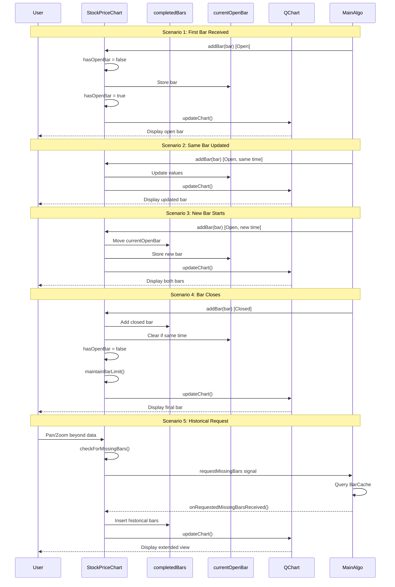

## Memory Management Strategy

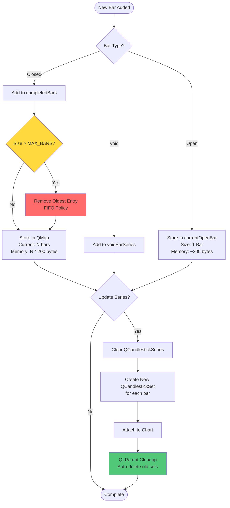

## Thread Safety and Signal Flow

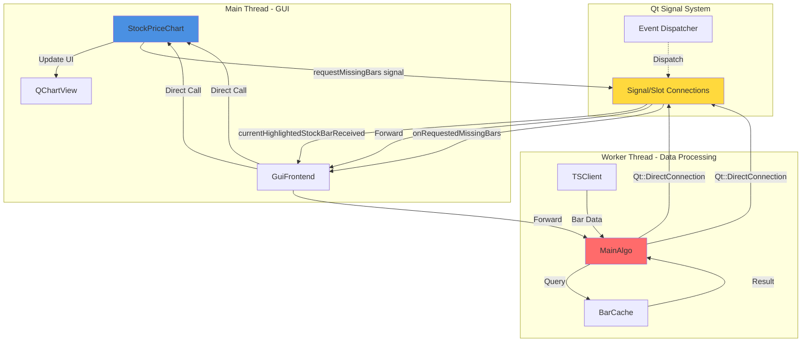

## Error Handling and Edge Cases

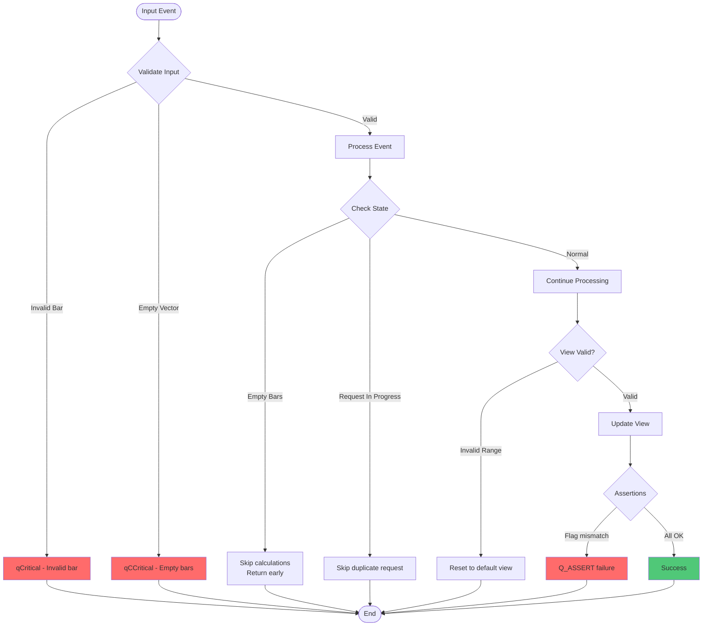

## Key Features and Implementation Details

### 1. Real-time Updates
- **Open Bar Tracking**: Maintains `currentOpenBar` that updates in real-time
- **Price Line**: Dynamic horizontal line showing current price with color (green=up, red=down)
- **Price Label**: Floating label in right margin showing current price

### 2. Data Management
- **Circular Buffer**: Maintains maximum of 1000 bars (`MAX_BARS`)
- **Efficient Storage**: Uses `QMap<QDateTime, Bar>` for O(log n) lookups
- **Void Bar Handling**: Special markers for bars with no trading activity

### 3. Visualization
- **Candlestick Chart**: Green for price increase, red for decrease
- **Market Hours Overlay**: 
  - Pre-market: Brown tint (90, 60, 30, 100 RGBA)
  - After-hours: Blue tint (50, 50, 80, 100 RGBA)
  - Closed: Dark gray (40, 40, 50, 120 RGBA)
  - Weekend: Dark gray (deeper shade)
- **Dark Theme**: Consistent with application theme

### 4. Interaction Controls
- **Mouse Wheel**:
  - Scroll: Zoom both axes
  - Ctrl+Scroll: Zoom horizontally (time axis)
  - Shift+Scroll: Zoom vertically (price axis)
  - Alt+Scroll: Pan horizontally
  - Ctrl+Shift+Scroll: Pan vertically
- **Mouse Drag**: Left-click drag for pan in both directions
- **Right Click**: Reset to default 30-minute view centered on current bar
- **Keyboard**: 'i' to focus stock input (from GuiFrontend)

### 5. Performance Optimizations
- **View-based Rendering**: Only processes visible bars for min/max calculations using `QMap::lowerBound`
- **Request Throttling**: `currentGetBarsRequestInProcess` prevents duplicate requests
- **State Preservation**: Maintains view state (zoom/pan) during updates
- **Lazy Background Updates**: Only updates on range changes via axis signals
- **Z-Value Layering**: Backgrounds at -2 and -1, chart data at 0+

### 6. Smart Bar Fetching
- **Automatic Detection**: Detects when user pans/zooms beyond available data
- **Signal-based Request**: Emits `requestMissingBars` signal to MainAlgo via GuiFrontend
- **Asynchronous Loading**: Non-blocking bar retrieval from cache
- **Seamless Integration**: Automatically renders new bars when received
- **Request Guard**: Prevents multiple simultaneous requests with flag

## Configuration Constants

```cpp
#define CANDLESTICK_BODY_WIDTH 0.9  // 90% of available space
const int MAX_BARS = 1000;          // Maximum bars to display
const int DEFAULT_VIEW_MINUTES = 30; // Default time window
const int TIME_TICK_COUNT = 7;       // Ticks for 30-min view (every 5 min)
const double PRICE_PADDING = 0.0002; // 0.02% padding for Y axis
const double MIN_PRICE_RANGE = 0.0005; // 0.05% minimum range
const double ZOOM_FACTOR_IN = 0.9;   // Zoom in factor
const double ZOOM_FACTOR_OUT = 1.1;  // Zoom out factor
const double PAN_SHIFT_PERCENT = 0.05; // 5% shift for pan operations
```

## Dependencies

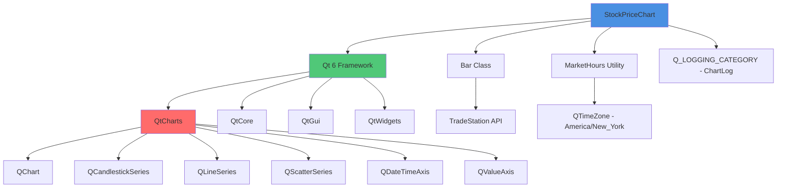

## Performance Characteristics

| Operation | Time Complexity | Space Complexity | Notes |
|-----------|----------------|------------------|-------|
| Add Bar | O(log n) | O(1) | QMap insertion |
| Update Chart | O(n) | O(n) | n = visible bars only |
| Find Bar by Time | O(log n) | O(1) | QMap lookup |
| Maintain Bar Limit | O(1) amortized | O(1) | Removes oldest when > MAX_BARS |
| Zoom/Pan | O(m) | O(1) | m = bars in new view |
| Background Update | O(h × d) | O(h × d) | h = hours, d = days in view |
| Missing Bar Check | O(1) | O(1) | Simple time comparison |

Where:
- n = total bars in completedBars
- m = bars visible in current view
- h = hours visible in view
- d = days visible in view

## Qt Components Used

- **QChart** and **QChartView**: Main charting framework
- **QCandlestickSeries**: Price visualization
- **QLineSeries**: Last price line
- **QScatterSeries**: Void bar markers
- **QDateTimeAxis** and **QValueAxis**: Time and price axes
- **QGraphicsTextItem** and **QGraphicsRectItem**: Overlays and backgrounds
- **QMap**: Efficient bar storage with time-based lookups
- **Q_LOGGING_CATEGORY**: Debug logging (ChartLog category)