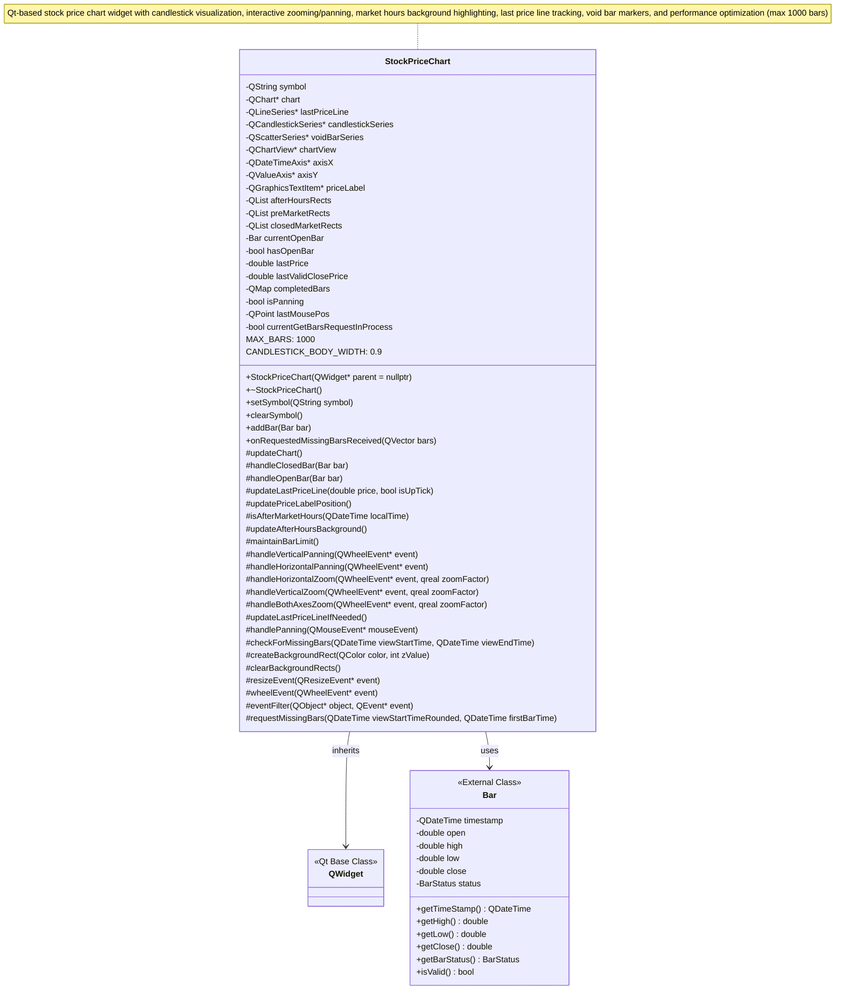

# StockPriceChart Class Diagram

## Key Features

- **Data Visualization**: Displays stock price data using candlestick charts
- **Interactivity**: Supports mouse panning and wheel-based zooming (horizontal, vertical, combined)
- **Market Hours**: Visual background indicators for pre-market, regular hours, after-hours, and closed periods
- **Real-time Updates**: Handles both completed bars and open (in-progress) bars
- **Performance**: Maintains a rolling window of maximum 1000 bars
- **Signals**: Emits requests for missing historical data when zooming out beyond available data

## Qt Components Used

- `QChart` and `QChartView` for the main charting framework
- `QCandlestickSeries` for price visualization
- `QLineSeries` for last price line
- `QScatterSeries` for void bar markers
- `QDateTimeAxis` and `QValueAxis` for time and price axes
- `QGraphicsTextItem` and `QGraphicsRectItem` for overlays and backgrounds