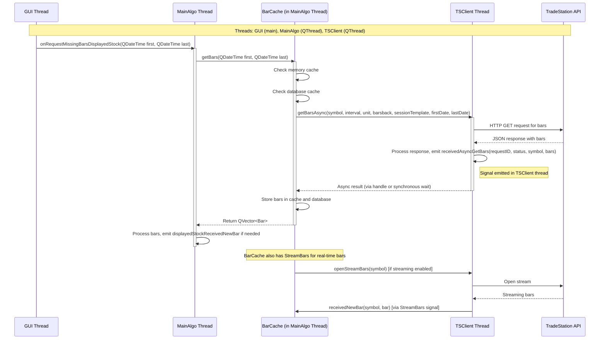

# Thread Relations for TSClient, Async Requests, and BarCache

This document visualizes the relationships between threads when the GUI signals the need for bars, leading to async requests via TSClient for bar data, and how BarCache in the MainAlgo thread handles the data flow.

## Key Points

- **Threads**:
  - GUI Thread: Handles user interface and signals requests.
  - MainAlgo Thread: Runs the main algorithm logic, contains BarCache instances.
  - TSClient Thread: Handles all API communications asynchronously.

- **Signal/Slot Connections**:
  - GUI to MainAlgo: `onRequestMissingBarsDisplayedStock` (slot in MainAlgo).
  - BarCache to TSClient: Direct method call `getBarsAsync` (cross-thread).
  - TSClient to BarCache: `receivedAsyncGetBars` signal (if connected), or synchronous result via handle.
  - StreamBars to BarCache: `receivedNewBar` for real-time updates.

- **Bars Path**:
  1. GUI signals need for bars.
  2. MainAlgo calls BarCache.getBars.
  3. BarCache checks caches, then calls TSClient.getBarsAsync.
  4. TSClient sends async HTTP request.
  5. Response processed in TSClient thread, result returned to BarCache (synchronously or via signal).
  6. Bars stored in BarCache (memory + DB).
  7. Bars returned to MainAlgo for display/emission.

- **Async Handling**:
  - Async requests use request IDs for tracking.
  - Results can be handled via signals or synchronous waits on handles (depending on implementation).

- **Streaming**:
  - For real-time bars, StreamBars is opened, connecting signals from TSClient thread to BarCache in MainAlgo thread.</content>
<parameter name="filePath">/home/simon/Documents/L2Trader/Doc/Thread_Relations_TSClient.md