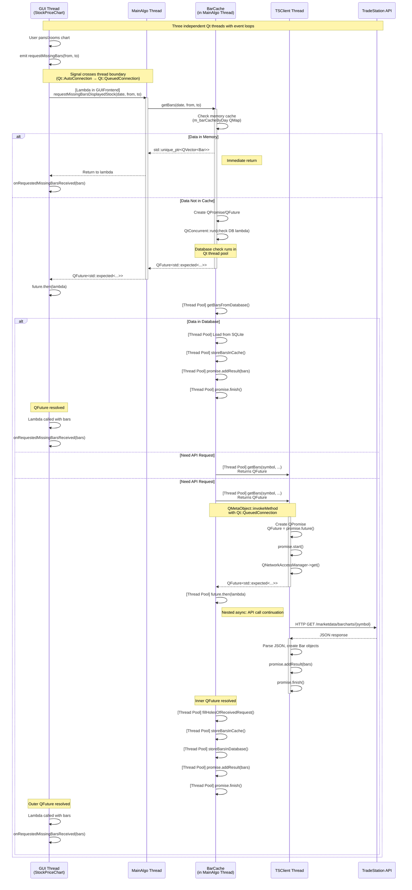
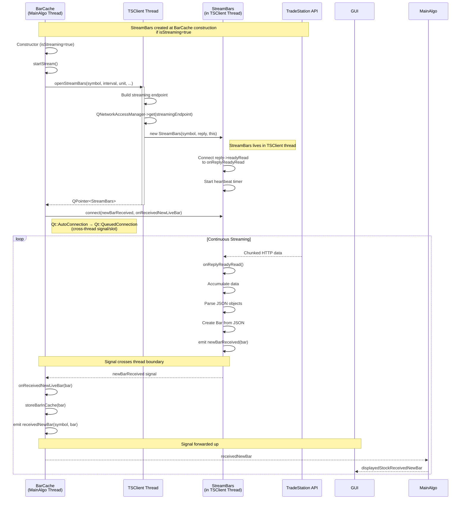

# Thread Relations for TSClient, Async Requests, and BarCache

This document describes the thread architecture and cross-thread communication patterns when the GUI requests bar data, leading to async API requests via TSClient, and how BarCache manages the data flow. The architecture uses Qt's QFuture/QPromise pattern for asynchronous operations.

## Thread Architecture

The application runs on three main threads plus Qt's global thread pool:

1. **GUI Thread (Main Qt Thread)**: Handles user interface, user interactions, and rendering
2. **MainAlgo Thread**: Runs business logic, contains StockInstruments (including BarCache instances)
3. **TSClient Thread**: Manages all TradeStation API communications (REST and streaming)
4. **Qt Thread Pool**: Used by BarCache for asynchronous database I/O operations (via `QtConcurrent::run`)

All threads use Qt's event loop and communicate via signals/slots and QFuture/QPromise.

## Historical Bar Data Request Flow



## Real-Time Bar Streaming Flow



## Key Architectural Patterns

### 1. QFuture/QPromise Pattern

TSClient methods return `QFuture<std::expected<T, Error>>` for async operations:

```cpp
// TSClient returns QFuture immediately
QFuture<std::expected<std::unique_ptr<QVector<Bar>>, TSClient::Error>>
TSClient::getBars(const QString &symbol, ...);

// BarCache can return either immediate data or QFuture
typedef std::variant<
    std::unique_ptr<QVector<Bar>>,
    QFuture<std::expected<std::unique_ptr<QVector<Bar>>, TSClient::Error>>
> GetBarsResult_t;
```

**How it works:**
1. Caller invokes `TSClient::getBars()` from any thread
2. `QMetaObject::invokeMethod` with `Qt::QueuedConnection` posts to TSClient thread
3. TSClient creates `QPromise`, starts it, returns `QFuture` immediately
4. Network request executes asynchronously in TSClient thread
5. When reply finishes, `promise.addResult()` and `promise.finish()` are called
6. QFuture continuations (`.then()`) execute when promise finishes

### 2. Thread Affinity

- **TSClient**: Lives in TSClient thread, created at startup
  - `m_networkManager` also lives in TSClient thread
  - All API requests execute in this thread's event loop

- **MainAlgo**: Lives in MainAlgo thread
  - `StockInstruments` instances (containing BarCache) are parented to MainAlgo
  - All BarCache instances live in MainAlgo thread
  - BarCache uses `QtConcurrent::run` to offload database I/O to Qt's thread pool

- **Stream Objects**: Created and live in TSClient thread
  - `StreamBars`, `StreamMarketDepthQuote`, `StreamPositions`, `StreamOrders`
  - Owned by TSClient, parented correctly
  - Emit signals that cross thread boundaries to consumers

### 3. Cross-Thread Communication

**Method Invocation:**
```cpp
// From any thread → TSClient thread
QMetaObject::invokeMethod(
    tsclient,
    [this, promise]() mutable { /* execute in TSClient thread */ },
    Qt::QueuedConnection
);
```

**Signal/Slot Connections:**
- Qt automatically uses `Qt::QueuedConnection` when signal/slot are in different threads
- Ensures thread-safe communication via event queue
- Example: `StreamBars::newBarReceived` → `BarCache::onReceivedNewLiveBar`

### 4. Stream Lifecycle

1. **Creation**: TSClient creates Stream object (lives in TSClient thread)
2. **Connection**: Consumer connects to Stream's signals (cross-thread)
3. **Data Flow**: Stream emits signals → cross thread boundary → consumer slots
4. **Cleanup**: TSClient owns streams, deletes via `closeStream()`

### 5. Memory and Database Caching

BarCache implements two-level caching:

**Memory Cache:**
- `QMap<QDate, QVector<Bar>> m_barCacheByDay`
- Protected by `QReadWriteLock m_barCacheRwLock`
- Fast lookup, volatile

**Database Cache:**
- SQLite database per symbol: `bars_cache_{symbol}.db`
- Persistent across application restarts
- One connection per BarCache: `QSqlDatabase m_db`

**Cache Strategy:**
1. Check memory cache first (synchronous)
2. If miss, spawn thread pool task via `QtConcurrent::run` to check database
3. If database miss, thread pool task initiates API request (returns nested QFuture)
4. Store received data in both caches (within thread pool task)

## Thread Safety Considerations

1. **TSClient Singleton**: Thread-safe via Qt's event loop and queued connections
2. **BarCache**: Lives entirely in MainAlgo thread, but spawns thread pool tasks for DB I/O
3. **QFuture/QPromise**: Thread-safe by design, Qt handles synchronization
4. **Streams**: Live in TSClient thread, emit signals that Qt queues to other threads
5. **Network Replies**: Processed in TSClient thread where QNetworkAccessManager lives
6. **Database Access**: Each BarCache has its own SQLite connection, accessed only from thread pool tasks
7. **Memory Cache**: Protected by `QReadWriteLock` for thread-safe read/write access

## Common Data Request Patterns

### Pattern 1: Immediate Data (Cache Hit)
```cpp
BarCache::GetBarsResult_t result = barCache->getBars(date, from, to);
if (std::holds_alternative<std::unique_ptr<QVector<Bar>>>(result)) {
    auto bars = std::get<std::unique_ptr<QVector<Bar>>>(result);
    // Use bars immediately
}
```

### Pattern 2: Async Data (Cache Miss)
```cpp
BarCache::GetBarsResult_t result = barCache->getBars(date, from, to);
if (std::holds_alternative<QFuture<...>>(result)) {
    auto future = std::get<QFuture<...>>(result);
    future.then(this, [](std::expected<...> result) {
        if (result.has_value()) {
            // Use bars when available
        }
    });
}
```

### Pattern 3: Streaming Data (Real-Time)
```cpp
// In BarCache constructor when isStreaming=true
m_stream = TSClient::getInstance()->openStreamBars(symbol, ...);
connect(m_stream, &StreamBars::newBarReceived,
        this, &BarCache::onReceivedNewLiveBar,
        Qt::UniqueConnection);
// Bars arrive continuously via signal
```

## Summary

The architecture elegantly separates concerns across three threads:
- **GUI Thread**: Handles user interactions and visualization
- **MainAlgo Thread**: Manages business logic and data caching
- **TSClient Thread**: Isolates all network I/O and API communication

Qt's QFuture/QPromise pattern enables natural async programming without callback hell, while Qt's signal/slot mechanism with automatic connection type detection ensures thread-safe communication. The result is a responsive, maintainable, and thread-safe trading application.