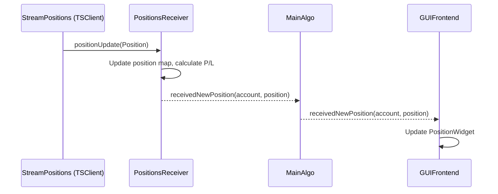
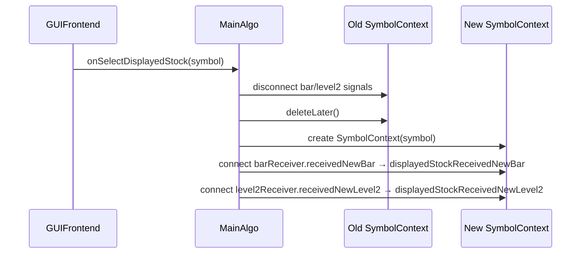

# Algo/ Directory - Trading Algorithm Components - Agent Instructions

The Algo directory contains the trading algorithm coordination logic and various receivers for processing market data and trading events. TSClient is brokerage-only (orders, positions, accounts). Market data (Level 2, trades, bars) flows from DBClient in live mode and from ReplayEngine in replay mode.

## Overview

**Location**: `Src/Algo/`
**Purpose**: Trading algorithm coordination, data reception, and processing
**Key Component**: MainAlgo singleton running in dedicated thread

**Directory Contents**:
- `MainAlgo.h/cpp` — Central coordinator singleton
- `BarReceiver/` — Bar reception (wired to `LiveBarAccumulator`)
- `Level2Receiver/` — Level 2 (10-level book) reception, replaces former `MarketDepthQuoteReceiver/`
- `Level1Receiver/` — Level 1 (BBO) reception for secondary stocks (new)
- `PositionsReceiver/` — Position tracking via StreamPositions
- `OrdersReceiver/` — Order tracking via StreamOrders
- `StreamReceiver/` — Base class for all receivers

## MainAlgo (MainAlgo.h/cpp)

**Role**: Central coordinator for all trading algorithm operations

### Singleton Pattern

```cpp
class MainAlgo final : public QObject {
public:
    static MainAlgo* getInstance();
    static void destroyInstance();

    Q_DISABLE_COPY(MainAlgo)

private:
    static MainAlgo* m_instance;
    explicit MainAlgo();
    ~MainAlgo();
};
```

### Threading

MainAlgo runs in its own dedicated QThread:
```cpp
QThread thread;  // Stack-allocated (preferred pattern)

MainAlgo::MainAlgo() {
    moveToThread(&thread);
    thread.start();
}

~MainAlgo() {
    thread.quit();
    if (!thread.wait(5000)) {
        thread.terminate();
        thread.wait();
    }
}
```

### Key Responsibilities

1. **Stock Instrument Management**
   - Create and manage SymbolContext instances (one per symbol)
   - Track currently displayed stock via `m_currentDisplayedSymbolContext`
   - Coordinate bar caching per symbol

2. **Account and Balance Management**
   - Track TradeStation accounts (brokerage-only via TSClient)
   - Poll balances periodically (configurable interval)
   - Emit balance updates to UI

3. **Position Tracking**
   - Manage PositionsReceiver (Qt parent-child ownership)
   - Track open positions across accounts
   - Forward position updates to UI

4. **Order Management**
   - Manage OrdersReceiver (Qt parent-child ownership)
   - Place, modify, cancel orders via TSClient
   - Track order status changes
   - Forward order updates to UI

5. **Market Data Forwarding**
   - Connect Level2Receiver signals to `displayedStockReceivedNewLevel2` for the displayed stock
   - Connect BarReceiver signals to `displayedStockReceivedNewBar` for the displayed stock
   - Forward raw Level2 data (DWP/BAI computation removed — belongs in individual strategies)

6. **Replay Coordination**
   - Create and manage ReplayEngine
   - Forward replay control signals (start, stop, pause, resume) to UI
   - Manage replay order/position streams with simulated account

7. **Strategy Management**
   - Own and run StrategyManager for loaded strategy plugins

### Key Members

```cpp
class MainAlgo {
    QThread thread;

    // Per-symbol instruments
    QMap<QString, QPointer<SymbolContext>> m_symbolContexts;
    QPointer<SymbolContext> m_currentDisplayedSymbolContext;

    // Receivers (Qt parent-child ownership, parent is 'this')
    PositionsReceiver* m_positionReceiver = nullptr;
    OrdersReceiver* m_orderReceiver = nullptr;
    bool positionStreamStarted = false;
    bool orderStreamStarted = false;

    // Account and balance
    Account m_activeAccount;
    Balance m_currentBalance;
    std::unique_ptr<QTimer> m_balancePollingTimer;

    // Strategy management
    StrategyManager m_strategyManager;

    // Replay engine (owned, runs in MainAlgo thread)
    ReplayEngine* m_replayEngine = nullptr;

    // Crash monitoring
    std::unique_ptr<QSocketNotifier> m_crashNotifier;
};
```

### Signal Interface

**Signals emitted by MainAlgo**:
```cpp
signals:
    // Market data for displayed stock
    void displayedStockReceivedNewBar(QString symbol, Bar bar);
    void displayedStockReceivedNewLevel2(QString symbol,
                                         Level2 level2,
);  // Simplified: raw Level2 only; strategies compute their own metrics

    // Trading events
    void receivedNewPosition(QString account, Position position);
    void positionDeleted(QString account, QString positionID);
    void receivedNewOrder(QString account, Order order);

    // Account and balance
    void tradeStationAccountsReceived(QVector<Account> accounts);
    void balanceUpdated(Balance balance);

    // Replay control (forwarded from ReplayEngine)
    void replayStarted();
    void replayStopped();
    void replayPaused();
    void replayResumed();
    void replayTimeUpdated(QDateTime currentTime);
    void replayEndReached();
```

> **Removed signals**: `displayedStockReceivedNewQuote` (Quote type removed; BBO now comes from `Level2.m_bids[0]`/`Level2.m_asks[0]`), `displayedStockReceivedNewMarketDepthQuote` (replaced by `displayedStockReceivedNewLevel2`).

**Slots for receiving events**:
```cpp
public slots:
    void onTradeStationAuthStateChanged(bool isAuthenticated,
                                        TSClient::AuthStateReason reason,
                                        const QString& message);
    void onSelectDisplayedStock(const QString& symbol);

private slots:
    void onReceivedNewPosition(const QString& account, Position position);
    void onPositionDeleted(const QString& account, const QString& positionID);
    void onLoadedPositionsFromDatabase(const QString& account, QMap<QString, Position> positions);
    void onReceivedNewOrder(const QString& account, Order order);

    void onReceivedAsyncGetAccounts(const QVector<Account>& results);
    void onBalanceReceived(const QVector<Balance>& results);
    void requestBalance();

    void onStrategyCrashNotified();
    void onReplayEndReached();
```

## SymbolContext

**Role**: Per-symbol passive actor — holds all data/receivers for one symbol and processes events via a thread-pool-backed work queue.

**Actor Model Pattern**:
```cpp
class SymbolContext : public QObject {
public:
    explicit SymbolContext(const QString& p_symbol, QObject* p_parent = nullptr);
    ~SymbolContext();

    void enqueueLevel2(const Level2& p_level2);  // Thread-safe enqueue
    void enqueueTrade(const Trade& p_trade);      // Thread-safe enqueue

    QString symbol;
    BarCache barCache;
    BarReceiver barReceiver;
    Level2Receiver m_level2Receiver;
    LiveBarAccumulator m_liveBarAccumulator;     // 1-minute bar accumulator
    LiveBarAccumulator m_live10sBarAccumulator;  // 10-second bar accumulator
    BarAggregator m_barAggregator;

private:
    using WorkItem = std::variant<Level2, Trade>;
    void drain();
    void processLevel2(const Level2& l2);
    void processTrade(const Trade& trade);

    QMutex m_queueMutex;
    QQueue<WorkItem> m_queue;
    std::atomic<bool> m_draining{false};
    std::atomic<bool> m_destroying{false};
    QWaitCondition m_drainDone;
};
```

**Threading Guarantees**:
- `enqueueLevel2()` / `enqueueTrade()` are thread-safe (mutex-protected push)
- Only ONE pool thread drains a symbol at a time → sequential per symbol, parallel across symbols
- ABA-safe drain loop: re-checks queue after clearing `m_draining` flag
- Destructor sets `m_destroying` and waits for running drain to finish

**DirectConnection Rule**:
All internal signal-slot connections within SymbolContext use `Qt::DirectConnection` so they execute on the pool thread during `drain()`. External connections (to MainAlgo, GUI, StrategyManager) keep `Qt::AutoConnection` → become `QueuedConnection` when emitted from the pool thread.

**Centralized Routing**:
SymbolContext does NOT connect to DBClient directly. MainAlgo wires:
```
DBClient::newLevel2 → MainAlgo::onNewLevel2Received → symbolContext->enqueueLevel2()
DBClient::newTrade  → MainAlgo::onNewTradeReceived  → symbolContext->enqueueTrade()
```
This is the same handler for both live and replay modes — no mode-checking required.

**Lifecycle**:
- Created when symbol first selected via `onSelectDisplayedStock()`
- Previous instrument is cleaned up (`deleteLater()`) when a different symbol is selected
- Only one SymbolContext exists at a time (the displayed stock)
- MainAlgo subscribes to DBClient live data on creation (if not in replay mode)

## BarAggregator

**Role**: Real-time aggregation of closed 1-minute bars into higher-timescale bars

**Location**: `Src/Algo/BarAggregator/BarAggregator.h/.cpp`

**Purpose**: Derives live 5m, 15m, 30m, 1h, 4h, 1d, 1w, and 1M bars from the stream of closed 1m bars. Runs on the MainAlgo thread.

```cpp
class BarAggregator : public QObject {
    Q_OBJECT
public:
    explicit BarAggregator(QObject* parent = nullptr);

public slots:
    void onNewBar(const QString& symbol, const Bar& bar);  // feed closed 1m bars here

signals:
    // Thread context: emitted from MainAlgo thread
    void barUpdated(TimeFrame tf, const QString& symbol, const Bar& bar);  // in-progress bar
    void barClosed(TimeFrame tf, const QString& symbol, const Bar& bar);   // completed bar
};
```

**Accumulation logic**:
- Maintains one `Accumulator` struct per target TimeFrame per symbol
- Intraday close detection: `(minutesFromOpen + 1) % tfMinutes == 0`
- Daily bar closes at `TIME_LAST_CANDLE_AFTER_MARKET_SESSION`
- Weekly bar closes on Friday at `TIME_LAST_CANDLE_AFTER_MARKET_SESSION`
- Monthly bar closes when the next trading day falls in a different calendar month

**Wiring** (in `SymbolContext` constructor):
```cpp
connect(&barReceiver.m_liveBarAccumulator, &LiveBarAccumulator::barClosed,
        &m_barAggregator, &BarAggregator::onNewBar);
connect(&m_barAggregator, &BarAggregator::barClosed,
        &barCache, [&barCache](TimeFrame tf, const QString& sym, const Bar& bar) {
            barCache.storeBar(tf, sym, bar);
        });
```

## Receiver Components

### BarReceiver/

**Role**: Receive and process bar data

`BarReceiver` processes bars produced by `LiveBarAccumulator`. In live mode, bars come from `DBClient::newTrade` → `LiveBarAccumulator`. In replay mode, bars come from `ReplayEngine::replayTrade` → `LiveBarAccumulator`.

```cpp
class BarReceiver : public StreamReceiver {
signals:
    void receivedNewBar(QString symbol, Bar newBar);

protected:
    QPointer<Stream> getStreamBase() const override {
        return nullptr;  // No TradeStation stream — bars come via LiveBarAccumulator
    }

private:
    const QString m_symbol;
};
```

Historical bars are loaded into BarCache via REST API requests (TSClient historical endpoint).

### Level2Receiver/

**Role**: Process Level 2 market depth data (10-level book snapshots)

Replaces the former `MarketDepthQuoteReceiver/`. Uses the `Level2` model (from `Src/Core/Models/Level2.h`) which contains `std::array<Level2Row, 10>` for bids and asks. Connected to `DBClient::newLevel2` in live mode and `ReplayEngine::replayLevel2` in replay mode.

**Key Features**:
- Computes metrics from 10-level book snapshots:
  - **Bid-Ask Imbalance**: Ratio of bid vs ask volume across configurable levels
  - Raw Level2 data forwarded to strategies and GUI; metrics computed per-strategy
- No stream queuing logic (Databento has no concurrent stream limits)

**Signal**:
```cpp
void receivedNewLevel2(QString symbol, Level2 level2);  // 2 params only
```

**Slot** (invoked when Level2 data arrives):
```cpp
void onReceivedNewLevel2(Level2 level2);
```

**Data Flow**:
```
Live mode:
DBClient::newLevel2 (Databento Schema::Mbp10)
    ↓
Level2Receiver::onReceivedNewLevel2()
    ↓ (raw forward, no computation)
    ↓ emit receivedNewLevel2(...)
MainAlgo (forwarded to displayedStockReceivedNewLevel2)
    ↓
GUIFrontend → Level2Table display

Replay mode:
ReplayEngine::replayLevel2
    ↓ (same slot and processing)
Level2Receiver::onReceivedNewLevel2()
    ...
```

**BBO Access**: Best bid/ask is `Level2.m_bids[0]` and `Level2.m_asks[0]`. There is no separate Quote type.

### Level1Receiver/

**Role**: Receive Level 1 BBO updates for secondary (non-displayed) stocks

New receiver added as part of the Databento migration. Subscribes to `DBClient::newLevel1` (Databento `Schema::Mbp1`). Lightweight alternative to Level2Receiver for stocks that only need top-of-book data.

**Signal**:
```cpp
void receivedNewLevel1(QString symbol, Level1 level1);
```

**Slot**:
```cpp
void onReceivedNewLevel1(Level1 level1);
```

The `Level1` struct (defined in `Src/Core/Models/Level2.h`) contains a single `Level2Row m_bid` and `Level2Row m_ask`.

### PositionsReceiver/

**Role**: Track and manage trading positions

**Key Responsibilities**:
- Receive position updates from StreamPositions (TSClient brokerage stream)
- Maintain position map by account and position ID
- Calculate P/L (realized and unrealized)
- Detect position opens/closes
- Load historical positions from PositionsDatabase
- Emit events for position changes

**Signals**:
```cpp
void receivedNewPosition(QString account, Position position);
void positionDeleted(QString account, QString positionID);
void loadedPositionsFromDatabase(QString account, QMap<QString, Position> positions);
```

**Position Lifecycle**:
```
New Position → Open → Updated (price changes) → Closed
                  ↓
               Position object maintained in receiver
```

### OrdersReceiver/

**Role**: Track order status and lifecycle

**Key Responsibilities**:
- Receive order updates from StreamOrders (TSClient brokerage stream)
- Maintain order map by account and order ID
- Track order state transitions
- Store order history to OrdersDatabase
- Emit events for order changes

**Signal**:
```cpp
void receivedNewOrder(QString account, Order order);
```

**Order State Machine**:
```
Submitted → Acknowledged → Open → PartiallyFilled → Filled
                         ↓           ↓
                       Canceled   Canceled
                         ↓
                      Rejected
```

### StreamReceiver/

**Role**: Base class for all stream-based receivers

**Provides common functionality**:
- Stream heartbeat management (pause/resume)
- Active stream detection via `hasActiveStream()`
- Abstract `getStreamBase()` for derived classes to implement

```cpp
class StreamReceiver : public QObject {
public:
    void pauseHeartbeat();
    void resumeHeartbeat();
    [[nodiscard]] bool hasActiveStream() const;

protected:
    [[nodiscard]] virtual QPointer<Stream> getStreamBase() const = 0;
};
```

**Derived Classes**:
- `BarReceiver` — `getStreamBase()` returns `nullptr` (bars come via `LiveBarAccumulator`, not a Stream)
- `Level2Receiver` — `getStreamBase()` returns `nullptr` (data comes via `DBClient::newLevel2` signal)
- `Level1Receiver` — `getStreamBase()` returns `nullptr` (data comes via `DBClient::newLevel1` signal)
- `PositionsReceiver` — active, wraps `StreamPositions` from TSClient
- `OrdersReceiver` — active, wraps `StreamOrders` from TSClient

## Data Flow Patterns

### Level 2 Data Flow

```
DBClient thread → emit newLevel2(symbol, level2)
                    ↓ QueuedConnection
MainAlgo thread → onNewLevel2Received(symbol, level2)
                    → m_symbolContexts[symbol]->enqueueLevel2(level2)
                    ↓ QThreadPool::globalInstance()
Pool thread     → drain() → processLevel2()
                    → m_level2Receiver.onReceivedNewLevel2() [DirectConnection]
                    → emit receivedNewLevel2(...)
                    ↓ QueuedConnection (pool → MainAlgo thread)
MainAlgo thread → onDisplayedLevel2Received()
                    → emit displayedStockReceivedNewLevel2()
                    ↓ QueuedConnection (MainAlgo → GUI thread)
GUI thread      → update Level2Table
```

### Position Update Flow



### Stock Selection Flow



## Threading Model

### Thread Boundaries

**MainAlgo thread** (routing + lightweight coordination):
- MainAlgo singleton
- StrategyManager
- PositionsReceiver, OrdersReceiver
- GUI throttle timer

**QThreadPool** (heavy per-symbol processing):
- SymbolContext::drain() runs on pool threads
- Level2Receiver, BarReceiver, LiveBarAccumulator, BarAggregator execute on pool thread via DirectConnection
- One pool thread per symbol at a time (sequential per symbol, parallel across symbols)

**Cross-thread communication** via signals:
```
TSClient thread  ─[QueuedConnection]→  MainAlgo thread  (orders, positions, accounts)
DBClient thread  ─[QueuedConnection]→  MainAlgo thread  (market data routing)
MainAlgo thread  ─[enqueue+pool]→      QThreadPool      (per-symbol processing)
Pool thread      ─[QueuedConnection]→  MainAlgo thread   (processed results)
MainAlgo thread  ─[QueuedConnection]→  Main/GUI thread   (UI updates)
```

### Thread Safety Assertions

Using ASSUME macros (not Q_ASSERT):
```cpp
void MainAlgo::onSelectDisplayedStock(const QString& symbol) {
    OBJ_ASSUME_EQUAL(QThread::currentThread(), &thread);
    // Method logic...
}
```

## Memory Management

### Composition Over Pointers

SymbolContext uses composition for its receivers and cache:
```cpp
// ✓ CORRECT - Direct member objects
class SymbolContext {
    BarCache barCache;
    BarReceiver barReceiver;
    Level2Receiver m_level2Receiver;
};

// ✗ WRONG - Unnecessary pointers
class SymbolContext {
    BarCache* barCache;
    Level2Receiver* m_level2Receiver;
};
```

### Qt Parent-Child Ownership

For receivers that are recreated (e.g., during replay transitions):
```cpp
PositionsReceiver* m_positionReceiver = nullptr;  // Qt parent-child (parent is 'this')
OrdersReceiver* m_orderReceiver = nullptr;        // Qt parent-child (parent is 'this')
```

### SymbolContext Management

```cpp
// Stored by symbol in map with QPointer for safe access
QMap<QString, QPointer<SymbolContext>> m_symbolContexts;

// Created on demand in onSelectDisplayedStock()
m_currentDisplayedSymbolContext = new SymbolContext(symbol, this);
m_symbolContexts.insert(symbol, m_currentDisplayedSymbolContext);

// Old instrument cleaned up via deleteLater() when switching symbols
oldInstrument->deleteLater();
```

## Balance Polling

Periodic balance updates via TSClient (brokerage API):
```cpp
void MainAlgo::startBalancePolling() {
    m_balancePollingTimer = std::make_unique<QTimer>(this);
    m_balancePollingTimer->setInterval(PollingConstants::BALANCE_POLLING_INTERVAL_MS);

    connect(m_balancePollingTimer.get(), &QTimer::timeout,
            this, &MainAlgo::requestBalance);

    m_balancePollingTimer->start();
}
```

**Polling interval**: Centralized in `Src/Misc/CONSTANTS.h` as `PollingConstants::BALANCE_POLLING_INTERVAL_MS`.

## Configuration

### Settings

Via QSettings:
```cpp
// Balance polling interval
Settings::getValue("MainAlgo/BalancePollingInterval", 5000);

// Default timeframe
Settings::getValue("MainAlgo/DefaultTimeframe", "1Min");

// Position tracking
Settings::getValue("MainAlgo/EnablePositionTracking", true);
```

## Error Handling

### API Request Failures

Handle async request failures (TSClient brokerage operations):
```cpp
QFuture<std::expected<QVector<Account>, TSClient::Error>> future =
    TSClient::getInstance()->getAccounts();

future.then(this, [this](std::expected<QVector<Account>, TSClient::Error> results) {
    if (!results.has_value()) {
        CRITICAL << "Failed to get accounts";
        return;
    }
    // Process accounts...
});
```

### Position Tracking Errors

Handle position stream issues:
```cpp
if (!m_positionReceiver->hasActiveStream()) {
    WARNING << "Position stream disconnected";
    // Reconnection logic...
}
```

## Replay Mode

MainAlgo coordinates replay mode for strategy testing using Databento `.dbn.zst` files via `ReplayEngine`.

### Entering Replay Mode

```cpp
void MainAlgo::enterReplayMode(QDate p_date, QTime p_startTime, ReplayEngine::PlaybackSpeed p_speed) {
    // 1. Create ReplayEngine (lazy init, parent=this for thread affinity)
    m_replayEngine = new ReplayEngine(this, TSClient::getInstance());

    // 2. Forward replay control signals to MainAlgo signals for UI
    connect(m_replayEngine, &ReplayEngine::replayStarted, this, &MainAlgo::replayStarted);
    connect(m_replayEngine, &ReplayEngine::replayStopped, this, &MainAlgo::replayStopped);
    // ... (paused, resumed, timeUpdated, endReached)

    // 3. Wire market data signals to receivers (connectReplaySignals)
    connect(m_replayEngine, &ReplayEngine::replayLevel2, level2Receiver, &Level2Receiver::onReceivedNewLevel2);
    connect(m_replayEngine, &ReplayEngine::replayTrade, m_liveBarAccumulator, &LiveBarAccumulator::onNewTrade);

    // 4. Start replay order/position streams with simulated account
    startReplayOrderStreams();

    // 5. Start replay
    m_replayEngine->startReplay(p_date, p_startTime, p_speed);
}
```

### Exiting Replay Mode

When exiting replay mode back to live/simulation mode, `resumeLiveStreams()` performs critical cleanup:

```cpp
void MainAlgo::resumeLiveStreams() {
    // 1. Refetch real TradeStation accounts from API
    //    (m_activeAccount may still be "SIM123456" from replay)
    QFuture<std::expected<QVector<Account>, TSClient::Error>> future =
        TSClient::getInstance()->getAccounts();

    future.then(this, [this](auto results) {
        if (!results.has_value()) return;

        QVector<Account> accounts = results.value();
        m_activeAccount = accounts.first();
        emit tradeStationAccountsReceived(accounts);

        // 2. Delete and recreate receivers with real account
        delete m_positionReceiver;
        m_positionReceiver = new PositionsReceiver(m_activeAccount.getAccountId(), this);
        // Connect signals...

        delete m_orderReceiver;
        m_orderReceiver = new OrdersReceiver(m_activeAccount.getAccountId(), this);
        // Connect signals...
    });
}
```

**Critical**: Must refetch accounts before recreating receivers, otherwise API calls fail with ContentAccessDenied errors due to invalid account ID.

### startReplayOrderStreams()

Creates receivers for order/position tracking with simulated account:

```cpp
void MainAlgo::startReplayOrderStreams() {
    QString simAccountID = OrderEmulator::getSimulatedAccountID();  // "SIM123456"

    m_positionReceiver = new PositionsReceiver(simAccountID, this);
    // Connect signals...

    m_orderReceiver = new OrdersReceiver(simAccountID, this);
    // Connect signals...

    // Emit simulated account to update GUI account selector
    emit tradeStationAccountsReceived({simAccount});
}
```

### Order/Position Flow in Replay Mode

```
GUI/Strategy → placeOrder() → TSClient
    ↓ (Mode::Replay)
MockNetworkAccessManager
    ↓
OrderEmulator
    ↓ (reception delay 100-500ms)
emit OPN status
    ↓ (execution delay 10-50ms)
emit FLL status + position update
    ↓
MockNetworkReply::injectData()
    ↓
StreamOrders/StreamPositions
    ↓
OrdersReceiver/PositionsReceiver
    ↓
MainAlgo::onReceivedNewOrder/Position()
    ↓
GUI (OrderWidget, PositionWidget)
```

### Key Differences from Live Mode

| Aspect | Live Mode | Replay Mode |
|--------|-----------|-------------|
| Account | Real TradeStation account | `SIM123456` simulated |
| Orders | Real API (TSClient) | OrderEmulator |
| Positions | Real API (TSClient) | OrderEmulator |
| Market data | `DBClient::newLevel2` / `newTrade` (live) | Recorded `.dbn.zst` files (ReplayEngine) |
| Fills | Real market | Based on recorded depth |
| Latency | Real network | Simulated (100-500ms) |
| Balance | Real | $100,000 simulated |

See `Src/Core/Replay/OrderEmulator/AGENTS.md` for order emulation details.

## Related Agent Instructions

- `../Core/AGENTS.md`: MainApp orchestration
- `../Core/Cache/BarCache/AGENTS.md`: Bar caching details
- `../Clients/TSClient/AGENTS.md`: TSClient (brokerage-only: orders, positions, accounts)
- `../FrontEnd/AGENTS.md`: UI integration
- `../Strategy/AGENTS.md`: Strategy plugin system

## Related Documentation

- `Doc/ARCHITECTURE.md`: System architecture and data flows
- `Doc/DEVELOPMENT.md`: Development guidelines
