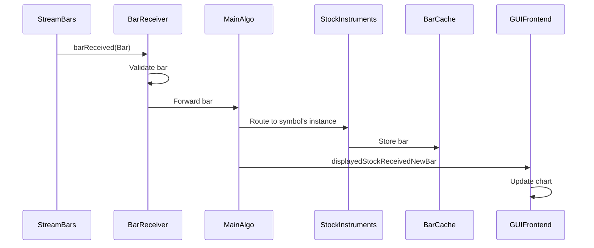
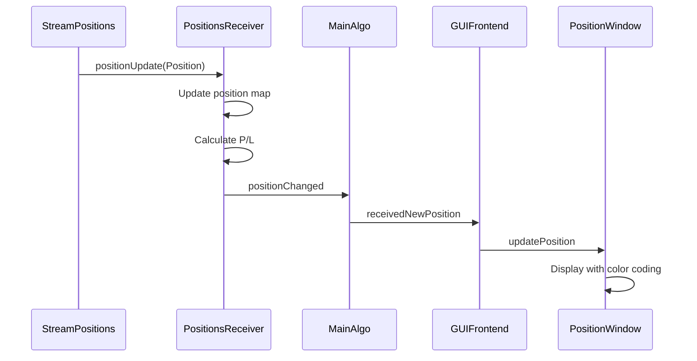

# Algo/ Directory - Trading Algorithm Components - Agent Instructions

The Algo directory contains the trading algorithm coordination logic and various receivers for processing market data and trading events.

## Overview

**Location**: `Src/Algo/`
**Purpose**: Trading algorithm coordination, data reception, and processing
**Key Component**: MainAlgo singleton running in dedicated thread

## MainAlgo (MainAlgo.h/cpp)

**Role**: Central coordinator for all trading algorithm operations

### Singleton Pattern

```cpp
class MainAlgo : public QObject {
public:
    static MainAlgo& getInstance() {
        static MainAlgo instance;
        return instance;
    }

    Q_DISABLE_COPY_MOVE(MainAlgo)

private:
    MainAlgo();  // Private constructor
    ~MainAlgo(); // Private destructor
};
```

### Threading

MainAlgo runs in its own dedicated QThread:
```cpp
QThread m_thread;  // Stack-allocated (preferred pattern)

MainAlgo::MainAlgo() {
    moveToThread(&m_thread);
    m_thread.start();
}

~MainAlgo() {
    m_thread.quit();
    if (!m_thread.wait(5000)) {
        m_thread.terminate();
        m_thread.wait();
    }
}
```

### Key Responsibilities

1. **Stock Instrument Management**
   - Create and manage StockInstruments instances (one per symbol)
   - Track currently displayed stock
   - Coordinate bar caching per symbol

2. **Account and Balance Management**
   - Track TradeStation accounts
   - Poll balances periodically (configurable interval)
   - Emit balance updates to UI

3. **Position Tracking**
   - Manage PositionsReceiver
   - Track open positions across accounts
   - Forward position updates to UI

4. **Order Management**
   - Manage OrdersReceiver
   - Place, modify, cancel orders via TSClient
   - Track order status changes
   - Forward order updates to UI

5. **Market Data Coordination**
   - Route bar data to appropriate StockInstruments
   - Route market depth quotes to appropriate receivers
   - Manage stream lifecycles

### Key Members

```cpp
class MainAlgo {
    // Per-symbol instruments
    QMap<QString, StockInstruments*> m_stockInstruments;
    QString m_currentlyDisplayedSymbol;

    // Receivers
    std::unique_ptr<PositionsReceiver> m_positionReceiver;
    std::unique_ptr<OrdersReceiver> m_orderReceiver;

    // Balance polling
    QTimer* m_balancePollingTimer;
    Balance m_currentBalance;

    // Account management
    QVector<Account> m_tradeStationAccounts;
    QString m_selectedAccountId;
};
```

### Signal Interface

**Signals emitted by MainAlgo**:
```cpp
signals:
    // Account and balance
    void tradeStationAccountsReceived(const QVector<Account>& accounts);
    void balanceUpdated(const Balance& balance);

    // Market data for displayed stock
    void displayedStockReceivedNewBar(const QString& symbol, const Bar& bar);
    void displayedStockReceivedNewMarketDepthQuote(
        const QString& symbol,
        const MarketDepthQuote& quote,
        double dwp,
        double bidTotalVol,
        double askTotalVol
    );

    // Trading events
    void receivedNewPosition(const QString& accountId, const Position& position);
    void positionDeleted(const QString& accountId, const QString& positionId);
    void receivedNewOrder(const QString& accountId, const Order& order);
```

**Slots for receiving events**:
```cpp
public slots:
    // Authentication
    void onAuthStateChanged(bool authenticated);

    // Stock selection
    void onSelectDisplayedStock(const QString& symbol);

    // Order placement
    void onPlaceOrder(const PlaceOrderRequest& request);

    // Data requests
    void onRequestMissingBars(const QString& symbol,
                             const QDateTime& start,
                             const QDateTime& end);
```

## StockInstruments

**Role**: Per-symbol data container and processor

**Composition Pattern** (preferred over pointers):
```cpp
class StockInstruments : public QObject {
private:
    QString m_symbol;
    QString m_timeframe;

    // Direct member objects (composition)
    BarCache m_barCache;
    MarketDepthQuoteReceiver m_marketDepthQuoteReceiver;

    // Future: Run-up detection, indicators, etc.
};
```

**Lifecycle**:
- Created when symbol first selected
- Persists for application lifetime (cached)
- Reused when symbol selected again
- Manages its own bar cache and receivers

**Responsibilities**:
- Manage BarCache for symbol
- Process market depth quotes
- Future: Run-up detection, technical indicators, signals

## Receiver Components

### BarReceiver/

**Role**: Receive and process bar data from streams and API responses

**Key Classes**:
- `BarReceiver`: Base class for bar reception
- Validates bars (OHLC relationships, timestamps)
- Routes bars to appropriate StockInstruments
- Handles bar updates (close price changes during live trading)

**Bar Validation**:
```cpp
bool isValidBar(const Bar& bar) {
    return bar.high() >= bar.low() &&
           bar.high() >= bar.open() &&
           bar.high() >= bar.close() &&
           bar.low() <= bar.open() &&
           bar.low() <= bar.close() &&
           bar.totalVolume() >= 0 &&
           bar.tradeCount() >= 0;
}
```

### MarketDepthQuoteReceiver/

**Role**: Process Level 2 market depth data

**Key Features**:
- Aggregates bid/ask levels
- Calculates metrics:
  - **DWP (Depth-Weighted Price)**: Order book imbalance
  - **Spread**: Best ask - best bid
  - **Total volumes**: Sum of bid/ask sizes
- Emits processed data for display and strategy use

**Metrics Calculation**:
```cpp
// Depth-Weighted Price (buy pressure indicator)
double dwp = (totalBidVolume - totalAskVolume) /
             (totalBidVolume + totalAskVolume);
// DWP > 0: More buying pressure
// DWP < 0: More selling pressure
// DWP = 0: Balanced
```

**Data Flow**:
```
StreamMarketDepthQuote (TSClient)
    ↓
MarketDepthQuoteReceiver
    ↓ (process and calculate metrics)
MainAlgo
    ↓ (emit signal)
GUIFrontend → MarketDepthTable display
```

### PositionsReceiver/

**Role**: Track and manage trading positions

**Key Responsibilities**:
- Receive position updates from StreamPositions
- Maintain position map by account and position ID
- Calculate P/L (realized and unrealized)
- Detect position opens/closes
- Emit events for position changes

**Position Lifecycle**:
```
New Position → Open → Updated (price changes) → Closed
                  ↓
               Position object maintained in receiver
```

**P/L Calculation**:
```cpp
double unrealizedPnL = (lastPrice - averagePrice) * quantity;
double unrealizedPnLPercent = (unrealizedPnL / (averagePrice * quantity)) * 100.0;
```

### OrdersReceiver/

**Role**: Track order status and lifecycle

**Key Responsibilities**:
- Receive order updates from StreamOrders
- Maintain order map by account and order ID
- Track order state transitions
- Store order history to OrdersDatabase
- Emit events for order changes

**Order State Machine**:
```
Submitted → Acknowledged → Open → PartiallyFilled → Filled
                         ↓           ↓
                       Canceled   Canceled
                         ↓
                      Rejected
```

**Order Tracking**:
```cpp
struct OrderTracking {
    QString orderId;
    QString accountId;
    Order order;
    OrderStatus status;
    QDateTime lastUpdate;
};
```

### StreamReceiver/

**Role**: Base class for stream-based receivers

**Provides common functionality**:
- Stream lifecycle management
- Error handling
- Reconnection logic
- Backpressure handling
- Logging

**Derived Classes**:
- BarReceiver (for StreamBars)
- MarketDepthQuoteReceiver (for StreamMarketDepthQuotes)
- PositionsReceiver (for StreamPositions)
- OrdersReceiver (for StreamOrders)

## Data Flow Patterns

### Live Bar Reception



### Position Update Flow



## Threading Model

### Thread Boundaries

All Algo components run on MainAlgo thread:
- MainAlgo
- StockInstruments instances
- All receivers

**Cross-thread communication** via signals:
```
TSClient thread ─[signal]→ MainAlgo thread
MainAlgo thread ─[signal]→ Main/GUI thread
```

### Thread Safety Assertions

In debug builds, verify thread affinity:
```cpp
void MainAlgo::someMethod() {
    Q_ASSERT(QThread::currentThread() == &m_thread);
    // Method logic...
}
```

## Memory Management

### Composition Over Pointers

StockInstruments uses composition:
```cpp
// ✓ CORRECT - Direct member objects
class StockInstruments {
    BarCache m_barCache;
    MarketDepthQuoteReceiver m_marketDepthQuoteReceiver;
};

// ✗ WRONG - Unnecessary pointers
class StockInstruments {
    BarCache* m_barCache;  // Don't do this
    MarketDepthQuoteReceiver* m_marketDepthQuoteReceiver;  // Don't do this
};
```

### Smart Pointers

For receivers with optional lifetime:
```cpp
std::unique_ptr<PositionsReceiver> m_positionReceiver;
std::unique_ptr<OrdersReceiver> m_orderReceiver;
```

### StockInstruments Management

```cpp
// Stored by symbol in map
QMap<QString, StockInstruments*> m_stockInstruments;

// Created on demand
StockInstruments* getOrCreateInstruments(const QString& symbol) {
    if (!m_stockInstruments.contains(symbol)) {
        m_stockInstruments[symbol] = new StockInstruments(symbol, this);
    }
    return m_stockInstruments[symbol];
}

// Cleanup in destructor
qDeleteAll(m_stockInstruments);
```

## Balance Polling

Periodic balance updates:
```cpp
void MainAlgo::startBalancePolling(int intervalMs = 5000) {
    m_balancePollingTimer = new QTimer(this);
    m_balancePollingTimer->setInterval(intervalMs);

    connect(m_balancePollingTimer, &QTimer::timeout, this, [this]() {
        if (TSClient::getInstance().isAuthenticated()) {
            requestBalanceUpdate();
        }
    });

    m_balancePollingTimer->start();
}
```

Configurable interval (default 5 seconds).

## Configuration

### Settings

Via QSettings:
```cpp
// Balance polling interval
Settings::getValue("MainAlgo/BalancePollingInterval", 5000);

// Default timeframe
Settings::getValue("MainAlgo/DefaultTimeframe", "1Min");

// Position tracking
Settings::getValue("MainAlgo/EnablePositionTracking", true);
```

## Error Handling

### Stream Errors

Handle stream disconnections:
```cpp
connect(stream, &StreamBars::errorOccurred, this,
        [this, symbol](const QString& error) {
            qCWarning() << "Stream error for" << symbol << ":" << error;
            // Attempt reconnection or notify user
        });
```

### API Request Failures

Handle async request failures:
```cpp
TSClient::getInstance().getAccounts([this](bool success, const QJsonDocument& response) {
    if (!success) {
        qCWarning() << "Failed to get accounts";
        // Retry or notify user
        return;
    }
    // Process accounts...
});
```

### Position Tracking Errors

Handle position stream issues:
```cpp
if (!m_positionReceiver->isConnected()) {
    qCWarning() << "Position stream disconnected, reconnecting...";
    m_positionReceiver->reconnect();
}
```

## Testing Considerations

### Unit Tests

Test components independently:
- Bar validation logic
- P/L calculations
- Order state transitions
- Metric calculations (DWP, spread)

### Integration Tests

Test data flows:
- Bar reception → cache → UI
- Order placement → tracking → UI
- Position updates → P/L → UI

### Mock Streams

For testing without live market:
- Mock StreamBars for deterministic bar sequences
- Mock StreamPositions for position lifecycle tests
- Mock StreamOrders for order flow tests

## Common Patterns

### Selecting Displayed Stock

```cpp
// User selects symbol in UI
void GUIFrontend::onSymbolEntered(const QString& symbol) {
    emit selectedDisplayedStock(symbol);
}

// MainAlgo handles selection
void MainAlgo::onSelectDisplayedStock(const QString& symbol) {
    m_currentlyDisplayedSymbol = symbol;

    // Get or create instruments
    StockInstruments* instruments = getOrCreateInstruments(symbol);

    // Start streaming if not already
    instruments->startStreaming();

    // Load historical bars
    instruments->getBarCache().preloadBars();
}
```

### Placing an Order

```cpp
// UI creates order request
PlaceOrderRequest request;
request.accountId = selectedAccount;
request.symbol = "AAPL";
request.tradeAction = TradeAction::Buy;
request.orderType = OrderType::Limit;
request.quantity = 100;
request.limitPrice = 150.50;
request.timeInForce = TimeInForce::Day;

// Forward to MainAlgo
emit orderPlaced(request);

// MainAlgo places via TSClient
void MainAlgo::onPlaceOrder(const PlaceOrderRequest& request) {
    TSClient::getInstance().placeOrder(request,
        [this](bool success, const QString& orderId) {
            if (success) {
                qCInfo() << "Order placed:" << orderId;
            } else {
                qCWarning() << "Order failed";
            }
        });
}
```

## Performance Considerations

- **Symbol caching**: Reuse StockInstruments instances
- **Stream efficiency**: Only stream currently displayed symbols
- **Balance polling**: Configurable interval, don't poll too frequently
- **Position tracking**: Use maps for O(1) lookups
- **Memory**: Bar caches evict old data automatically

## Related Agent Instructions

- `../Core/AGENTS.md`: MainApp orchestration
- `../Core/Cache/BarCache/AGENTS.md`: Bar caching details
- `../Clients/TSClient/AGENTS.md`: API and stream communication
- `../FrontEnd/AGENTS.md`: UI integration

## Related Documentation

- `Doc/ARCHITECTURE.md`: System architecture and data flows
- `Doc/DEVELOPMENT.md`: Development guidelines
