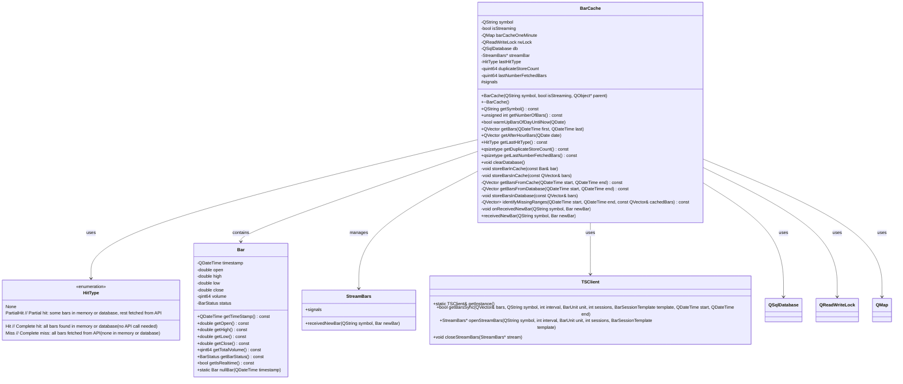
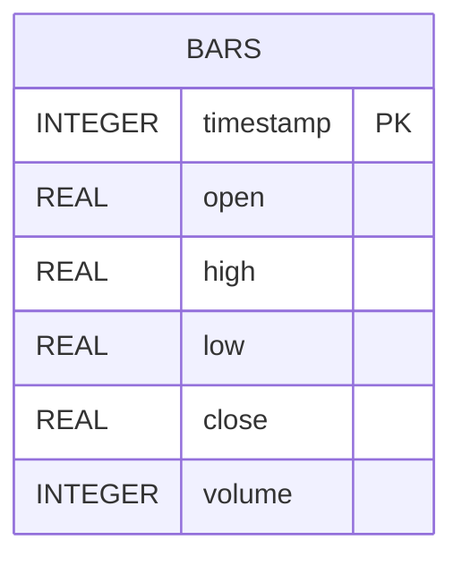
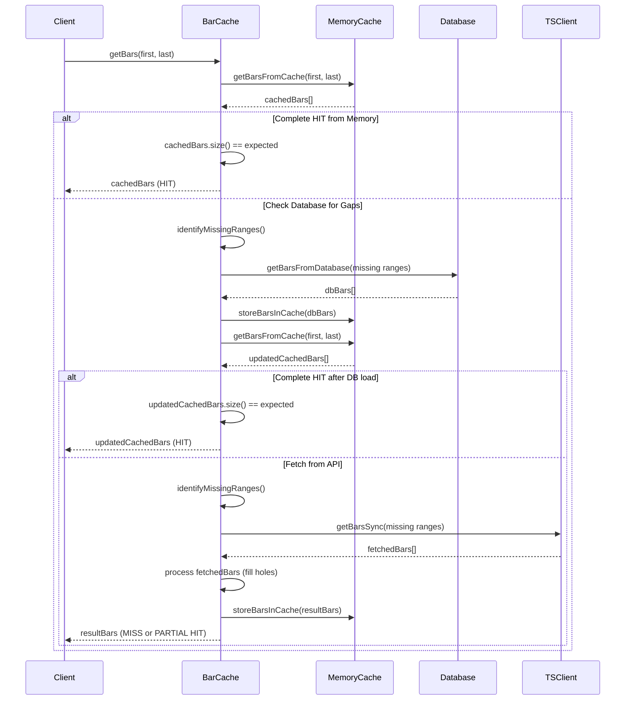
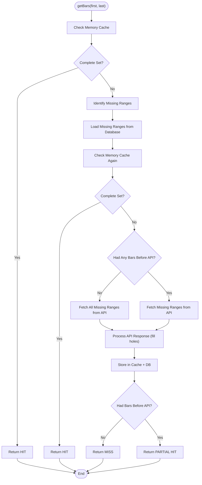
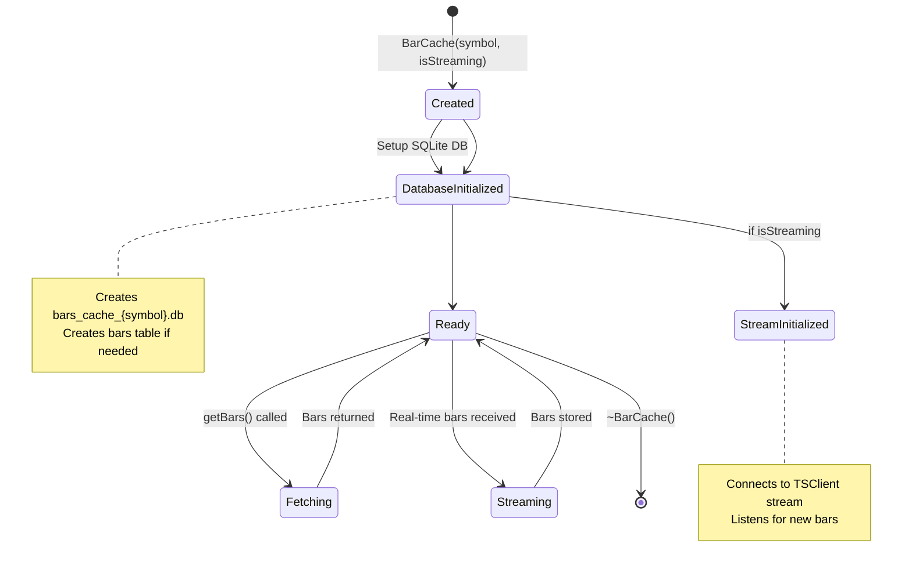
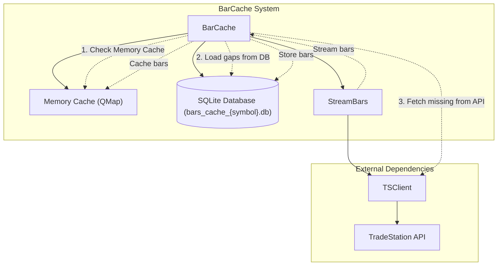

# BarCache Class Architecture

## Class Diagram

## Database Schema

## Sequence Diagram - getBars() Method

## Flowchart - Cache Hit Logic

## State Diagram - BarCache Lifecycle

## Component Diagram

