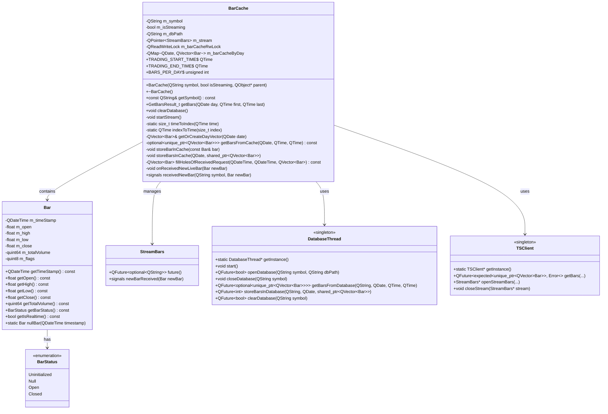
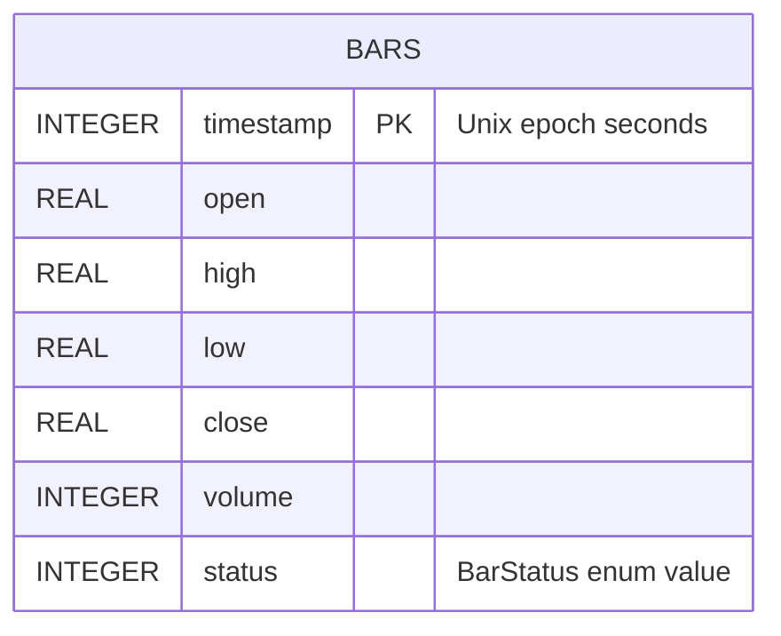
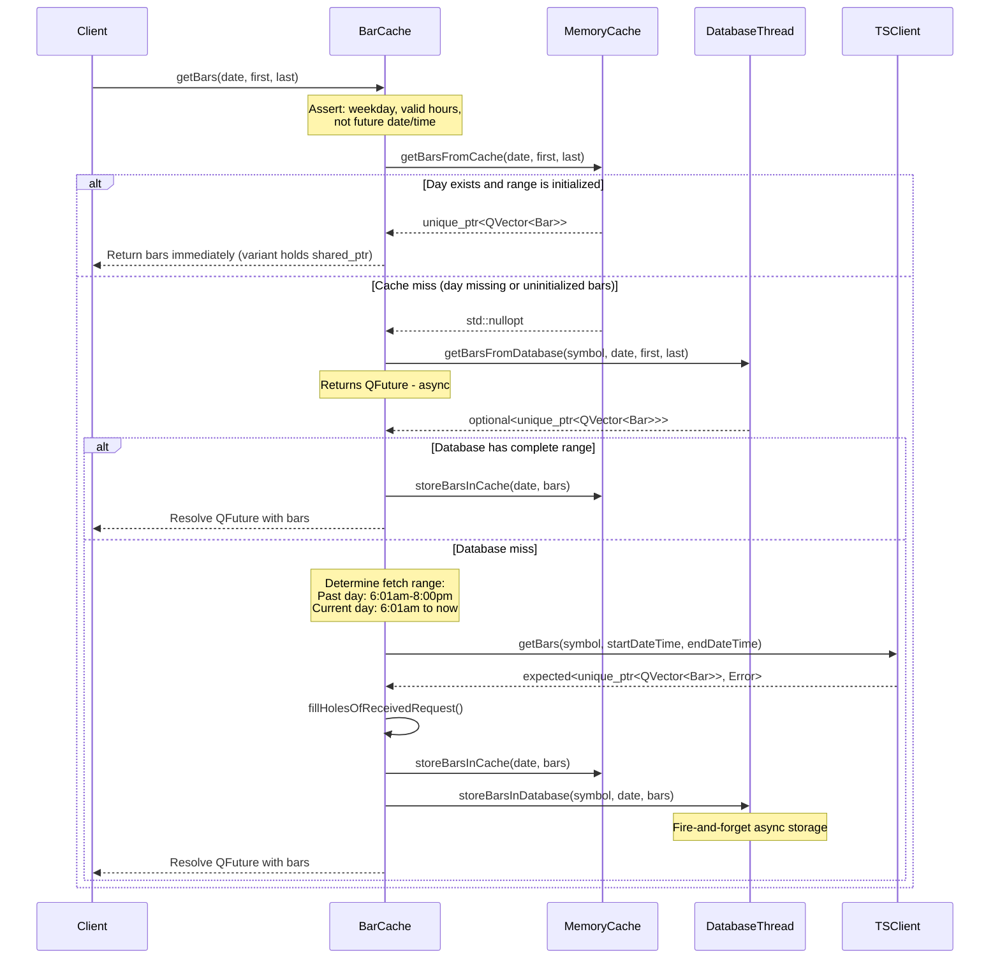
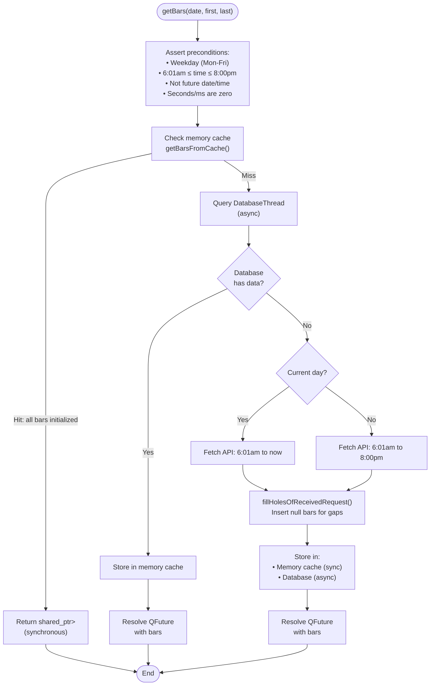
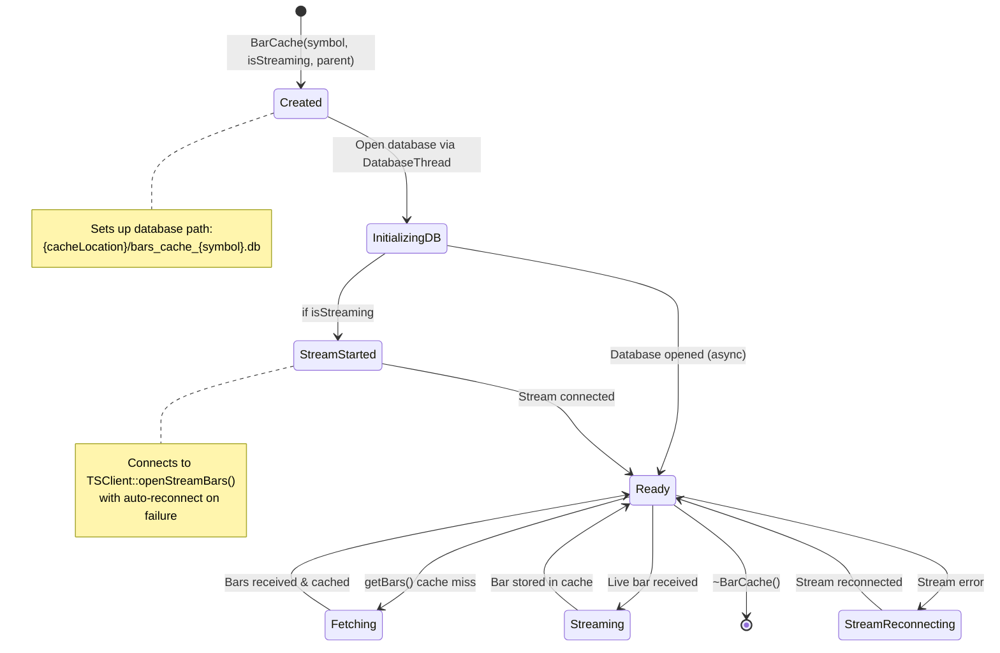
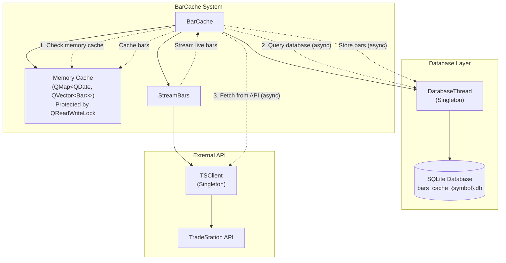

# BarCache Class Architecture

## Overview

The BarCache class provides efficient caching of 1-minute stock bars using a day-based storage approach. Each trading day (6:01am-8:00pm ET) is stored in a separate QVector, with bars indexed by their minute offset. Database operations are handled asynchronously via a dedicated `DatabaseThread` singleton.

## Key Design Principles

1. **Day-Based Storage**: Uses `QMap<QDate, QVector<Bar>>` where each QVector represents one complete trading day
2. **Complete Day Rule**: If a day exists in the cache, ALL bars for that day are available. The exception is for the current day; for past days, if the date is in the QMap, it means the QVector of bars for that day will contain all 840 minute bars. Even for minutes where no trades happened, there will still be a 'null' bar for that minute. This is a design choice, so that an algorithm can iterate through all 840 bars and know it's stepping one minute at a time, and take action on whether or not the minute had any trades.
3. **Index-Based Access**: Each bar's position in the vector corresponds to its minute offset (index 0 = 6:01am bar, index 839 = 8:00pm bar)
4. **Pre-Allocated Vectors**: Day vectors are pre-allocated to 840 bars for efficiency
5. **TradeStation Timestamp Quirk**: TradeStation timestamps minute bars at the **end** of the minute interval, not the beginning. This means:
   - The first tradeable minute (06:00:00 to 06:00:59) is timestamped as **06:01** — there is no bar with timestamp 06:00
   - The last bar of the day IS timestamped **20:00** (representing the 19:59:00 to 19:59:59 interval)
   - Therefore, valid bar timestamps range from 06:01 to 20:00 inclusive (840 bars total)
6. **Asynchronous Database Operations**: All database I/O is performed on a dedicated `DatabaseThread` to avoid blocking the main thread
7. **Thread-Safe Access**: Memory cache is protected by `QReadWriteLock` for concurrent access


## Class Diagram



## Database Schema

The database file is named `bars_cache_{symbol}.db` and is managed entirely by `DatabaseThread`.



## Sequence Diagram - getBars() Method



## Flowchart - getBars() Logic



## State Diagram - BarCache Lifecycle



## Component Diagram



## Storage Architecture

### Memory Cache Structure
- **Container**: `QMap<QDate, QVector<Bar>>`
- **Key**: Trading date (QDate)
- **Value**: Vector of exactly 840 bars (6:01am to 8:00pm inclusive)
- **Thread Safety**: Protected by `mutable QReadWriteLock m_barCacheRwLock`
- **Index Mapping**: `index = (hour - 6) * 60 + minute - 1`
  - Index 0 = 6:01am bar
  - Index 1 = 6:02am bar
  - ...
  - Index 509 = 2:30pm bar
  - Index 839 = 8:00pm bar

### Complete Day Rule
- **Invariant**: If a QDate exists in the map, the QVector is pre-allocated to 840 bars
- **Uninitialized Detection**: Bars with `BarStatus::Uninitialized` indicate missing data (cache miss)
- **Exception**: Current day (streaming) may have partial data from 6:01am to now
- **Benefit**: Simplifies cache logic - no need to track partial day states

### Index Calculation (Current Implementation)
```cpp
// Constants
static inline const QTime TRADING_START_TIME = QTime(6, 1);  // 6:01 AM ET
static inline const QTime TRADING_END_TIME = QTime(20, 0);   // 8:00 PM ET
static constexpr unsigned int BARS_PER_DAY = 840;

// Convert time to vector index (0-839)
size_t BarCache::timeToIndex(const QTime& time)
{
    // time must be between 6:01 AM and 8:00 PM inclusive
    size_t minutesSince6AM = (time.hour() - 6) * 60 + time.minute();
    size_t index = minutesSince6AM - 1;  // -1 because first bar is 6:01, not 6:00
    return index;  // Range: 0 to 839
}

// Convert index back to bar timestamp
QTime BarCache::indexToTime(size_t index)
{
    size_t adjustedMinutes = index + 1;  // +1 to offset back
    int hour = 6 + (adjustedMinutes / 60);
    int minute = adjustedMinutes % 60;
    return QTime(hour, minute, 0);
}

// Examples:
// timeToIndex(QTime(6, 1))   → 0    (first bar)
// timeToIndex(QTime(14, 30)) → 509  (2:30 PM bar)
// timeToIndex(QTime(20, 0))  → 839  (last bar)
```

### Return Type: GetBarsResult_t

The `getBars()` method returns a variant that can hold either:
1. **Synchronous result**: `std::shared_ptr<QVector<Bar>>` - when data is in memory cache
2. **Asynchronous result**: `QFuture<std::expected<std::shared_ptr<QVector<Bar>>, TSClient::Error>>` - when data must be fetched from database or API

```cpp
typedef std::variant<
    std::shared_ptr<QVector<Bar>>,
    QFuture<std::expected<std::shared_ptr<QVector<Bar>>, TSClient::Error>>
> GetBarsResult_t;
```

### Bar Status States
- **Uninitialized**: Default state, bar has never been set (cache miss indicator)
- **Null**: Bar was set but represents a minute with no trading activity
- **Open**: Live bar still being updated (current minute)
- **Closed**: Complete bar, no more updates expected