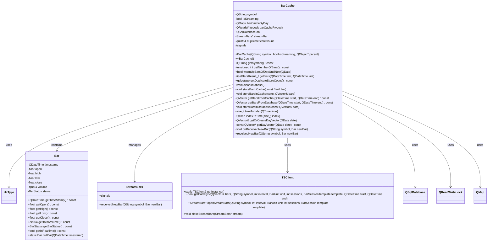
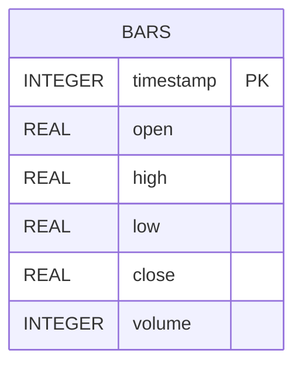
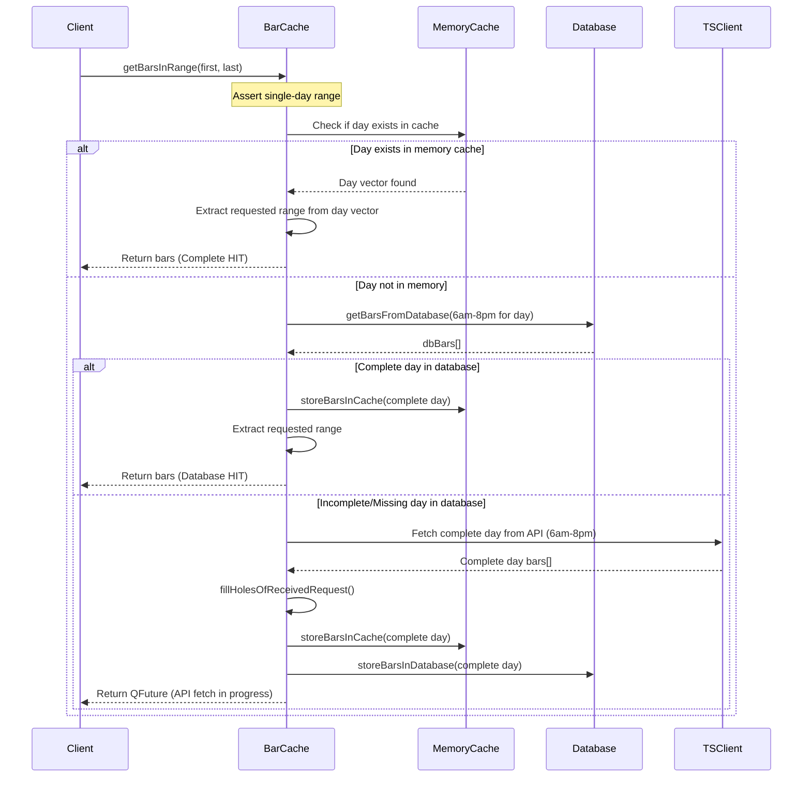
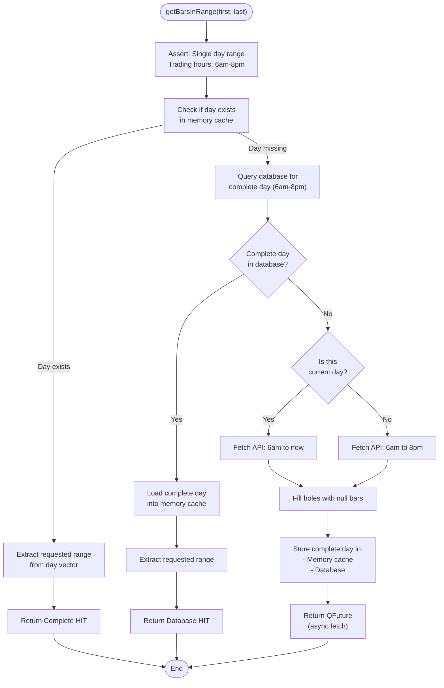
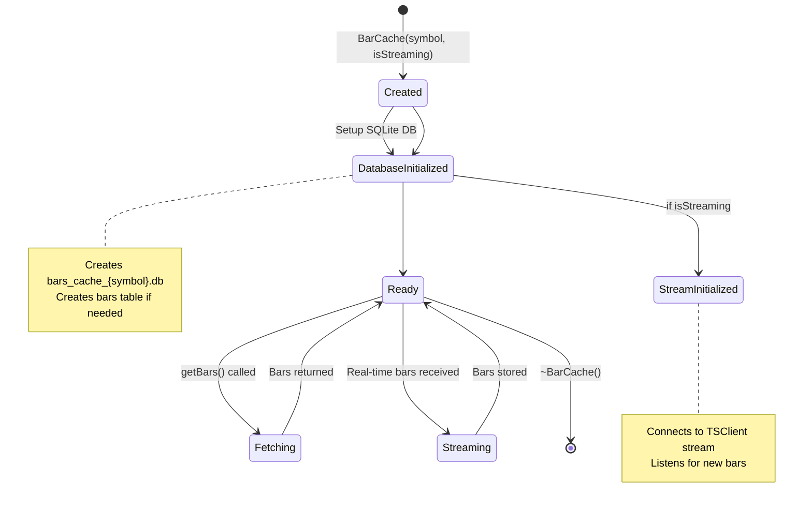
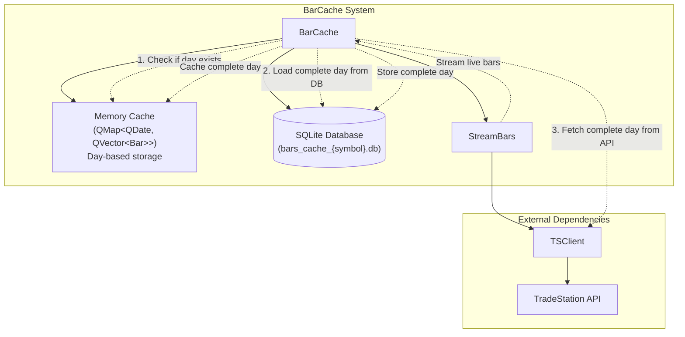

# BarCache Class Architecture

## Overview

The BarCache class provides efficient caching of 1-minute stock bars using a day-based storage approach. Each trading day (6am-8pm ET) is stored in a separate QVector, with bars indexed by their minute offset from 6am.

## Key Design Principles

1. **Day-Based Storage**: Uses `QMap<QDate, QVector<Bar>>` where each QVector represents one complete trading day
2. **Complete Day Rule**: If a day exists in the cache, ALL bars for that day are available (except for current day streaming)
3. **Index-Based Access**: Each bar's position in the vector corresponds to its minute offset from 6am (index 0 = 6:00am, index 840 = 8:00pm)
4. **Pre-Allocated Vectors**: Day vectors are pre-allocated to 841 bars (6:00am to 8:00pm inclusive) for efficiency

## Class Diagram



## Database Schema



## Sequence Diagram - getBarsInRange() Method (New Complete Day Logic)



## Flowchart - New Complete Day Cache Logic



## State Diagram - BarCache Lifecycle



## Component Diagram



## Storage Architecture

### Memory Cache Structure
- **Container**: `QMap<QDate, QVector<Bar>>`
- **Key**: Trading date (QDate)
- **Value**: Vector of 841 bars (one per minute, 6:00am-8:00pm inclusive)
- **Index Mapping**: `index = (hour - 6) * 60 + minute`
  - Index 0 = 6:00am
  - Index 1 = 6:01am
  - ...
  - Index 839 = 7:59pm
  - Index 840 = 8:00pm

### Complete Day Rule
- **Invariant**: If a QDate exists in the map, ALL bars for that day must be present
- **Exception**: Current day (streaming) may have partial data from 6am to now
- **Benefit**: Simplifies cache logic - no need to track partial day states

### Index Calculation Example
```cpp
// Convert time to vector index
QTime time(14, 30, 0);  // 2:30 PM
size_t index = (14 - 6) * 60 + 30;  // = 8 * 60 + 30 = 510

// Convert index back to time
size_t index = 510;
int hour = 6 + (510 / 60);  // = 6 + 8 = 14
int minute = 510 % 60;       // = 30
// Result: 14:30 (2:30 PM)
```