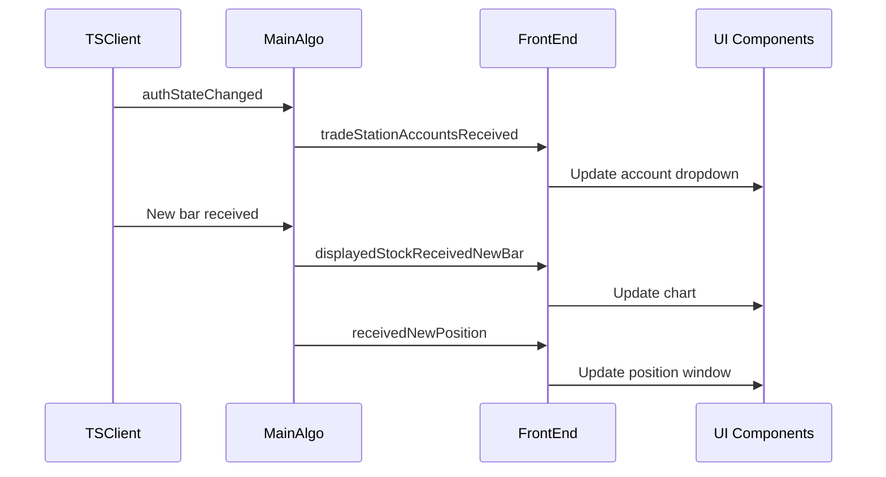
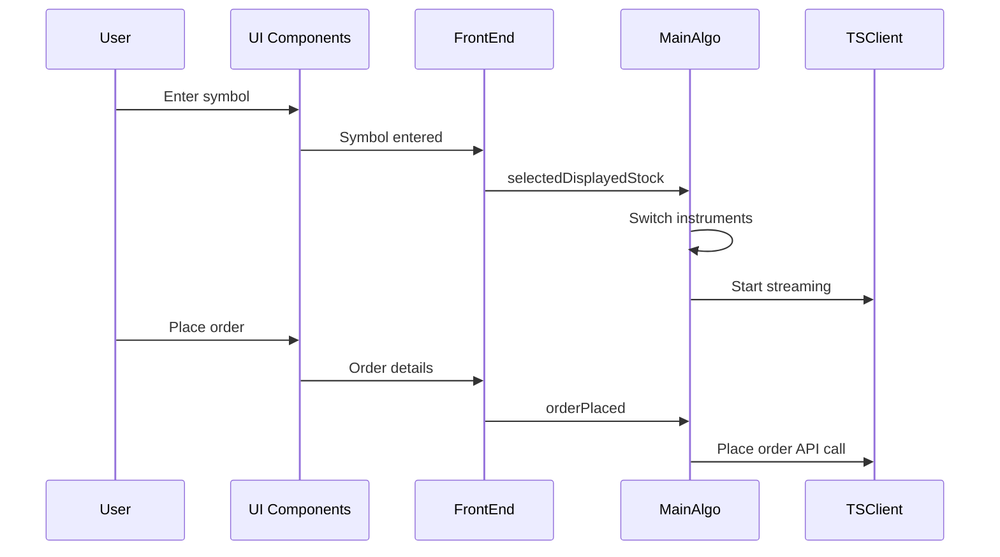

# FrontEnd/ Directory - User Interface Architecture - Agent Instructions

The FrontEnd directory contains user interface implementations for L2Trader in both graphical (GUI) and terminal (TUI) modes.

## Overview

**Location**: `Src/FrontEnd/`
**Purpose**: Provide user interface abstraction and implementations
**Pattern**: Strategy pattern with abstract base class

## Architecture

### FrontEnd Base Class (FrontEnd.h)

Abstract base class defining the UI contract:

```cpp
class FrontEnd : public QObject {
    Q_OBJECT

signals:
    // User actions propagate to backend
    void selectedDisplayedStock(const QString& symbol);

public slots:
    // Backend data updates (pure virtual - must implement)
    virtual void onTSClientDataUsageUpdate(qsizetype bytes) = 0;
    virtual void onTradeStationAccountsReceived(const QVector<Account>& accounts) = 0;
    virtual void onMemoryUsageUpdate(qsizetype bytes) = 0;
    virtual void onStreamCountUpdate(size_t barsCount, size_t marketDepthCount) = 0;
    virtual void onCurrentHighlightedStockBarReceived(const QString& symbol, const Bar& bar) = 0;
    virtual void onCurrentHighlightedReceivedNewMarketDepthQuote(...) = 0;
    virtual void onNewPositionReceived(const QString& accountId, const Position& position) = 0;
    virtual void onPositionDeleted(const QString& accountId, const QString& positionId) = 0;
    virtual void onNewOrderReceived(const QString& accountId, const Order& order) = 0;
    virtual void onBalanceUpdated(const Balance& balance) = 0;
};
```

### Build-Time Selection

Frontend implementation selected at compile time:

```cpp
// In main.cpp or MainApp
#ifdef GUI_ENABLED
    FrontEnd* frontend = new GUIFrontend(&mainAlgo);
#else
    FrontEnd* frontend = new TUIFrontend(&mainAlgo);
    static_cast<TUIFrontend*>(frontend)->initialize();
#endif
```

CMake configuration:
```cmake
option(ENABLE_GUI "Enable GUI frontend (Qt Widgets)" ON)

if(ENABLE_GUI)
    target_compile_definitions(L2Trader PRIVATE GUI_ENABLED)
    # Link Qt Widgets, QCustomPlot (third-party charting library)
else()
    # Link ncurses, Qt Core only
endif()
```

## Directory Structure

### GUI/ - Graphical User Interface

**Full-featured Qt Widgets desktop application**

See `GUI/AGENTS.md` for detailed implementation:
- Main window with menu bar and tabs
- Real-time candlestick charts (QCustomPlot)
- Level 2 market depth table
- Position and order windows
- Order entry widget with sticky price feature
- Logging and cache management
- Dark theme support

**Key Dependencies**:
- Qt Widgets
- QCustomPlot (third-party charting library in qcustomplot/ folder)

### TUI/ - Text User Interface

**Lightweight ncurses terminal application**

See `TUI/AGENTS.md` for detailed implementation:
- Window-based layout (orders, positions, status)
- Keyboard navigation
- Color-coded displays
- Resource monitoring
- Read-only monitoring (no order entry)

**Key Dependencies**:
- ncurses library
- Qt Core (for event loop and signals)
- No GUI dependencies

## Data Flow

### Backend → Frontend

Data flows from backend to UI via signals:



### Frontend → Backend

User actions propagate to backend via signals:



## Threading Model

### Frontend Thread Affinity

Both GUI and TUI frontends run on the **main thread**:
- Receives signals from worker threads (queued connections)
- Updates UI components (must be on main thread)
- Emits signals to worker threads (auto-queued)

### Cross-Thread Communication

Signal/slot connections automatically handle threading:

```cpp
// Connection from worker thread (MainAlgo) to main thread (Frontend)
connect(&MainAlgo::getInstance(), &MainAlgo::displayedStockReceivedNewBar,
        frontend, &FrontEnd::onCurrentHighlightedStockBarReceived,
        Qt::QueuedConnection);  // Explicit queued (thread-safe)

// Connection from main thread (Frontend) to worker thread (MainAlgo)
connect(frontend, &FrontEnd::selectedDisplayedStock,
        &MainAlgo::getInstance(), &MainAlgo::onSelectDisplayedStock,
        Qt::QueuedConnection);  // Explicit queued (thread-safe)
```

## Common Interface Methods

### Status Updates

All frontends must handle status updates:

```cpp
void onTSClientDataUsageUpdate(qsizetype bytes) {
    // Display network data usage
    // GUI: Status bar label
    // TUI: Status window
}

void onMemoryUsageUpdate(qsizetype bytes) {
    // Display application memory usage
    // Update periodically (500ms interval)
}

void onStreamCountUpdate(size_t barsCount, size_t marketDepthCount) {
    // Display active stream counts (separate for bars and Level 2 market depth)
    // GUI: Status bar displays "Bars: X | Level2: Y"
    // TUI: Status window displays "Bars: X | Level2: Y"
    // Helps monitor connection health and TradeStation API limits
    // Note: Market depth has hard limit of 10 concurrent streams
}
```

### Account Management

```cpp
void onTradeStationAccountsReceived(const QVector<Account>& accounts) {
    // Populate account selection
    // GUI: Dropdown/combo box
    // TUI: Selectable list
    // Remember last selected account
}
```

### Market Data

```cpp
void onCurrentHighlightedStockBarReceived(const QString& symbol, const Bar& bar) {
    // Update chart with new bar
    // GUI: QCustomPlot candlestick chart
    // TUI: Text-based price display (future)
}

void onCurrentHighlightedReceivedNewMarketDepthQuote(
    const QString& symbol,
    const MarketDepthQuote& quote,
    double dwp,
    double bidTotalVol,
    double askTotalVol)
{
    // Update market depth display
    // GUI: Table with bid/ask levels
    // TUI: Not implemented (optional)
}
```

### Trading Events

```cpp
void onNewPositionReceived(const QString& accountId, const Position& position) {
    // Add or update position in display
    // Calculate and show P/L
    // Color-code by profit/loss
}

void onPositionDeleted(const QString& accountId, const QString& positionId) {
    // Remove position from display
    // Update totals
}

void onNewOrderReceived(const QString& accountId, const Order& order) {
    // Add or update order in display
    // Show status (ACK, Open, Filled, etc.)
    // Allow cancellation for open orders
}

void onBalanceUpdated(const Balance& balance) {
    // Display account balance
    // Show buying power, cash available
    // Update margin information
}
```

## User Action Signals

### Stock Selection

```cpp
// Emitted when user selects a symbol to display
signals:
    void selectedDisplayedStock(const QString& symbol);

// Usage in GUI:
void GUIFrontend::onSymbolEntered() {
    QString symbol = ui->symbolInput->text().toUpper();
    emit selectedDisplayedStock(symbol);
}

// Usage in TUI:
void TUIFrontend::handleInput(int ch) {
    // Future: Allow symbol entry
    emit selectedDisplayedStock(enteredSymbol);
}
```

## Implementation Guidelines

### Creating New Frontend

To add a new frontend implementation:

1. **Inherit from FrontEnd**:
   ```cpp
   class NewFrontend : public FrontEnd {
       Q_OBJECT
   public:
       explicit NewFrontend(MainAlgo* algo, QObject* parent = nullptr);

       // Implement all pure virtual methods
       void onTSClientDataUsageUpdate(qsizetype bytes) override;
       // ... etc
   };
   ```

2. **Implement all required slots**: Each pure virtual method must be implemented

3. **Emit appropriate signals**: User actions should emit signals

4. **Handle thread safety**: All UI updates on main thread

5. **Add to build system**:
   ```cmake
   option(ENABLE_NEW "Enable new frontend" OFF)
   if(ENABLE_NEW)
       target_compile_definitions(L2Trader PRIVATE NEW_ENABLED)
   endif()
   ```

6. **Update main.cpp**:
   ```cpp
   #ifdef NEW_ENABLED
       frontend = new NewFrontend(&mainAlgo);
   #endif
   ```

### Testing Frontends

Mock the backend for UI testing:
```cpp
class MockMainAlgo : public QObject {
    // Simulate backend signals
    void emitTestBar() {
        emit displayedStockReceivedNewBar("AAPL", generateTestBar());
    }
};
```

## Configuration and Settings

### Persistent Settings

Frontends can store/restore settings:
```cpp
// On close
void GUIFrontend::saveSettings() {
    Settings::setValue("GUI/WindowGeometry", window->saveGeometry());
    Settings::setValue("GUI/LastSymbol", currentSymbol);
    Settings::setValue("GUI/SelectedAccount", selectedAccountId);
}

// On startup
void GUIFrontend::restoreSettings() {
    window->restoreGeometry(Settings::getValue("GUI/WindowGeometry"));
    // ... restore other settings
}
```

### User Preferences

- Theme selection (dark/light)
- Chart colors and indicators
- Default timeframes
- Keyboard shortcuts
- Window layouts

## Error Handling

### Display Errors to User

Frontends should display errors appropriately:

**GUI**:
```cpp
QMessageBox::critical(window, "Error", errorMessage);
```

**TUI**:
```cpp
// Flash error in status bar
// Write to stderr (doesn't interfere with ncurses)
fprintf(stderr, "Error: %s\n", errorMessage.toStdString().c_str());
```

### Handle Missing Data

Gracefully handle missing or invalid data:
```cpp
void onNewPositionReceived(const QString& accountId, const Position& position) {
    if (!position.isValid()) {
        qCWarning() << "Received invalid position, ignoring";
        return;
    }
    // Update display...
}
```

## Performance Considerations

### Update Throttling

For high-frequency updates:
```cpp
// Throttle chart updates to avoid overwhelming UI
QTimer* m_updateThrottle = new QTimer(this);
m_updateThrottle->setInterval(100);  // Max 10 updates/sec
m_updateThrottle->setSingleShot(true);

void onCurrentHighlightedStockBarReceived(const QString&, const Bar& bar) {
    m_pendingBar = bar;  // Store latest
    if (!m_updateThrottle->isActive()) {
        updateChart(m_pendingBar);
        m_updateThrottle->start();
    }
}
```

### Lazy Loading

Load data on demand:
```cpp
// Don't load all position history upfront
// Load only visible positions
// Load details when expanded
```

### Efficient Rendering

- Use double buffering for charts
- Update only changed table cells
- Minimize full repaints

## Accessibility

### Keyboard Navigation

Support keyboard-only operation:
- Tab navigation between components
- Keyboard shortcuts for common actions
- Enter to submit forms

### Color Coding

Use color meaningfully but don't rely solely on it:
- Add text labels (e.g., "+5.2%" not just green)
- Use icons in addition to color
- Support colorblind-friendly schemes

## Localization

Prepare for internationalization:
```cpp
// Use tr() for all user-visible strings
ui->label->setText(tr("Symbol:"));
QMessageBox::information(nullptr, tr("Success"), tr("Order placed"));
```

## Related Agent Instructions

- `GUI/AGENTS.md`: Detailed GUI implementation
- `TUI/AGENTS.md`: Detailed TUI implementation
- `../Algo/AGENTS.md`: Backend algorithm coordination
- `../Core/AGENTS.md`: Core application components

## Related Documentation

- `Doc/FRONTEND.md`: Complete frontend architecture documentation
- `Doc/ARCHITECTURE.md`: System-wide architecture
- `Doc/DEVELOPMENT.md`: Development guidelines
